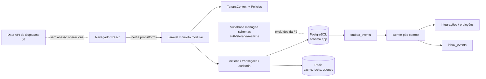
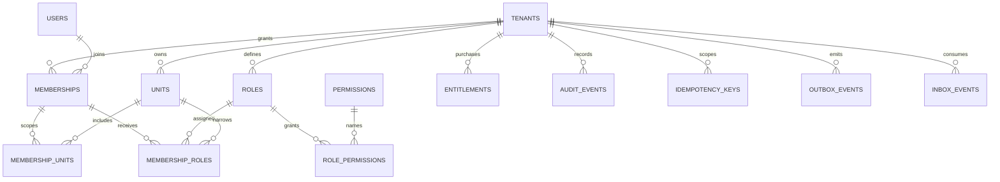

# Arquitetura de dados do Caldas Gestão

**Status:** proposta para aprovação; ainda não implementation-ready  
**Escopo:** fundação de dados SaaS e contrato de evolução do banco  
**Fonte:** modelo original derivado do dossiê clean-room, não reconstrução do banco do produto observado

## 1. Decisão resumida

O Caldas Gestão usará um PostgreSQL compartilhado, em um único banco, com o schema de aplicação `app`. O Laravel é a autoridade de escrita e autorização; o navegador fala com Laravel + Inertia e nunca com a Data API do Supabase. Todas as entidades de negócio pertencem a um `tenant_id` obrigatório e recebem `unit_id` quando o fato é de uma unidade. Usuários são identidades globais; acesso a um tenant é uma `membership`, e a abrangência por unidade é uma relação explícita.

A F2 cria somente a fundação necessária para login, escolha de contexto e autorização:

`tenants`, `units`, `users`, `memberships`, `membership_units`, `roles`, `permissions`, `role_permissions`, `membership_roles`, `entitlements`, `audit_events`, `idempotency_keys`, `outbox_events` e `inbox_events`.

Identificadores públicos de usuários e agregados serão UUIDv7, gerados pela aplicação e armazenados no PostgreSQL como `uuid`. Identificadores internos de infraestrutura sem exposição pública — por exemplo, `jobs`, `migrations` e o ID técnico da outbox — podem continuar `bigint`. Instantes usam `timestamptz` em UTC; conceitos civis usam `date`; o fuso IANA da empresa/unidade é dado explícito. Valores monetários futuros usarão inteiros em unidade mínima + `char(3)` de moeda, nunca `float`.

Esta proposta não afirma que o banco já foi migrado. Antes do primeiro `migrate` remoto, a baseline Laravel/Fortify precisa ser coordenada: `users.id` UUIDv7, `User` com `HasUuids`, nomes físicos Laravel `email` e `password`, `email_normalized` como coluna adicional, `passkeys.user_id` e `sessions.user_id` UUID, factories/reset tokens/2FA compatíveis e testes de autenticação. Essa mudança deve acontecer em uma revisão própria, antes de dados remotos, e não por backfill improvisado.

RLS fica adiada. O isolamento obrigatório nesta fase é composto por foreign keys, índices/uniques com tenant, `TenantContext`, scopes, Policies e testes negativos. RLS só será ativada após provar o contexto transacional com pooler e jobs.

O shell F1 pode ser construído com fixtures e autenticação sintética, mas nenhuma rota persistente de produção entra antes do gate F2. A ordem operacional é: provisionar schema/baseline de identidade, rodar migrations e testes PostgreSQL, criar tenant/unidade/membership/RBAC, e só então trocar fixtures por dados reais nas telas do shell.

## 2. Epistemologia e claims

O dossiê separa fato observado, interpretação e decisão de produto. A coluna “classificação” nas tabelas abaixo não significa que o alvo tenha o campo; significa o grau de suporte para a decisão proposta.

| ID     | Classificação       | Claim e consequência                                                                                                                | Evidência                                |
| ------ | ------------------- | ----------------------------------------------------------------------------------------------------------------------------------- | ---------------------------------------- |
| DB-001 | Proposed            | Banco compartilhado e schema `app`, com coluna de tenancy, é a fundação inicial.                                                    | ADR-001; database-proposal.md            |
| DB-002 | Proposed            | Toda tabela de negócio tenant-owned tem `tenant_id` não nulo; `unit_id` é obrigatório somente quando o fato pertence a uma unidade. | ADR-001; model.md                        |
| DB-003 | Inferred → Proposed | Usuário e profissional são conceitos distintos; a identidade pode existir sem um profissional e vice-versa.                         | SCR-005, UX-013, model.md                |
| DB-004 | Proposed            | Membership é a fronteira de acesso ao tenant; unidades e papéis são relações explícitas, nunca inferidas do frontend.               | roles-permissions.md; ADR-001            |
| DB-005 | Proposed            | RBAC concede capacidade e Policies/ABAC restringem tenant, unidade, propriedade e estado; entitlement é uma decisão separada.       | roles-permissions.md; BEH-010, BEH-022   |
| DB-006 | Proposed            | UUIDv7 é o ID público de users e agregados; IDs técnicos de infraestrutura podem ser bigint.                                        | api-proposal.md; decisão deste documento |
| DB-007 | Proposed            | Mutações repetíveis, webhooks e consumidores usam idempotency/inbox/outbox; eventos não carregam PII desnecessária.                 | api-proposal.md; network-observations.md |
| DB-008 | Proposed            | Auditoria e ledgers são append-only; correção financeira/estoque usa ajuste ou reversão, não deleção destrutiva.                    | model.md; FLOW-004/005                   |
| DB-009 | Proposed            | Laravel controla escrita e o navegador consome contratos Inertia; Supabase Data API não é o caminho operacional.                    | ADR-001; frontend-implementation-plan.md |
| DB-010 | Observed            | As telas exibem unidades de negócio distintas, estados independentes de venda/pagamento e recursos condicionados a entitlement.     | EV-002, EV-005, EV-006; BEH-016, BEH-022 |
| DB-011 | Unknown             | O schema, as tabelas e os contratos internos do produto observado não foram capturados.                                             | network-observations.md                  |

`DB-*` são IDs de decisão/proposta deste documento, não alegações sobre o banco do alvo. Novas evidências devem atualizar primeiro o claim ledger e depois este contrato.

## 3. Limites de contexto e ownership

O monólito é modular, mas cada contexto possui dono dos dados e comandos. Contextos relacionados trocam IDs e eventos, não gravam diretamente nas tabelas de outro contexto.

| Contexto              | Dono inicial                                                  | Fase | Não deve possuir                              |
| --------------------- | ------------------------------------------------------------- | ---: | --------------------------------------------- |
| Plataforma e tenancy  | `Tenant`, `Unit`, `Entitlement`                               |   F2 | regras de agenda ou venda                     |
| Identidade e acesso   | `User`, `Membership`, `Role`, `Permission`                    |   F2 | cadastro operacional de profissional          |
| Auditoria e entrega   | auditoria, idempotência, outbox/inbox                         |   F2 | PII de domínio ou payload fiscal bruto        |
| CRM                   | `Customer`, contatos, consentimentos                          |   F3 | saldo financeiro como coluna própria          |
| Workforce             | `Professional`, vínculos de unidade/serviço                   |   F3 | autenticação como propriedade do profissional |
| Catálogo              | serviços, produtos, taxonomia e versões de preço              |   F3 | saldo de estoque editável livremente          |
| Agenda                | séries, ocorrências, disponibilidade e bloqueios              |   F4 | status financeiro genérico                    |
| Vendas e cobrança     | venda/comanda, itens, pagamentos e ajustes                    |   F5 | apagar ledger ou reescrever preço histórico   |
| Financeiro e comissão | obrigações, liquidações, movimentos e comissão                |   F6 | derivar saldo de um campo manual              |
| Analytics             | definições, snapshots, relatórios e exportações               |   F7 | cálculo divergente do domínio transacional    |
| Expansões             | fiscal, estoque avançado, relacionamento, arquivos, marketing |   F8 | atravessar tenant ou bypass de Policies       |

O contexto que possui uma tabela é a única autoridade para seus comandos. Foreign keys e leituras são permitidas; mutações cruzadas acontecem por Action/serviço de domínio e, quando eventual, por evento versionado.

## 4. Visão de componentes e fluxo de dados

### Invariantes de fronteira

1. O tenant ativo é resolvido no servidor a partir da sessão/membership; `tenant_id` enviado pelo cliente é apenas uma entrada a validar, nunca uma autorização.
2. Todo query de dado tenant-owned exige `TenantContext`; o teste de Policy continua obrigatório mesmo se a query já estiver scoped.
3. `unit_id` deve pertencer ao mesmo `tenant_id`. Preferir FKs compostas `(tenant_id, id)` em pivôs e tabelas que referenciam uma unidade.
4. Um job assíncrono carrega `tenant_id`, `unit_id` quando aplicável, versão do agregado e correlation ID; não depende de estado global do request.
5. Eventos publicados somente após commit. Falha de consumidor não desfaz a transação que originou o fato. Antes de usar outbox, `after_commit` precisa estar habilitado ou todo dispatch precisa usar `dispatchAfterCommit`; deixar essa configuração falsa é dívida/gate de implementação, não comportamento presumido.
6. Operações explícitas de plataforma — provisionamento, criação inicial de tenant e manutenção de catálogo global — têm Actions/roles próprios, escopo e auditoria; não são exceção silenciosa aos comandos tenant-scoped.

## 5. F2 — schema inicial detalhado

### 5.1 Convenções físicas

- schema PostgreSQL: `app`; migrations e `search_path` devem apontar explicitamente para ele;
- configuração proposta: `DB_SCHEMA=app`; runtime usa Session Pooler com `search_path=app,public` e `sslmode=require`; conexão de migration usa DSN direto/TLS e também cria/qualifica `app`;
- nomes de tabela/coluna em `snake_case`, singularidade conceitual e pluralidade de tabela;
- PK pública: `uuid`, UUIDv7 gerado no Laravel antes do insert; não depender de extensão sem ADR;
- FK pública: `uuid`; FK para infraestrutura não pública pode ser `bigint`;
- datas: `created_at`, `updated_at`, `occurred_at`, `available_at` e equivalentes são `timestamptz` em UTC;
- somente conceitos civis (por exemplo, vigência de calendário) usam `date`;
- `status`, `kind` e `action` devem ter valores controlados por enum/string + check quando o conjunto é estável; não usar booleanos ambíguos como `paid`/`closed` para máquinas diferentes;
- JSONB é para metadados/configuração versionada e payload mínimo, não para esconder entidades relacionais ou permitir bypass de autorização;
- tabelas de infraestrutura Laravel (`migrations`, `jobs`, `failed_jobs`, `cache`, `sessions`) ficam preferencialmente no schema `app` para consistência de search path, mantendo chaves técnicas sem formar contrato público;
- SQLite é apenas fast loop local; não é gate de constraints, locks, JSONB, tipos PostgreSQL ou índices parciais. CI/staging PostgreSQL é obrigatório.

### 5.2 Diagrama F2

### 5.3 Tabelas de tenancy e identidade

#### `app.tenants`

| Campo                      | Tipo/null                   | Regra                                        |
| -------------------------- | --------------------------- | -------------------------------------------- |
| `id`                       | `uuid` NOT NULL             | PK UUIDv7                                    |
| `slug`                     | `varchar(80)` NOT NULL      | único global, lowercase, formato controlado  |
| `name`                     | `varchar(160)` NOT NULL     | nome operacional                             |
| `legal_name`               | `varchar(200)` NULL         | PII/comercial; acesso restrito               |
| `status`                   | `varchar(24)` NOT NULL      | `active`, `suspended`, `closed`; check       |
| `timezone`                 | `varchar(64)` NOT NULL      | IANA; default inicial definido no onboarding |
| `default_currency`         | `char(3)` NOT NULL          | ISO 4217; check de formato                   |
| `lock_version`             | `bigint` NOT NULL DEFAULT 0 | concorrência otimista                        |
| `created_at`, `updated_at` | `timestamptz` NOT NULL      | auditoria técnica                            |

**Classificação:** `Proposed` (DB-001/002). `legal_name` é PII interna; os demais são internos.  
**Constraints/indexes:** `PRIMARY KEY (id)`, `UNIQUE (slug)`, check de status/moeda; índice parcial por `status` se o onboarding exigir.  
**FK/deleção:** não apagar em cascata; `closed` e retenção legal governam o ciclo. Filhos devem ser tratados por processo de fechamento.  
**Histórico:** mudanças sensíveis geram `audit_events`; não há tabela de histórico F2 separada.

#### `app.units`

| Campo                      | Tipo/null                   | Regra                                                                   |
| -------------------------- | --------------------------- | ----------------------------------------------------------------------- |
| `id`                       | `uuid` NOT NULL             | PK UUIDv7                                                               |
| `tenant_id`                | `uuid` NOT NULL             | FK `tenants`; parte da chave de escopo                                  |
| `slug`                     | `varchar(80)` NOT NULL      | único por tenant                                                        |
| `name`                     | `varchar(160)` NOT NULL     | nome de operação                                                        |
| `status`                   | `varchar(24)` NOT NULL      | `active`, `inactive`; check                                             |
| `timezone`                 | `varchar(64)` NULL          | override IANA; senão tenant                                             |
| `address`                  | `jsonb` NULL                | PII, apenas endereço estruturado mínimo; será normalizado se necessário |
| `lock_version`             | `bigint` NOT NULL DEFAULT 0 | concorrência otimista                                                   |
| `created_at`, `updated_at` | `timestamptz` NOT NULL      | —                                                                       |

**Classificação:** `Proposed` (DB-002; UX-030). `address` é PII.  
**Constraints/indexes:** `UNIQUE (tenant_id, id)` para FKs compostas; `UNIQUE (tenant_id, slug)`; índice `(tenant_id, status, name)`.  
**FK/deleção:** `tenant_id` `RESTRICT`; inativar em vez de apagar quando houver histórico. Relações futuras usam `RESTRICT` ou `SET NULL` deliberado, jamais cascata genérica.

#### `app.users`

| Campo                       | Tipo/null               | Regra                                     |
| --------------------------- | ----------------------- | ----------------------------------------- |
| `id`                        | `uuid` NOT NULL         | PK UUIDv7; ID público opaco               |
| `name`                      | `varchar(160)` NOT NULL | PII                                       |
| `email`                     | `varchar(320)` NOT NULL | nome físico esperado pelo Laravel/Fortify |
| `email_normalized`          | `varchar(320)` NOT NULL | unique global, lowercase/canonicalizado   |
| `email_verified_at`         | `timestamptz` NULL      | —                                         |
| `password`                  | `text` NOT NULL         | nome físico esperado pelo Laravel/Fortify |
| `remember_token`            | `varchar(100)` NULL     | somente se sessão Laravel exigir          |
| `two_factor_secret`         | `text` NULL             | segredo cifrado/encapsulado, nunca logado |
| `two_factor_recovery_codes` | `text` NULL             | cifrado, acesso restrito                  |
| `two_factor_confirmed_at`   | `timestamptz` NULL      | —                                         |
| `status`                    | `varchar(24)` NOT NULL  | `active`, `locked`, `deactivated`; check  |
| `created_at`, `updated_at`  | `timestamptz` NOT NULL  | —                                         |

**Classificação:** `Inferred → Proposed` (DB-003; SCR-005). Nome/email são PII; credenciais são segredo.  
**Constraints/indexes:** `UNIQUE (email_normalized)`; índice parcial por status; `email` pode manter o valor de apresentação, mas autenticação/busca usa a forma normalizada; não tornar email de tenant, pois uma identidade pode pertencer a vários tenants.  
**FK/deleção:** memberships apontam para user com `RESTRICT`; desativar/anonymizar conforme LGPD. Não apagar usuário enquanto auditoria necessária.

**Pré-requisito de bootstrap Laravel/Fortify:** antes do primeiro migrate remoto, a baseline deve criar `users.id` como UUIDv7 e configurar `User` com `HasUuids`; preservar os nomes físicos `email` e `password` exigidos pelo Laravel/Fortify; adicionar `email_normalized` e sua unicidade; ajustar `passkeys.user_id` e `sessions.user_id` para UUID; revisar factories, password reset tokens, 2FA e casts; e cobrir login, reset, verificação, passkeys e 2FA em PostgreSQL. A baseline atual do scaffold ainda não representa esse estado.

#### `app.memberships`

| Campo                      | Tipo/null                   | Regra                                              |
| -------------------------- | --------------------------- | -------------------------------------------------- |
| `id`                       | `uuid` NOT NULL             | PK UUIDv7                                          |
| `tenant_id`                | `uuid` NOT NULL             | FK `tenants`                                       |
| `user_id`                  | `uuid` NOT NULL             | FK global `users`                                  |
| `status`                   | `varchar(24)` NOT NULL      | `invited`, `active`, `suspended`, `revoked`; check |
| `joined_at`                | `timestamptz` NULL          | —                                                  |
| `revoked_at`               | `timestamptz` NULL          | —                                                  |
| `lock_version`             | `bigint` NOT NULL DEFAULT 0 | concorrência otimista                              |
| `created_at`, `updated_at` | `timestamptz` NOT NULL      | —                                                  |

**Classificação:** `Proposed` (DB-004; roles-permissions.md). Relação de acesso é interna; convite/email é PII operacional.  
**Constraints/indexes:** PK `(id)` mais `UNIQUE (tenant_id, id)` para FKs compostas; `UNIQUE (tenant_id, user_id)`; índice `(user_id, status)` e `(tenant_id, status)`; check de `revoked_at` para status revogado.  
**FK/deleção:** `tenant_id` e `user_id` `RESTRICT`; membership revogada permanece para histórico e pode voltar a `invited` por comando de reinvite auditado. A unidade primária vive somente em `membership_units.is_primary`; uma membership ativa exige unidade, salvo papel tenant-wide explicitamente aprovado.

**Ativação transacional:** o único caminho do fluxo app para `active` é `ActivateMembership` Action. Dentro de uma transação, ela bloqueia a membership e todas as unidades ativas do tenant em ordem determinística (`FOR UPDATE`), revalida que existe ao menos uma relação `membership_units` ligada a uma `units.status = active` ou um `membership_role` tenant-wide não revogado ligado a um role existente, grava `lock_version`/auditoria e emite evento após commit. Update direto de `memberships.status` fica proibido no código de aplicação. O gate F2 exige testes concorrentes de ativação, revogação e alteração de unidades/papéis; trigger de banco pode endurecer a regra depois, mas não substitui o serviço transacional nesta fase.

#### `app.membership_units`

| Campo           | Tipo/null                        | Regra                                 |
| --------------- | -------------------------------- | ------------------------------------- |
| `tenant_id`     | `uuid` NOT NULL                  | parte das FKs compostas               |
| `membership_id` | `uuid` NOT NULL                  | FK `(tenant_id, id)` de memberships   |
| `unit_id`       | `uuid` NOT NULL                  | FK `(tenant_id, id)` de units         |
| `is_primary`    | `boolean` NOT NULL DEFAULT false | no máximo uma primária por membership |
| `created_at`    | `timestamptz` NOT NULL           | —                                     |

**Classificação:** `Proposed` (DB-002/004). Não contém PII.  
**Constraints/indexes:** PK `(membership_id, unit_id)` mais `UNIQUE (tenant_id, membership_id, unit_id)` para FKs compostas; check de tenant consistente; índice `(tenant_id, unit_id, membership_id)`; unique parcial por `(membership_id) WHERE is_primary`.  
**FK/deleção:** `RESTRICT` para membership e unit; revogar acesso removendo/desativando relação via comando auditado, não por cascata silenciosa.

### 5.4 Tabelas de autorização

#### `app.roles`

| Campo                      | Tipo/null                        | Regra                                                   |
| -------------------------- | -------------------------------- | ------------------------------------------------------- |
| `id`                       | `uuid` NOT NULL                  | PK UUIDv7                                               |
| `tenant_id`                | `uuid` NOT NULL                  | cada tenant recebe cópia/versionamento de papel inicial |
| `key`                      | `varchar(80)` NOT NULL           | chave estável (`owner`, `manager`, etc.)                |
| `name`                     | `varchar(120)` NOT NULL          | rótulo editável                                         |
| `description`              | `text` NULL                      | interna                                                 |
| `is_system`                | `boolean` NOT NULL DEFAULT false | papel seed protegido                                    |
| `lock_version`             | `bigint` NOT NULL DEFAULT 0      | concorrência otimista                                   |
| `created_at`, `updated_at` | `timestamptz` NOT NULL           | —                                                       |

**Classificação:** `Proposed` (DB-004/005; roles-permissions.md).  
**Constraints/indexes:** `UNIQUE (tenant_id, id)`, `UNIQUE (tenant_id, key)`, índice `(tenant_id, is_system)`; papel system não pode ser apagado sem migração explícita.  
**FK/deleção:** `tenant_id RESTRICT`; memberships roles `RESTRICT`; desativação futura preferível a deleção.

#### `app.permissions`

| Campo                      | Tipo/null               | Regra                                         |
| -------------------------- | ----------------------- | --------------------------------------------- |
| `id`                       | `uuid` NOT NULL         | PK UUIDv7                                     |
| `key`                      | `varchar(120)` NOT NULL | único global (`customer.read`, `sale.refund`) |
| `description`              | `text` NOT NULL         | catálogo interno                              |
| `created_at`, `updated_at` | `timestamptz` NOT NULL  | —                                             |

**Classificação:** `Proposed` (DB-005). Não contém PII.  
**Constraints/indexes:** `UNIQUE (key)`; check de formato `resource.action[:scope]`; permissões são catálogo versionado por migration.

#### `app.role_permissions`

| Campo           | Tipo/null              | Regra                |
| --------------- | ---------------------- | -------------------- |
| `tenant_id`     | `uuid` NOT NULL        | escopo do papel      |
| `role_id`       | `uuid` NOT NULL        | FK `(tenant_id, id)` |
| `permission_id` | `uuid` NOT NULL        | FK `permissions`     |
| `created_at`    | `timestamptz` NOT NULL | —                    |

**Classificação:** `Proposed` (DB-005).  
**Constraints/indexes:** PK `(role_id, permission_id)` mais `UNIQUE (tenant_id, role_id, permission_id)` para a FK composta; índice `(tenant_id, permission_id)`; FK composta impede papel de outro tenant.  
**Histórico:** alterações de capacidade geram audit event com ator e motivo; não reescrever eventos passados.

#### `app.membership_roles`

| Campo              | Tipo/null                   | Regra                                            |
| ------------------ | --------------------------- | ------------------------------------------------ |
| `id`               | `uuid` NOT NULL             | PK UUIDv7 histórica                              |
| `tenant_id`        | `uuid` NOT NULL             | escopo                                           |
| `membership_id`    | `uuid` NOT NULL             | FK composta                                      |
| `role_id`          | `uuid` NOT NULL             | FK composta                                      |
| `scope_kind`       | `varchar(16)` NOT NULL      | `tenant` ou `unit`                               |
| `assignment_scope` | `varchar(120)` NOT NULL     | `tenant` ou `unit:<unit_uuid>`; valor persistido |
| `unit_id`          | `uuid` NULL                 | obrigatório quando `scope_kind = unit`           |
| `lock_version`     | `bigint` NOT NULL DEFAULT 0 | concorrência otimista                            |
| `created_at`       | `timestamptz` NOT NULL      | —                                                |
| `revoked_at`       | `timestamptz` NULL          | revogação auditável                              |

**Classificação:** `Proposed` (DB-004/005).  
**Constraints/indexes:** `id` é PK UUIDv7 para preservar cada grant histórico. Criar no PostgreSQL 15+ um índice parcial explícito: `CREATE UNIQUE INDEX membership_roles_active_unique ON app.membership_roles (tenant_id, membership_id, role_id, unit_id) NULLS NOT DISTINCT WHERE revoked_at IS NULL`; ao implementar via Laravel, usar `DB::statement` na migration de PostgreSQL (ou dois índices parciais compatíveis se necessário). Índices adicionais: `(tenant_id, scope_kind, unit_id, membership_id)` e `(membership_id, revoked_at)`. Checks exigem `scope_kind = tenant` com `unit_id IS NULL` e `assignment_scope = 'tenant'`, ou `scope_kind = unit` com `unit_id IS NOT NULL` e `assignment_scope = 'unit:' || unit_id::text`; `revoked_at` é monotônico.  
**FK/deleção:** FKs compostas explícitas `(tenant_id, membership_id) → memberships(tenant_id, id)`, `(tenant_id, role_id) → roles(tenant_id, id)` e `(tenant_id, unit_id) → units(tenant_id, id)`; `RESTRICT` para membership/role/unit, com unidade normalmente inativada.

#### `app.entitlements`

| Campo                      | Tipo/null                     | Regra                                                                |
| -------------------------- | ----------------------------- | -------------------------------------------------------------------- |
| `id`                       | `uuid` NOT NULL               | PK UUIDv7                                                            |
| `tenant_id`                | `uuid` NOT NULL               | FK tenant                                                            |
| `key`                      | `varchar(100)` NOT NULL       | capacidade (`fiscal`, `goals`, etc.)                                 |
| `status`                   | `varchar(24)` NOT NULL        | `trial`, `active`, `grace`, `suspended`, `expired`, `revoked`; check |
| `quantity`                 | `bigint` NULL                 | limite, quando aplicável; `>= 0`                                     |
| `starts_at`                | `timestamptz` NOT NULL        | início da validade                                                   |
| `ends_at`                  | `timestamptz` NULL            | fim; deve ser posterior a `starts_at`                                |
| `source`                   | `varchar(40)` NOT NULL        | `plan`, `trial`, `manual`, `integration`                             |
| `config`                   | `jsonb` NOT NULL DEFAULT '{}' | configuração sem segredo/PII                                         |
| `lock_version`             | `bigint` NOT NULL DEFAULT 0   | concorrência otimista                                                |
| `created_at`, `updated_at` | `timestamptz` NOT NULL        | —                                                                    |

**Classificação:** `Observed → Proposed` (DB-010; BEH-010, BEH-022).  
**Constraints/indexes:** check `quantity IS NULL OR quantity >= 0` e `ends_at IS NULL OR ends_at > starts_at`; F2 permite uma única concessão em estados concedentes por `(tenant_id, key)` com índice parcial `UNIQUE (tenant_id, key) WHERE status IN ('trial', 'active', 'grace', 'suspended')`; esse índice não calcula `now()`. O serviço decide vigência em uma data `as_of` com `starts_at <= :as_of AND (ends_at IS NULL OR ends_at > :as_of)` e estado concedente; testar bordas de início/fim e timezone. Agendamento de várias versões futuras exige tabela/versionamento ou exclusion constraint em ADR posterior, sem introduzir extensão prematuramente; índice `(tenant_id, status, key, starts_at)`.  
**FK/deleção:** revogar/expirar; preservar histórico de entitlement para explicar paywall e autorização passada.

### 5.5 Auditoria, idempotência e entrega

#### `app.audit_events`

| Campo                          | Tipo/null                     | Regra                                               |
| ------------------------------ | ----------------------------- | --------------------------------------------------- |
| `id`                           | `bigint` NOT NULL             | PK técnica; não expor como ID de negócio            |
| `event_id`                     | `uuid` NOT NULL               | UUIDv7 público para correlação                      |
| `tenant_id`                    | `uuid` NULL                   | NULL apenas para ação de plataforma antes de tenant |
| `unit_id`                      | `uuid` NULL                   | unidade do mesmo tenant                             |
| `actor_user_id`                | `uuid` NULL                   | usuário ou actor system                             |
| `action`                       | `varchar(120)` NOT NULL       | verbo estável (`membership.revoked`)                |
| `resource_type`                | `varchar(120)` NOT NULL       | tipo lógico                                         |
| `resource_id`                  | `uuid` NULL                   | ID do recurso, quando houver                        |
| `request_id`, `correlation_id` | `varchar(100)` NULL           | rastreio sanitizado                                 |
| `reason`                       | `varchar(500)` NULL           | motivo informado, sem PII desnecessária             |
| `metadata`                     | `jsonb` NOT NULL DEFAULT '{}' | diff mínimo redigido                                |
| `ip_address`                   | `inet` NULL                   | dado pessoal operacional, retenção controlada       |
| `user_agent_hash`              | `char(64)` NULL               | hash, não payload bruto                             |
| `occurred_at`                  | `timestamptz` NOT NULL        | instante do evento                                  |

**Classificação:** `Proposed` (DB-008; data-governance.md). Auditoria contém PII operacional potencial.  
**Constraints/indexes:** `UNIQUE (event_id)`; índices `(tenant_id, occurred_at DESC)`, `(tenant_id, resource_type, resource_id, occurred_at DESC)`, `(actor_user_id, occurred_at DESC)`; tabela append-only por trigger/policy de banco ou role de escrita dedicada.  
**Deleção/retenção:** sem `UPDATE`/`DELETE` operacional; retenção e anonimização precisam respeitar obrigação legal. Leitura sensível também gera evento quando aplicável. `tenant_id NULL` só representa uma ação de plataforma anterior à criação de tenant e não abre caminho para comandos tenant-owned sem escopo.

**Mecanismo escolhido para produção:** trigger PostgreSQL `audit_events_append_only_guard`, criado por migration/provisionamento e owned pela role de migration, com função `BEFORE UPDATE OR DELETE` que rejeita a operação por exceção. A role de runtime recebe `INSERT`/`SELECT` necessários, mas não `UPDATE`/`DELETE` nem privilégio de bypass; o trigger não depende de superuser. Em Supabase gerenciado, o provisionamento usa somente roles/grants disponíveis no projeto, e falha se não puder criar a função/trigger com ownership adequado. O gate exige teste com a role de runtime, tentativa de alteração/apagamento, restore e retenção auditáveis.

#### `app.idempotency_keys`

| Campo                          | Tipo/null                  | Regra                                                                           |
| ------------------------------ | -------------------------- | ------------------------------------------------------------------------------- |
| `id`                           | `bigint` NOT NULL          | PK técnica                                                                      |
| `tenant_id`                    | `uuid` NOT NULL            | escopo obrigatório de todo comando F2; plataforma futura fica fora desta tabela |
| `actor_user_id`                | `uuid` NULL                | usuário chamador, se houver                                                     |
| `key`                          | `varchar(200)` NOT NULL    | valor do header, sem segredo                                                    |
| `request_hash`                 | `char(64)` NOT NULL        | hash canônico do comando                                                        |
| `status`                       | `varchar(24)` NOT NULL     | `started`, `succeeded`, `failed`; check                                         |
| `response_code`                | `smallint` NULL            | status HTTP final                                                               |
| `resource_type`, `resource_id` | `varchar(120)`/`uuid` NULL | referência mínima para replay                                                   |
| `response_ref`                 | `jsonb` NULL               | resposta sanitizada ou referência; nunca token/PII desnecessária                |
| `expires_at`, `completed_at`   | `timestamptz` NULL         | TTL e conclusão                                                                 |
| `created_at`, `updated_at`     | `timestamptz` NOT NULL     | —                                                                               |

**Classificação:** `Proposed` (DB-007; api-proposal.md). Pode conter hash e referência de usuário; resposta deve ser minimizada.  
**Constraints/indexes:** em PostgreSQL 15+, criar o índice único completo `CREATE UNIQUE INDEX idempotency_keys_scope_unique ON app.idempotency_keys (tenant_id, actor_user_id, key) NULLS NOT DISTINCT`; ao implementar via Laravel, usar `DB::statement` na migration PostgreSQL. Somente a alternativa compatível usa índices únicos parciais: `CREATE UNIQUE INDEX ... ON app.idempotency_keys (tenant_id, actor_user_id, key) WHERE actor_user_id IS NOT NULL` mais `CREATE UNIQUE INDEX ... ON app.idempotency_keys (tenant_id, key) WHERE actor_user_id IS NULL`; índice parcial adicional para `status = 'started'`; lock por linha durante replay. Plataforma futura não reutiliza este contrato sem ADR.  
**Deleção:** expirar e purgar somente após TTL documentado; falha não pode liberar uma segunda execução com mesmo hash sem política de forward-fix.

#### `app.outbox_events`

| Campo                             | Tipo/null                      | Regra                                                                  |
| --------------------------------- | ------------------------------ | ---------------------------------------------------------------------- |
| `id`                              | `bigint` NOT NULL              | PK técnica interna                                                     |
| `event_id`                        | `uuid` NOT NULL                | UUIDv7; chave de deduplicação externa                                  |
| `tenant_id`                       | `uuid` NOT NULL                | FK tenant                                                              |
| `unit_id`                         | `uuid` NULL                    | FK composta, quando aplicável                                          |
| `actor_user_id`                   | `uuid` NULL                    | ator ou sistema que originou o fato                                    |
| `aggregate_type`, `aggregate_id`  | `varchar(120)`/`uuid` NOT NULL | raiz e ID do fato                                                      |
| `aggregate_version`               | `bigint` NOT NULL              | versão do agregado no commit                                           |
| `event_type`                      | `varchar(160)` NOT NULL        | nome versionável                                                       |
| `event_version`                   | `smallint` NOT NULL            | contrato do payload                                                    |
| `correlation_id`, `causation_id`  | `varchar(120)` NULL            | rastreio e evento causador                                             |
| `payload`                         | `jsonb` NOT NULL               | mínimo, sem PII/segredo                                                |
| `status`                          | `varchar(24)` NOT NULL         | `pending`, `available`, `publishing`, `retryable`, `dead`, `published` |
| `occurred_at`, `available_at`     | `timestamptz` NOT NULL         | relógio do domínio e próximo retry                                     |
| `last_attempt_at`, `published_at` | `timestamptz` NULL             | tentativa e conclusão                                                  |
| `dead_at`                         | `timestamptz` NULL             | terminalização após retries                                            |
| `locked_at`, `lease_until`        | `timestamptz` NULL             | claim/lease do worker                                                  |
| `locked_by`                       | `varchar(120)` NULL            | worker que possui o lease                                              |
| `attempts`                        | `integer` NOT NULL DEFAULT 0   | retry limitado                                                         |
| `last_error`                      | `text` NULL                    | sanitizado, sem payload sensível                                       |
| `created_at`                      | `timestamptz` NOT NULL         | —                                                                      |

**Classificação:** `Proposed` (DB-007; events.md). Payload é interno/integracional.  
**Constraints/indexes:** `UNIQUE (event_id)`; checks SQL coerentes: `CHECK ((status = 'published') = (published_at IS NOT NULL))`, `CHECK ((status = 'dead') = (dead_at IS NOT NULL))`, `CHECK (status IN ('published', 'dead') OR (published_at IS NULL AND dead_at IS NULL))` e `CHECK (status <> 'publishing' OR (locked_by IS NOT NULL AND lease_until IS NOT NULL))`; índice parcial `(available_at, id) WHERE status IN ('pending', 'available', 'retryable')`; índice de leases `(status, lease_until, available_at, id)` e índices `(tenant_id, occurred_at)`/`(correlation_id)` para suporte e rastreio. O claim é atômico em transação com `FOR UPDATE SKIP LOCKED`, alterando para `publishing` e preenchendo `locked_by`, `locked_at`, `lease_until`; um reaper move `publishing` com lease expirado para `retryable`, incrementa attempts e agenda backoff.  
**Deleção:** publicação não apaga imediatamente; retenção/arquivamento após janela de replay. Evento de domínio não é refeito por edição destrutiva.

#### `app.inbox_events`

| Campo                                         | Tipo/null                          | Regra                                                                       |
| --------------------------------------------- | ---------------------------------- | --------------------------------------------------------------------------- |
| `id`                                          | `bigint` NOT NULL                  | PK técnica                                                                  |
| `tenant_id`                                   | `uuid` NOT NULL                    | FK tenant                                                                   |
| `consumer`                                    | `varchar(120)` NOT NULL            | nome/versionamento do consumidor                                            |
| `event_id`                                    | `uuid` NOT NULL                    | ID da outbox/fonte                                                          |
| `event_type`, `event_version`                 | `varchar(160)`/`smallint` NOT NULL | contrato recebido                                                           |
| `status`                                      | `varchar(24)` NOT NULL             | `received`, `processing`, `retryable`, `processed`, `failed`, `dead`; check |
| `attempts`                                    | `integer` NOT NULL DEFAULT 0       | retry                                                                       |
| `received_at`, `processed_at`, `available_at` | `timestamptz`                      | —                                                                           |
| `last_attempt_at`, `dead_at`                  | `timestamptz` NULL                 | tentativa e terminalização                                                  |
| `locked_at`, `lease_until`                    | `timestamptz` NULL                 | claim/lease do consumidor                                                   |
| `locked_by`                                   | `varchar(120)` NULL                | worker/consumer que possui o lease                                          |
| `last_error`                                  | `text` NULL                        | sanitizado                                                                  |
| `created_at`, `updated_at`                    | `timestamptz` NOT NULL             | —                                                                           |

**Classificação:** `Proposed` (DB-007). Não guardar PII do evento; buscar recurso pelo ID autorizado.  
**Constraints/indexes:** `UNIQUE (consumer, event_id)`; índice `(consumer, status, available_at, lease_until)`; índice tenant para suporte/auditoria. Claim atômico usa `FOR UPDATE SKIP LOCKED`; lease expirado é recuperado por reaper em `processing → retryable`, enquanto `failed` representa falha registrada que ainda pode ser reprocessada por comando explícito e `dead` exige forward-fix/replay.  
**Deleção:** preservar dead-letter e tentativas pela retenção operacional; purge somente após resolução/replay documentado.

## 6. Contratos Laravel e frontend

### Backend

1. `TenantContext` resolve tenant e unidades autorizadas no começo do request/job. É imutável durante a operação.
2. Modelos tenant-owned usam scope/trait que exige contexto; comandos administrativos usam uma entrada explícita e auditada, não um bypass implícito.
3. Controllers são finos: `FormRequest` valida entrada; `Action`/serviço de domínio autoriza, aplica invariantes e abre transação; Model/Eloquent persiste; `Policy` revalida recurso e escopo.
4. `lock_version` e `If-Match`/versão esperada protegem edição concorrente. Conflito retorna `409`, preservando a versão atual.
5. `outbox_events` é gravada na mesma transação do fato. Dispatcher só libera após commit. Jobs são idempotentes por `inbox_events`/chave de origem. O estado atual de `after_commit` ainda não é uma decisão implementada; tratá-lo como dívida, e o gate de produção exige `after_commit=true` ou `dispatchAfterCommit` verificável em teste. Uma transação que publica antes do commit é rejeitada.
6. Query/Read model → DTO mínimo → API Resource/page props → Inertia. Nunca serializar modelo Eloquent inteiro, credencial, PII fora do propósito ou payload de auditoria não autorizado.
7. Cache keys sempre incluem ambiente, versão, tenant, unidade e filtros normalizados. Invalidação ocorre pelo dono do agregado; Redis não recebe prontuário, documento, senha ou payload sensível aberto.

### RBAC + ABAC persistidos

- `role_permissions` responde “qual capacidade existe?” e usa chaves estáveis `resource.action[:scope]`;
- `membership_roles.scope_kind` (`tenant`/`unit`) e `assignment_scope` persistem o escopo concedido; `unit_id` é obrigatório para `unit` e nulo para `tenant`;
- RBAC nunca concede acesso fora do `tenant_id` da membership. ABAC acrescenta propriedade do recurso, estado, unidade ativa, entitlement e step-up quando necessário;
- uma Policy deve verificar membership ativa, papel ativo, scope_kind/assignment_scope, unit_id do recurso, estado permitido e entitlement aplicável;
- mudança de papel, permissão, membership ou entitlement invalida o cache de autorização e emite auditoria/evento;
- se a integridade entre `assignment_scope` e `unit_id` não couber em `CHECK`, a F2 deve escolher trigger PostgreSQL ou enforcement de aplicação com teste concorrente e registrar a escolha no ADR de autorização.

### Frontend

- Toda resposta de página contém `schemaVersion` (começar em `1`) e IDs como `string`.
- Instantes são ISO 8601 UTC; datas civis são `YYYY-MM-DD`; o fuso de negócio vem de `workspace.tenant/unit`.
- Dinheiro segue `{ amount_minor: number|string, currency: string }` conforme risco de overflow; a UI nunca calcula com float.
- Listagens usam cursor opaco (`next_cursor`, `prev_cursor`) ou paginação explicitamente documentada; cursor inclui tenant, filtro e ordenação, mas não expõe PK sequencial.
- Props compartilhadas mínimas: usuário, tenant, unidade ativa, unidades disponíveis, permissões, entitlements, request/correlation ID e `schemaVersion`.
- `unit_id` pode aparecer no payload para seleção, mas o servidor valida membership e a Policy. Esconder um botão não é controle de acesso.
- Mutação crítica envia `Idempotency-Key`; conflito mostra estado stale/recarregar/revisar em vez de sobrescrever.

O contrato inicial mantém Inertia conforme `frontend-implementation-plan.md`; `/v1` e API pública ficam como superfície futura, usando os mesmos DTOs e Resources para evitar dois modelos de autoridade.

## 7. Supabase, schemas e conexões

### Schemas

- `app`: único schema de negócio da aplicação; migrations Laravel criam e alteram suas tabelas.
- `public`: não usar para dados operacionais novos; pode conter restos de bootstrap/infrastrutura até migração controlada.
- schemas gerenciados do Supabase (`auth`, `storage`, `realtime`, `vault` e equivalentes do plano): fora do ownership da aplicação, sem migrations Laravel e sem FKs de domínio. O primeiro ciclo não usa Supabase Auth nem acesso direto ao Storage.
- Data API do Supabase: desligada para o projeto, ou sem exposição do schema `app`/tabelas operacionais. O navegador não recebe service key.

### Runtime e migrations

| Uso                                                                 | Conexão             | Regra                                                                                                      |
| ------------------------------------------------------------------- | ------------------- | ---------------------------------------------------------------------------------------------------------- |
| requests/queue Laravel persistentes                                 | Session Pooler, TLS | limite de conexões, `sslmode=require`, testar prepared statements e transações                             |
| migrations, schema dump, backup/restore e operações administrativas | conexão direta, TLS | janela controlada, sem pooler para DDL sensível                                                            |
| desenvolvimento/testes                                              | PostgreSQL local/CI | obrigatório para gate; SQLite apenas fast loop, nunca prova de constraints/locks/JSONB/timestamptz/índices |

A distinção Pooler/direta é operacional, não uma segunda fonte de schema. A configuração final depende do provedor e deve ser verificada no ambiente; nenhum segredo deve entrar nesta documentação ou no frontend.

### Bootstrap da migration

1. Antes de qualquer `php artisan migrate` remoto, executar um provision command/deploy SQL explícito pela conexão direta: inventariar banco, criar schema `app`, owner/grants mínimos e `search_path=app,public`; não executar `drop`.
2. Definir `DB_SCHEMA=app`, `DB_SEARCH_PATH=app,public`, `DB_SSLMODE=require`, DSN direto de migration e DSN Session Pooler de runtime; secrets ficam no ambiente/cofre.
3. Fazer a baseline coordenada Laravel/Fortify: `users.id` UUIDv7, `User` `HasUuids`, `email`/`password` físicos, `email_normalized`, `passkeys.user_id`/`sessions.user_id` UUID, reset tokens/2FA/factories e testes compatíveis.
4. Criar migration bootstrap para `tenants`, `units` e relações F2; manter `migrations`, `sessions`, `cache`, `jobs` e `failed_jobs` em `app` para consistência, com IDs técnicos internos.
5. Criar catálogo de permissions/roles iniciais como seed idempotente; seeds não podem depender de ordem acidental.
6. Se houver usuários existentes em `public.users`, parar e decidir migração explícita; não fazer backfill nem mudar tipo de ID em uma migration “mágica”.
7. Validar FK cross-tenant, índices, grants, `search_path`, TLS, conexão pooler e conexão direta em CI/staging PostgreSQL antes do primeiro migrate remoto.
8. Só então apontar Laravel para `app` e remover/arquivar restos de scaffold em migration separada, após observabilidade e rollback testados.

Não alterar as migrations scaffold atuais como parte desta documentação. A implementação futura deve produzir migrations incrementais e reversíveis conforme ADR-002.

## 8. Evolução e migrations futuras

### F3 — CRM, workforce e catálogo

Adicionar customers/contacts/consents, professionals/professional_units, services/products/categories e price/policy versions. Reutilizar `tenant_id`, `unit_id` e UUIDv7; não introduzir uma tabela “people” genérica sem caso de uso. Backfill de campos derivados é assíncrono e verificável.

### F4 — agenda

Adicionar appointment series/occurrences/items, availability e schedule blocks, com constraints/locks de conflito PostgreSQL. Separar status operacional de faturamento. Validar DST, timezone de unidade, concorrência e idempotência antes de índices sofisticados.

### F5 — venda e fechamento de comandas

Adicionar sales/items, `closing_sessions` e links com agenda. Capturar preço/moeda/regra vigente no item. Totais e fechamentos são recalculáveis e auditáveis. `payment_intents`, `payments`, `payment_allocations` e `refunds` ficam para evolução posterior, quando houver decisão de registrar recebimentos ou integrar gateways.

### F6 — financeiro, caixa, comissão e estoque

Adicionar obligations/settlements/accounts/movements, cash sessions, commission versions/accruals e stock ledger. Ledgers são append-only, com fechamento/reconciliação e ajustes compensatórios.

### F7 — analytics e relatórios

Adicionar metric definitions/snapshots, report runs, export jobs, goals e projeções. A definição/versionamento pertence ao domínio; consultas analíticas não alteram a fonte transacional. Considerar partição somente com dados de volume medido e ADR.

### F8 — expansões

Fiscal, pacotes/assinaturas, marketing/mensageria, anamnese/documentos, integrações e warehouse somente após threat/privacy review, entitlement, retenção, testes sintéticos e dono de contexto.

## 9. Padrão de migration segura

1. **Expand:** adicionar coluna/tabela/index novo nullable ou dual-read; código antigo continua funcionando.
2. **Backfill:** job idempotente em lotes, com checkpoint, métrica, lock curto, tenant/unit scope e validação de contagem/checksum.
3. **Dual-write/read:** escrever ambos quando necessário; comparar sem bloquear o caminho crítico.
4. **Contract:** tornar NOT NULL/unique/FK, trocar leitura para o novo campo e remover legado em migration posterior.
5. **Forward-fix:** migrations são para avançar; dados incorretos recebem comando de correção auditado e idempotente, não rollback destrutivo.

DDL pesada usa índice concorrente quando apropriado, janela/timeout observável e conexão direta. Toda mudança de status/ledger/auditoria mantém compatibilidade de eventos por `event_version`. Rollback de código deve ser possível durante a janela expand; rollback físico só é aceitável quando não destrói dados novos.

## 10. RLS: decisão adiada, contrato para eventual adoção

RLS não é requisito F2. Se adotada, cada request/job deverá definir contexto de tenant em transação confiável e limpar esse contexto ao devolver a conexão; isso precisa ser compatível com Session Pooler e workers. As Policies do PostgreSQL serão uma defesa adicional, nunca substituto de `TenantContext`, Eloquent scopes e Laravel Policies. O gate para adotar inclui testes de cross-tenant, rollback de contexto, conexões reutilizadas, jobs, migrations e observabilidade sem vazamento de PII.

## 11. Gate de validação para aprovação

### Cenários de domínio

| Cenário                          | Prova exigida                                                                |
| -------------------------------- | ---------------------------------------------------------------------------- |
| usuário em dois tenants          | mesma identidade, memberships isoladas e nenhum papel atravessa tenant       |
| membership revogada              | requests/jobs antigos falham ou expiram sem cache permissivo                 |
| usuário com duas unidades        | unidade ativa válida; query nunca retorna a terceira unidade                 |
| papel tenant-wide vs unit-scoped | Policy permite somente o escopo correto; pivô impede mistura                 |
| entitlement expirado             | UI pode mostrar paywall, servidor retorna `403 capability_denied`            |
| dupla submissão                  | mesma chave/hash retorna resultado original sem duplicar efeito              |
| retry de outbox                  | consumidor processa uma vez por `(consumer,event_id)`                        |
| falha após commit                | outbox permanece disponível; request não duplica ao ser repetido             |
| auditoria                        | alteração de acesso contém ator, motivo, tenant e correlation ID sem segredo |
| anonymização                     | CRM pode ser anonimizado sem remover ledger/auditoria sob retenção           |

### Matriz PostgreSQL obrigatória

- migrations em PostgreSQL real (CI/staging), incluindo schema `app`, UUID, `timestamptz`, `jsonb`, partial/compound uniques e FKs;
- dois tenants com slugs/unidades/usuários idênticos onde permitido e colisão onde proibido;
- tentativa explícita de FK cross-tenant em cada pivô;
- `UNIQUE NULLS NOT DISTINCT` de papel unitário e única unidade primária;
- criação dos índices parciais via PostgreSQL 15+ e `DB::statement`, mais equivalente compatível quando necessário;
- `FOR UPDATE SKIP LOCKED` em outbox/inbox com dois workers;
- lease/claim atômico, reaper de `publishing`/`processing` expirado e ausência de duplicata após recuperação;
- idempotency race com duas transações simultâneas;
- rollback de transação não deixa outbox/audit órfão;
- DST e virada de dia usando timezone da unidade;
- migração expand/backfill/contract em volume representativo e restore testado;
- explain plans para listagens por tenant/unidade e limpeza de TTL;
- entitlement em `as_of` exatamente no início/fim (`starts_at`, `ends_at`) e prova de que índice parcial não depende de `now()`;
- se RLS for experimentada, conexão pooler reutilizada, job sem request e contexto ausente/errado.
- autenticação Laravel/Fortify completa (login, reset, verificação, passkeys, 2FA) com UUID e schema `app`;
- `after_commit=true` ou `dispatchAfterCommit` verificável, com teste de rollback que prove ausência de publicação prematura;
- produção bloqueada até PII production gate: segredo fora do repo, logs/tracing/Redis/eventos sem PII desnecessária, criptografia/retention/backup/restore e acesso operacional revisados;
- auditoria append-only e grants de runtime verificados em PostgreSQL.

### ADRs ainda pendentes

- ADR para RLS e mecanismo de contexto com pooler;
- ADR para retenção legal, anonimização e legal hold por classe de dado;
- ADR para região/plano Supabase, PITR, restore e residência;
- ADR para Storage e arquivos sensíveis;
- ADR para particionamento/arquivamento de auditoria, eventos e ledgers;
- ADR para catálogo/versionamento de papéis e permissões customizados;
- ADR para API pública/mobile e eventual extração de read models;
- ADR para extensão PostgreSQL de UUIDv7, se geração na aplicação deixar de ser suficiente.
- decisão de baseline Laravel/Fortify UUID e provisionamento do trigger append-only de auditoria devem ser verificados antes do primeiro migrate remoto;
- ADR/gate para `after_commit`/`dispatchAfterCommit` e publicação segura da outbox;
- ADR para operações de plataforma sem tenant, fora da idempotência tenant-owned da F2.

## 12. Referências

- [ADR-001 — Stack inicial](../adr/ADR-001--stack-inicial.md)
- [ADR-002 — Fundação de dados e tenancy](../adr/ADR-002--fundacao-de-dados-e-tenancy.md)
- [Modelo de domínio](../reconstruction/domain/model.md)
- [Proposta de banco de domínio](../reconstruction/domain/database-proposal.md)
- [Governança de dados](../reconstruction/domain/data-governance.md)
- [Proposta de API](../reconstruction/api-proposal.md)
- [Plano de implementação frontend](../reconstruction/frontend-implementation-plan.md)

## 13. Decisão de domínio: categorias de comanda e fechamento (ADR-003)

Esta seção é `Proposed` e complementa a fundação F2; não descreve o banco interno do produto observado. O contexto Vendas terá `sale_categories`, `sales`, `sale_items`, `sale_status_histories`, `appointment_sale_links` e `closing_sessions`. Tabelas de Cobrança e recebimentos são evolução posterior, fora do MVP.

`Sale` é independente de agendamento e cliente. Ambos são opcionais conforme a categoria; `Appointment 0..N Sale` e `Sale 0..1 Appointment` no MVP. `sale_categories` é unit-scoped no MVP (`tenant_id` + `unit_id` obrigatórios), pode ser inativada sem apagar histórico e define `uniqueness_scope`: `customer`, `appointment`, `reference` ou `none`. Evolução tenant-wide exige nova decisão.

O backend materializa `open_context_key` (`customer:{uuid}`, `appointment:{uuid}`, `reference:{normalized}` ou nulo). `sales` exige `category_key_snapshot` e `category_name_snapshot`. PostgreSQL deve garantir, em estados `draft`, `open` e `ready_to_bill`, uma única chave por `(tenant_id, unit_id, sale_category_id, open_context_key)` quando não nula. Finalizar/cancelar libera o slot; `none` permite duplicidade.

`ClosingSession` é o agregado do fechamento consolidado, com estados `draft → ready → completed` ou `cancelled/failed`. A sessão exige mesma unidade e mesmo contexto de cliente ou referência, nunca mistura clientes/referências. Recebe várias vendas, bloqueia em ordem determinística e finaliza as comandas sem fundi-las nem apagar seus históricos. O MVP não processa nem registra pagamentos, recebimentos, gateways, Pix, cartão, refunds ou conciliação. Idempotência, locks, auditoria, outbox pós-commit, FKs cross-tenant e Policies são obrigatórios. Mobile agrupa comandas abertas por cliente/mesa/referência e permite fechar todas ou uma seleção.

Backlog: C1 categorias/policies/CRUD; C2 vendas/itens/abertura avulsa e agenda; C3 histórico/vínculos/status; C4 fechamento consolidado; C5 read model mobile; C6 concorrência, E2E, acessibilidade, PII/LGPD e produção. Pagamentos, recebimentos, gateways, refunds e conciliação são um backlog posterior. Dependências detalhadas estão no [PRD de comandas](../PRD--comandas-categorias-e-checkout.md).
