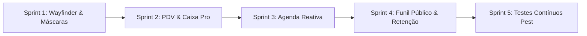

# Plano Estratégico de Melhorias e Correções Pós-Testes de Estresse
## Caldas Gestão | Ciclo de Refinamento e Blindagem Operacional

---

## 🧭 1. Contexto & Diagnóstico dos Testes de Estresse

Durante a execução da bateria de testes de estresse de ponta a ponta (E2E) no tenant isolado de testes em produção (`teste` / `matriz` em `https://gestao.caldasindica.com`), o sistema alcançou **100% de estabilidade técnica**, com **zero erros de JavaScript**, sem vazamento multitenant e com integridade transacional completa (comandas, estoque, movimentações de caixa e agendamento público).

No entanto, a convivência intensiva com os fluxos operacionais reais evidenciou **oportunidades chave de refinamento** que elevarão a velocidade operacional das barbearias e salões, a resiliência do código frontend e a conversão de novos agendamentos.

### Principais Fricções Observadas:
1. **Consistência de Rotas Wayfinder**: Ocorrência de URLs literais hardcoded (`/suppliers`, `/categories`) em `quick-create-dialogs.tsx` e oportunidade de padronizar todas as chamadas de formulários Inertia com o contrato `.form()` do Wayfinder.
2. **Ergonomia do Caixa & PDV**: Falta de máscaras monetárias automáticas nos campos de valor (obrigando digitação manual sem formatação) e ausência de atalhos rápidos de contagem de cédulas (+R$ 10, +R$ 20, +R$ 50, +R$ 100) e layout térmico (80mm/58mm) para impressoras de balcão.
3. **Reatividade da Agenda Interna**: Agendamentos realizados no funil público `/book` dependem de navegação ou atualização manual para aparecerem na grade do `/calendar`.
4. **Conversão Mobile no Autoagendamento**: O funil público `/book` carece de barra de ação inferior (bottom bar) persistente no mobile e de redirecionamento 1-clique para WhatsApp com mensagem pré-formatada.
5. **Automação Contínua (Blindagem)**: Os testes executados com sucesso no Playwright precisam ser consolidados em testes de feature no Pest PHP para execução contínua no CI/CD.

---

## 🎯 2. Divisão do Plano em Sprints

---

### 🚀 Sprint 1: Saneamento Arquitetural, Rotas Wayfinder & Máscaras Universais
**Foco**: Resiliência de rotas, eliminação de strings hardcoded e formatação padronizada de inputs.

- [ ] **Saneamento de `quick-create-dialogs.tsx`**:
  - Substituir `form.post('/suppliers', ...)` por `form.post(suppliers.store.url(), ...)`.
  - Substituir `form.post('/categories', ...)` por `form.post(categories.store.url(), ...)`.
  - Importar as rotas correspondentes de `@/routes/suppliers` e `@/routes/categories`.
- [ ] **Componente Padronizado `MoneyInput`**:
  - Criar componente baseado no `Input` do shadcn com formatação BRL em tempo real (ex: ao digitar `130`, formata dinamicamente para `R$ 130,00`).
  - Aplicar no Caixa Operacional (Abertura, Suprimento, Sangria, Fechamento), no cadastro de Serviços e Produtos.
- [ ] **Componente `PhoneInput` & `DocumentInput`**:
  - Máscara para WhatsApp/Celular `(99) 99999-9999` com limpeza automática de caracteres não numéricos antes da submissão.
  - Máscara para CPF `999.999.999-99` e CNPJ `99.999.999/9999-99` no cadastro de clientes e fornecedores.
- [ ] **Critérios de QA & Aceite**:
  - Tipagem 100% aprovada em `npm run types:check`.
  - Zero rotas literais string nos formulários operacionais.
  - Submissão sanitizada com valores numéricos íntegros recebidos pelo backend.

---

### 💵 Sprint 2: Ergonomia do Caixa & PDV de Alta Performance (POS Pro)
**Foco**: Velocidade na operação de balcão e impressão de comprovantes.

- [ ] **Atalhos Rápidos de Cédulas no Caixa**:
  - Adicionar chips clicáveis nos modais de Suprimento, Sangria e Fechamento de Caixa: `+R$ 10`, `+R$ 20`, `+R$ 50`, `+R$ 100` e botão `Limpar`, acelerando o fechamento em horários de pico.
- [ ] **Split Payments (Divisão de Pagamentos na Comanda)**:
  - Permitir liquidar uma comanda utilizando mais de uma forma de pagamento (ex: R$ 50,00 no PIX + R$ 60,00 no Cartão ou Dinheiro), com validação em tempo real do saldo restante.
- [ ] **Busca Rápida com Autocomplete no Lançamento de Itens**:
  - Campo de filtro em tempo real na gaveta de adicionar serviços e produtos, permitindo busca por nome ou código sem paginação manual.
- [ ] **Layout de Impressão Térmica (80mm / 58mm)**:
  - Adicionar folha de estilos `@media print` dedicada para o resumo de fechamento de turno (`/finance/cash/{id}`) e para o comprovante de comanda (`/sales/{id}`), adaptando a tipografia e corte para impressoras térmicas ESC/POS (Epson, Bematech, Elgin).
- [ ] **Critérios de QA & Aceite**:
  - Fechamento de turno simulado em menos de 10 segundos com os botões de atalho.
  - Comanda faturada com 2 formas de pagamento somando o valor exato.
  - Pré-visualização de impressão (Ctrl+P / Command+P) sem cortes laterais e com layout compacto de bobina.

---

### 📅 Sprint 3: Reatividade da Agenda & Gestão de Atendimento em Tempo Real
**Foco**: Sincronização instantânea e agilidade no fluxo de atendimento da barbearia.

- [ ] **Reatividade Automática da Grade de Agendamentos**:
  - Configurar polling suave via Inertia (`router.reload({ only: ['appointments', 'blocks'] })` a cada 30s) ou integração com WebSockets quando o usuário estiver na tela `/calendar`.
  - Novos agendamentos efetuados pelo cliente no funil público aparecem na tela dos profissionais sem necessidade de recarregar a página (`F5`).
- [ ] **Ação Rápida de Status no Card do Agendamento**:
  - Menu de contexto direto no card do agendamento para avançar de status com 1 clique: `Confirmar` ➔ `Marcar Presença` ➔ `Iniciar Atendimento` ➔ `Abrir Comanda`.
- [ ] **Badges de Alerta e Observações do Cliente**:
  - Exibir ícones semânticos de alerta no card da agenda quando o cliente possuir observações críticas cadastradas (ex: alergia a cosméticos, preferência de horário, histórico de faltas).
- [ ] **Critérios de QA & Aceite**:
  - Agendamento público criado em aba anônima reflete no calendário administrativo sem intervenção do operador.
  - Transição de status efetuada diretamente na grade sem recarregar o layout.

---

### 🌐 Sprint 4: Otimização do Funil Público de Agendamento (`/book`) & Retenção
**Foco**: Experiência do cliente final no smartphone e conversão de campanhas.

- [ ] **Bottom Bar Mobile Persistente no Agendamento Público**:
  - Barra inferior fixa para visualização em smartphones contendo o serviço selecionado, valor acumulado e botão destacado "Avançar para Horários" / "Finalizar Agendamento".
- [ ] **Comprovante 1-Clique com Envio para WhatsApp**:
  - Na tela de sucesso do agendamento (`/book/{tenant}/{unit}`), adicionar botão proeminente "Abrir no WhatsApp da Barbearia" com texto pré-formatado contendo data, horário, serviço e profissional, reduzindo o no-show (faltas).
- [ ] **Preview Dinâmico nas Campanhas de Retenção (`/retention/campaigns`)**:
  - Visualizador interativo em formato de tela de smartphone simulando a mensagem do WhatsApp com as tags dinâmicas substituídas (ex: `{nome}`, `{ultimo_servico}`, `{link_agendamento}`).
- [ ] **Critérios de QA & Aceite**:
  - Funil público navegável com 100% de usabilidade em viewport mobile (375x667 e 390x844).
  - Link de WhatsApp gerando deep link válido com mensagem decodificada perfeitamente.

---

### 🧪 Sprint 5: Automação Contínua & Blindagem contra Regressão (Pest Tests)
**Foco**: Garantir que as 5 áreas operacionais permaneçam blindadas contra regressões futuras.

- [ ] **Testes de Feature Pest para o Ciclo de Caixa**:
  - Teste de abertura de turno, suprimento, sangria e fechamento exato via requisição simulada no tenant de testes (`CashShiftTest.php`).
- [ ] **Testes de Feature Pest para Comandas & Baixa de Estoque**:
  - Teste cobrindo criação de comanda, adição de produto com decremento atômico de estoque e fechamento financeiro (`SaleOrderInventoryTest.php`).
- [ ] **Testes do Motor de Disponibilidade de Agendamento Online**:
  - Validação de que slots ocupados por agendamentos existentes ou bloqueios de intervalo são rigorosamente omitidos da API pública (`OnlineBookingAvailabilityTest.php`).
- [ ] **Critérios de QA & Aceite**:
  - Suíte completa rodando em `php artisan test --compact` com 100% de sucesso em menos de 5 segundos.

---

## 📋 Resumo das Fases e Governança

| Sprint | Prazo Estimado | Subagente Executor | Entregáveis Principais |
|---|---|---|---|
| **Sprint 1** | Curto | `frontend_developer` | Saneamento de rotas Wayfinder, `MoneyInput`, `PhoneInput`, `DocumentInput` |
| **Sprint 2** | Médio | `frontend_developer` | Atalhos de cédulas no Caixa, Split Payments, CSS Impressão Térmica 80mm |
| **Sprint 3** | Médio | `frontend_developer` | Polling/reatividade na Agenda, atalhos de status, badges de cliente |
| **Sprint 4** | Curto | `frontend_developer` | Mobile bottom bar no `/book`, botão WhatsApp, preview de retenção |
| **Sprint 5** | Curto | `backend_developer` / Pest | Testes automatizados de regressão cobrindo os 5 fluxos |

---

> [!TIP]
> **Recomendação de Execução**: Seguir estritamente o ciclo do projeto: Planejar ➔ Validar com o Usuário ➔ Dividir em Sprints ➔ Executar via subagentes delegados ➔ Testar em produção com o tenant `teste` ➔ Documentar em `/docs/`.
