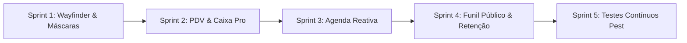

# Plano Estratégico de Melhorias e Correções Pós-Testes de Estresse
## Caldas Gestão | Ciclo de Refinamento e Blindagem Operacional

---

## 🧭 1. Contexto & Diagnóstico dos Testes de Estresse

Durante a execução da bateria de testes de estresse de ponta a ponta (E2E) no tenant isolado de testes em produção (`teste` / `matriz` em `https://gestao.caldasindica.com`), o sistema alcançou **100% de estabilidade técnica**, com **zero erros de JavaScript**, sem vazamento multitenant e com integridade transacional completa (comandas, estoque, movimentações de caixa e agendamento público).

No entanto, a convivência intensiva com os fluxos operacionais reais evidenciou **oportunidades chave de refinamento** que elevarão a velocidade operacional das barbearias e salões, a resiliência do código frontend e a conversão de novos agendamentos.

### Principais Fricções Observadas:
1. **Consistência de Rotas Wayfinder**: Ocorrência de URLs literais hardcoded (`/suppliers`, `/categories`) em `quick-create-dialogs.tsx` e oportunidade de padronizar todas as chamadas de formulários Inertia com o contrato `.form()` do Wayfinder.
2. **Ergonomia do Caixa & PDV**: Falta de máscaras monetárias automáticas nos campos de valor (obrigando digitação manual sem formatação) e ausência de atalhos rápidos de contagem de cédulas (+R$ 10, +R$ 20, +R$ 50, +R$ 100) e layout térmico (80mm/58mm) para impressoras de balcão.
3. **Reatividade da Agenda Interna**: Agendamentos realizados no funil público `/book` dependem de navegação ou atualização manual para aparecerem na grade do `/calendar`.
4. **Conversão Mobile no Autoagendamento**: O funil público `/book` carece de barra de ação inferior (bottom bar) persistente no mobile e de redirecionamento 1-clique para WhatsApp com mensagem pré-formatada.
5. **Automação Contínua (Blindagem)**: Os testes executados com sucesso no Playwright precisam ser consolidados em testes de feature no Pest PHP para execução contínua no CI/CD.

---

## 🎯 2. Divisão do Plano em Sprints

---

### 🚀 Sprint 1: Saneamento Arquitetural, Rotas Wayfinder & Máscaras Universais
**Foco**: Resiliência de rotas, eliminação de strings hardcoded e formatação padronizada de inputs.

- [ ] **Saneamento de `quick-create-dialogs.tsx`**:
  - Substituir `form.post('/suppliers', ...)` por `form.post(suppliers.store.url(), ...)`.
  - Substituir `form.post('/categories', ...)` por `form.post(categories.store.url(), ...)`.
  - Importar as rotas correspondentes de `@/routes/suppliers` e `@/routes/categories`.
- [ ] **Componente Padronizado `MoneyInput`**:
  - Criar componente baseado no `Input` do shadcn com formatação BRL em tempo real (ex: ao digitar `130`, formata dinamicamente para `R$ 130,00`).
  - Aplicar no Caixa Operacional (Abertura, Suprimento, Sangria, Fechamento), no cadastro de Serviços e Produtos.
- [ ] **Componente `PhoneInput` & `DocumentInput`**:
  - Máscara para WhatsApp/Celular `(99) 99999-9999` com limpeza automática de caracteres não numéricos antes da submissão.
  - Máscara para CPF `999.999.999-99` e CNPJ `99.999.999/9999-99` no cadastro de clientes e fornecedores.
- [ ] **Critérios de QA & Aceite**:
  - Tipagem 100% aprovada em `npm run types:check`.
  - Zero rotas literais string nos formulários operacionais.
  - Submissão sanitizada com valores numéricos íntegros recebidos pelo backend.

---

### 💵 Sprint 2: Ergonomia do Caixa & integração financeira do PDV
**Foco**: Velocidade de operação com rastreabilidade correta entre pagamento da comanda, meios de pagamento e turno de caixa.

- [ ] **Atalhos Rápidos de Cédulas no Caixa**:
  - Adicionar chips clicáveis nos modais de Suprimento, Sangria e Fechamento de Caixa: `+R$ 10`, `+R$ 20`, `+R$ 50`, `+R$ 100` e botão `Limpar`, acelerando o fechamento em horários de pico.
- [ ] **Split Payments (Divisão de Pagamentos na Comanda)**:
  - Permitir dividir o valor entre dinheiro, PIX, débito, crédito e permuta, mostrando total pago e saldo restante em tempo real.
  - Só concluir o recebimento quando a soma das parcelas for exatamente o total final da comanda/consolidação. Não aceitar valor acima do total nem marcar recebimento parcial como quitado nesta entrega.
  - Em pagamento em dinheiro, distinguir valor aplicado à comanda, valor entregue pelo cliente e troco. Exemplo: total R$ 10,00, cliente entrega R$ 14,00, troco R$ 4,00; registrar R$ 14,00 recebido, R$ 4,00 devolvido e entrada líquida de R$ 10,00. O troco é calculado, nunca digitado como valor independente.
- [ ] **Integração do recebimento com Caixa Operacional**:
  - Criar registro financeiro imutável por parcela recebida, ligado à sessão de fechamento, unidade e operador; não usar apenas um campo `payment_method` para representar pagamentos compostos.
  - Resolver o turno pelo operador autenticado e unidade ativa. Associar pagamentos ao turno que está aberto no momento do recebimento; nunca atribuir automaticamente a um turno fechado/anterior.
  - Para parcela em dinheiro, exigir turno aberto do operador. Sem turno aberto, oferecer “Abrir novo turno e continuar” ou “Voltar ao recebimento”; não concluir como pago em dinheiro sem registrar a entrada física. A comanda permanece pronta para cobrança enquanto a operação não for concluída.
  - PIX, cartões e permuta entram no demonstrativo por meio de pagamento, mas não alteram o saldo físico esperado da gaveta. Se houver turno aberto, ficam associados a ele para o resumo de recebimentos; sem turno aberto, permanecem no fechamento/relatório financeiro sem vínculo retroativo a turno.
  - Em pagamento misto, exigir turno aberto se qualquer parcela for em dinheiro; associar as parcelas ao turno atual e criar movimento físico `sale_inflow` apenas para o valor em dinheiro.
- [ ] **Demonstrativo do turno por natureza**:
  - Separar fundo inicial, vendas em dinheiro, suprimentos, sangrias/saídas e saldo físico esperado.
  - Exibir PIX, débito, crédito e permuta em totais independentes “recebido no turno”, fora do saldo físico contado.
  - Conferência final compara contagem física somente com o saldo esperado em dinheiro; os demais meios têm conciliação própria.
  - Na conferência, mostrar o total esperado em dinheiro como referência e permitir informar o total contado. Contagem assistida por cédulas/moedas pode ser oferecida como atalho opcional, somando ao total; nunca exigir uma composição específica de notas, porque diversas composições físicas são válidas.
- [ ] **Tratamento de exceções e histórico financeiro**:
  - Não permitir inserir movimento em turno encerrado nem editar/excluir parcela confirmada. Correções após o fechamento devem gerar estorno/ajuste compensatório com motivo, usuário, horário e referência ao lançamento original.
  - Migração de fechamentos antigos pode reconstruir o método e o valor registrados, mas não deve criar movimento em caixa histórico sem evidência de qual turno recebeu fisicamente o dinheiro.
  - Garantir idempotência e proteção de concorrência para não duplicar recebimentos/movimentos em reenvios ou fechamento simultâneo do turno.
- [ ] **Busca Rápida com Autocomplete no Lançamento de Itens**:
  - Campo de filtro em tempo real na gaveta de adicionar serviços e produtos, permitindo busca por nome ou código sem paginação manual.
- [ ] **Layout de Impressão Térmica (80mm / 58mm)**:
  - Adicionar folha de estilos `@media print` dedicada para o resumo de fechamento de turno (`/finance/cash/{id}`) e para o comprovante de comanda (`/sales/{id}`), adaptando a tipografia e corte para impressoras térmicas ESC/POS (Epson, Bematech, Elgin).
- [ ] **Critérios de QA & Aceite**:
  - Fechamento de turno simulado em menos de 10 segundos com os botões de atalho.
  - Comanda paga com duas ou mais formas, parcelas somando exatamente o total, exibidas corretamente no recibo e no relatório.
  - Dinheiro recebido com turno aberto aumenta o saldo físico exatamente uma vez; PIX/cartão/permuta não aumentam o dinheiro esperado.
  - Sem turno aberto, parcela em dinheiro não pode ser confirmada antes de abrir um novo turno; não há associação automática ao último turno fechado.
  - Pagamentos não monetários sem turno podem ser registrados sem alterar saldo físico e aparecem no relatório financeiro sem turno associado.
  - Fechamento do turno mostra divergência física apenas sobre o dinheiro contado e os recebimentos não monetários em quadro separado.
  - Pré-visualização de impressão (Ctrl+P / Command+P) sem cortes laterais e com layout compacto de bobina.

#### Regras de domínio e cenários cobertos

O fluxo atual (`FinalizeClosingSession`) persiste um único método na sessão/recibo e finaliza as comandas; não cria `CashMovement`. `OpenCashShift` e a liquidação de obrigações procuram o turno aberto do operador autenticado na unidade. `CashMovement` representa entradas/saídas físicas e `expected_amount_cents` é o saldo esperado da gaveta. Esta integração deve manter esses conceitos separados.

| Cenário | Regra proposta |
|---|---|
| Turno atual aberto; pagamento em dinheiro | Registrar parcela e movimento `sale_inflow` no turno atual, atomicamente com a confirmação do recebimento. |
| Pagamento em dinheiro com troco | Registrar valor entregue e troco para auditoria; a entrada líquida na gaveta e no saldo esperado equivale ao valor em dinheiro aplicado à comanda (ex.: +R$ 14,00 recebidos, -R$ 4,00 de troco, impacto líquido +R$ 10,00). |
| Turno atual aberto; PIX/cartão/permuta | Registrar parcelas para conciliação do turno, sem movimento que altere o saldo físico. |
| Pagamento misto com qualquer parcela em dinheiro | Exigir turno aberto; vincular parcelas ao turno atual, lançar como dinheiro somente a parcela física. |
| Sem turno aberto; pagamento totalmente não monetário | Permitir recebimento e fechamento, deixando-o fora de turnos encerrados e disponível no relatório financeiro. |
| Sem turno aberto; há parcela em dinheiro | Não confirmar o recebimento. Oferecer abertura de novo turno e continuação; se cancelar, manter a comanda pronta para cobrança. |
| Turno anterior encerrado | Não anexar novos recebimentos. Ajuste retroativo exige fluxo explícito, permissão, motivo e trilha de auditoria; fora do primeiro corte. |
| Reenvio, concorrência, falha parcial | Uma transação e chave idempotente garantem um único registro por recebimento; falha reverte parcelas, movimento e atualização do turno juntos. |
| Estorno de recebimento | Criar registro compensatório referenciando o original; preservar o histórico e ajustar o turno apenas se a correção pertencer ao turno ainda aberto. |
| Contagem de encerramento do turno | Conferir total físico contado contra saldo esperado em dinheiro; oferecer contagem por denominação como conveniência opcional e aceitar qualquer combinação que some ao valor informado. |

**Proposta de modelagem (a validar durante a implementação):** entidade de parcelas de pagamento da sessão de fechamento, com `tenant_id`, `unit_id`, `closing_session_id`, `cash_shift_id` anulável, método, `amount_cents` aplicado à venda, `tendered_cents` recebido para dinheiro, `change_cents` calculado, operador, horário e referência de estorno. `CashMovement` permanece como razão da movimentação física: apenas a entrada líquida da parcela em dinheiro cria `sale_inflow`. Valores seguem em centavos inteiros. Fechamentos legados sem turno comprovável não recebem movimentos retroativos.

**Fora do primeiro corte:** quitar parcialmente/deixar saldo devedor, atribuição manual a turno fechado, fundo compartilhado entre operadores e integração com adquirentes/bancos. Esses casos exigem estados, permissões e conciliação próprios; não devem ser simulados com lançamentos manuais em turnos fechados.

**Dependências para iniciar:** revisar as alterações locais existentes de método de pagamento da sessão/recibo e integrá-las sem descartá-las; decidir, com base no fluxo real do estabelecimento, se o caixa é individual por operador (comportamento atual) ou compartilhado por unidade. O padrão inicial recomendado é manter individual por operador.

---

### 📅 Sprint 3: Reatividade da Agenda & Gestão de Atendimento em Tempo Real
**Foco**: Sincronização instantânea e agilidade no fluxo de atendimento da barbearia.

- [ ] **Reatividade Automática da Grade de Agendamentos**:
  - Configurar polling suave via Inertia (`router.reload({ only: ['appointments', 'blocks'] })` a cada 30s) ou integração com WebSockets quando o usuário estiver na tela `/calendar`.
  - Novos agendamentos efetuados pelo cliente no funil público aparecem na tela dos profissionais sem necessidade de recarregar a página (`F5`).
- [ ] **Ação Rápida de Status no Card do Agendamento**:
  - Menu de contexto direto no card do agendamento para avançar de status com 1 clique: `Confirmar` ➔ `Marcar Presença` ➔ `Iniciar Atendimento` ➔ `Abrir Comanda`.
- [ ] **Badges de Alerta e Observações do Cliente**:
  - Exibir ícones semânticos de alerta no card da agenda quando o cliente possuir observações críticas cadastradas (ex: alergia a cosméticos, preferência de horário, histórico de faltas).
- [ ] **Critérios de QA & Aceite**:
  - Agendamento público criado em aba anônima reflete no calendário administrativo sem intervenção do operador.
  - Transição de status efetuada diretamente na grade sem recarregar o layout.

---

### 🌐 Sprint 4: Otimização do Funil Público de Agendamento (`/book`) & Retenção
**Foco**: Experiência do cliente final no smartphone e conversão de campanhas.

- [ ] **Bottom Bar Mobile Persistente no Agendamento Público**:
  - Barra inferior fixa para visualização em smartphones contendo o serviço selecionado, valor acumulado e botão destacado "Avançar para Horários" / "Finalizar Agendamento".
- [ ] **Comprovante 1-Clique com Envio para WhatsApp**:
  - Na tela de sucesso do agendamento (`/book/{tenant}/{unit}`), adicionar botão proeminente "Abrir no WhatsApp da Barbearia" com texto pré-formatado contendo data, horário, serviço e profissional, reduzindo o no-show (faltas).
- [ ] **Preview Dinâmico nas Campanhas de Retenção (`/retention/campaigns`)**:
  - Visualizador interativo em formato de tela de smartphone simulando a mensagem do WhatsApp com as tags dinâmicas substituídas (ex: `{nome}`, `{ultimo_servico}`, `{link_agendamento}`).
- [ ] **Critérios de QA & Aceite**:
  - Funil público navegável com 100% de usabilidade em viewport mobile (375x667 e 390x844).
  - Link de WhatsApp gerando deep link válido com mensagem decodificada perfeitamente.

---

### 🧪 Sprint 5: Automação Contínua & Blindagem contra Regressão (Pest Tests)
**Foco**: Garantir que as 5 áreas operacionais permaneçam blindadas contra regressões futuras.

- [ ] **Testes de Feature Pest para o Ciclo de Caixa**:
  - Teste de abertura de turno, suprimento, sangria e fechamento exato via requisição simulada no tenant de testes (`CashShiftTest.php`).
- [ ] **Testes de Feature Pest para Comandas & Baixa de Estoque**:
  - Teste cobrindo criação de comanda, adição de produto com decremento atômico de estoque e fechamento financeiro (`SaleOrderInventoryTest.php`).
- [ ] **Testes do Motor de Disponibilidade de Agendamento Online**:
  - Validação de que slots ocupados por agendamentos existentes ou bloqueios de intervalo são rigorosamente omitidos da API pública (`OnlineBookingAvailabilityTest.php`).
- [ ] **Critérios de QA & Aceite**:
  - Suíte completa rodando em `php artisan test --compact` com 100% de sucesso em menos de 5 segundos.

---

## 📋 Resumo das Fases e Governança

| Sprint | Prazo Estimado | Subagente Executor | Entregáveis Principais |
|---|---|---|---|
| **Sprint 1** | Curto | `frontend_developer` | Saneamento de rotas Wayfinder, `MoneyInput`, `PhoneInput`, `DocumentInput` |
| **Sprint 2** | Médio | `frontend_developer` / `backend_developer` / Pest | Recebimento dividido, integração auditável com turno, relatórios separados por dinheiro e meios eletrônicos, atalhos de cédulas, impressão térmica |
| **Sprint 3** | Médio | `frontend_developer` | Polling/reatividade na Agenda, atalhos de status, badges de cliente |
| **Sprint 4** | Curto | `frontend_developer` | Mobile bottom bar no `/book`, botão WhatsApp, preview de retenção |
| **Sprint 5** | Curto | `backend_developer` / Pest | Testes automatizados de regressão cobrindo os 5 fluxos |

---

> [!TIP]
> **Recomendação de Execução**: Seguir estritamente o ciclo do projeto: Planejar ➔ Validar com o Usuário ➔ Dividir em Sprints ➔ Executar via subagentes delegados ➔ Testar em produção com o tenant `teste` ➔ Documentar em `/docs/`.
