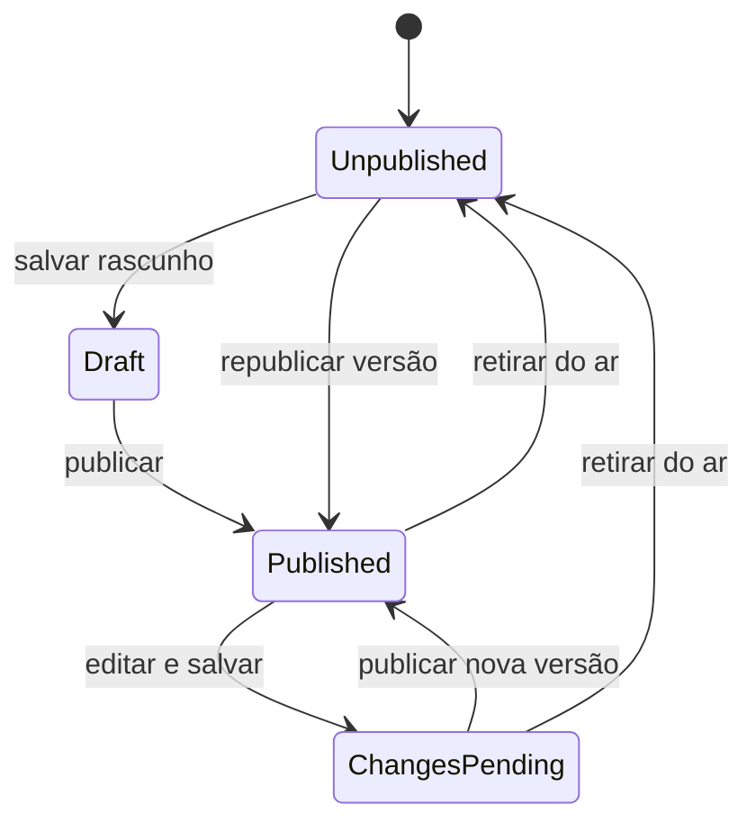

# Plano de implementação — reformulação completa do Agendamento Online

- **Status:** pronto para execução
- **Escopo administrativo:** `/online-booking`
- **Escopo público:** `/book/{public_slug}` e domínio público personalizado
- **Executor padrão:** subagentes `gpt-5.6-luna`
- **Objetivo:** transformar a configuração atual em uma central simples de construção, visualização, publicação e divulgação da página pública de agendamento.

## 1. Resultado esperado

O módulo deve funcionar como um mini construtor de site baseado em template. O usuário edita seções controladas, visualiza o resultado real em desktop e mobile, salva alterações como rascunho e decide quando disponibilizá-las aos clientes. A página pública continua rápida, acessível e independente do painel administrativo.

Ao final, o usuário deve conseguir:

1. entender imediatamente se a página está publicada;
2. editar conteúdo sem alterar a versão que clientes estão vendo;
3. visualizar um preview fiel do rascunho;
4. publicar, atualizar ou retirar a página do ar;
5. selecionar um domínio público ativo;
6. configurar o endereço e copiar o link canônico;
7. gerar links de divulgação com parâmetros UTM;
8. escolher serviços, profissionais e horários disponíveis;
9. consultar o histórico de publicações;
10. restaurar uma publicação anterior como novo rascunho.

## 2. Diagnóstico da implementação atual

### 2.1 Comportamento observado

- `OnlineBookingSettingsController@index` carrega unidade, configuração, galeria, serviços, profissionais, prontidão e URLs.
- `UpdateOnlineBookingSettings` atualiza configuração, flags de serviços/profissionais e ativação da unidade em uma única operação.
- `OnlineBookingSetting` é simultaneamente o documento editável e a fonte consumida pela página pública.
- A interface `resources/js/pages/online-booking/index.tsx` concentra detalhes, configurações, link, galeria, serviços, horários e confirmação em uma página extensa.
- O preview administrativo é uma representação interna e não garante fidelidade total com `resources/js/pages/public-booking/show.tsx`.
- O link personalizado já pode apontar para um `TenantDomain` público ativo.
- A concorrência é protegida por `lock_version`, mas a experiência atual pode responder com conflito quando uma aba fica desatualizada.

### 2.2 Problemas de produto

- O usuário não distingue claramente “salvo” de “publicado”.
- Qualquer alteração na configuração compartilhada pode afetar a página pública.
- A prontidão técnica aparece misturada com a edição de conteúdo.
- O endereço público, o domínio e o slug exigem conhecimento técnico.
- O preview não é a própria página pública renderizada com o rascunho.
- Não existe uma versão imutável que represente exatamente o que foi publicado.
- Não existe histórico, restauração nem atribuição da publicação a um usuário.
- Não existe uma área própria para campanhas, UTM e mensuração de origem.

## 3. Princípios de produto e UX

1. **Estado sempre visível:** o cabeçalho informa `Não publicada`, `Rascunho`, `Publicada` ou `Alterações para publicar`.
2. **Publicação intencional:** salvar conteúdo não altera automaticamente a experiência pública.
3. **Preview fiel:** rascunho e publicação usam o mesmo renderer e o mesmo contrato de dados.
4. **Linguagem simples:** usar “Endereço da página”, “Página publicada” e “Retirar do ar”; manter “slug”, “snapshot” e “UTM” em ajuda contextual ou opções avançadas.
5. **Template controlado:** permitir editar conteúdo, visibilidade e ordem segura das seções; não oferecer posicionamento livre de elementos.
6. **Mobile primeiro:** edição administrativa utilizável em telas pequenas e página pública otimizada para contratação rápida.
7. **Ação recuperável:** publicação anterior nunca é sobrescrita; restauração cria novo rascunho.
8. **Carregamento progressivo:** dados essenciais chegam primeiro; galeria, histórico, analytics e preview podem ser adiados.
9. **Tenant e unidade explícitos:** todo documento, publicação, campanha e token pertence a tenant e unidade.

## 4. Arquitetura de informação proposta

### 4.1 Página inicial do módulo

`/online-booking` passa a ser uma visão geral com:

- status da página e última publicação;
- endereço público e domínio atual;
- checklist de prontidão;
- miniatura da publicação atual;
- aviso de alterações pendentes;
- ações `Editar página`, `Visualizar`, `Publicar alterações`, `Compartilhar` e `Retirar do ar`;
- métricas básicas de visitas e conversões, quando estiverem disponíveis.

### 4.2 Rotas administrativas propostas

| Rota | Finalidade |
|---|---|
| `/online-booking` | visão geral e estado da publicação |
| `/online-booking/editor` | edição do rascunho por seções |
| `/online-booking/preview` | moldura administrativa de preview |
| `/online-booking/links` | link oficial e links de divulgação |
| `/online-booking/publications` | histórico de publicações |

O backend deve usar rotas nomeadas e o frontend deve acessá-las por Wayfinder.

### 4.3 Seções do template inicial

1. identidade e tema;
2. capa e apresentação;
3. serviços;
4. profissionais;
5. galeria;
6. horários e disponibilidade;
7. localização e contatos;
8. redes sociais;
9. confirmação e instruções finais;
10. SEO e compartilhamento.

Cada seção possui `enabled`, conteúdo validado e uma posição permitida pelo template. Serviços, profissionais, preços e durações continuam vindo das entidades operacionais; o rascunho guarda seleção, ordem e apresentação, não uma cópia editável dos cadastros.

## 5. Estados e regras de publicação

### 5.1 Vocabulário apresentado ao usuário

| Estado interno | Texto da interface | Significado |
|---|---|---|
| `unpublished` | Não publicada | nenhuma versão está disponível ao público |
| `draft` | Rascunho | existe conteúdo salvo, sem publicação ativa |
| `published` | Publicada | rascunho e publicação ativa são equivalentes |
| `changes_pending` | Alterações para publicar | existe publicação ativa e o rascunho foi alterado |

`changes_pending` pode ser calculado comparando `draft_revision` com `published_from_revision`; não precisa ser persistido como estado independente.

### 5.2 Máquina de estados



### 5.3 Invariantes

- Uma unidade possui no máximo um rascunho atual.
- Uma unidade possui no máximo uma publicação ativa.
- Uma publicação é imutável.
- O público lê somente a publicação ativa.
- O preview lê o rascunho solicitado por um token assinado e temporário.
- Publicar exige checklist mínimo válido: unidade ativa, serviço elegível, profissional elegível, vínculo serviço-profissional e endereço público resolvível.
- O domínio selecionado deve pertencer ao tenant, ser do tipo público e estar ativo.
- Slug deve ser único no escopo necessário para resolver a rota sem ambiguidade.
- Publicar e retirar do ar usam idempotência, transação e bloqueio pessimista ou versão otimista.
- Restauração copia uma publicação para o rascunho; não altera o registro histórico.

## 6. Modelo de dados proposto

### 6.1 `online_booking_sites`

Raiz de configuração por unidade.

- `id` UUID;
- `tenant_id` UUID indexado;
- `unit_id` UUID com unicidade;
- `public_domain_id` UUID nullable;
- `public_slug` varchar;
- `template_key` varchar, inicialmente `essential`;
- `status` enum/string: `unpublished` ou `published`;
- `draft_revision` bigint;
- `active_publication_id` UUID nullable;
- `published_at` timestamptz nullable;
- `unpublished_at` timestamptz nullable;
- `lock_version` bigint;
- timestamps.

### 6.2 `online_booking_drafts`

Documento editável da unidade.

- `id`, `tenant_id`, `unit_id`, `site_id`;
- `revision` bigint;
- `content` jsonb;
- `content_hash` char(64);
- `updated_by` UUID;
- timestamps;
- unicidade por `site_id`.

O JSON deve possuir schema versionado e DTO próprio. Estrutura inicial sugerida:

```json
{
  "schema_version": 1,
  "theme": {},
  "seo": {},
  "sections": [],
  "service_ids": [],
  "professional_ids": [],
  "public_hours": {},
  "booking_policy": {}
}
```

### 6.3 `online_booking_publications`

Snapshot imutável consumido pela página pública.

- `id`, `tenant_id`, `unit_id`, `site_id`;
- `version` bigint;
- `source_revision` bigint;
- `content` jsonb;
- `content_hash` char(64);
- `template_key` varchar;
- `public_domain_id` UUID nullable;
- `public_slug` varchar;
- `published_by` UUID;
- `published_at` timestamptz;
- `superseded_at` timestamptz nullable;
- timestamps somente quando necessários à convenção do projeto.

Índices: `(tenant_id, unit_id, version)`, `(site_id, published_at desc)` e resolução do endereço público.

### 6.4 `online_booking_campaign_links`

- `id`, `tenant_id`, `unit_id`, `site_id`;
- `name`;
- `utm_source`, `utm_medium`, `utm_campaign`, `utm_term`, `utm_content`;
- `short_code` nullable e único;
- `is_active`;
- `created_by`;
- timestamps.

O link canônico permanece limpo. UTMs são acrescentadas somente ao link de divulgação.

### 6.5 Analytics mínimo

Criar apenas após definir retenção e volume:

- `online_booking_visits`: identificador anônimo, publicação, campanha, landing path, referer normalizado, UTM, timestamp e consentimento quando aplicável;
- adicionar `campaign_link_id` e campos UTM normalizados ao agendamento criado pelo canal público ou a uma entidade de atribuição ligada ao agendamento.

Não armazenar IP bruto indefinidamente. Definir hash rotativo, retenção e anonimização conforme LGPD.

## 7. Contratos de backend

### 7.1 Queries

- `GET online_booking.index`: resumo, status, checklist e publicação ativa.
- `GET online_booking.editor`: rascunho e catálogos necessários ao editor.
- `GET online_booking.publications.index`: histórico paginado.
- `GET online_booking.campaign_links.index`: campanhas paginadas.

Usar props opcionais/deferred do Inertia para histórico, galeria pesada e métricas.

### 7.2 Commands

- `PATCH online_booking.draft.update` — salva rascunho com `lock_version` e `draft_revision`.
- `POST online_booking.publish` — valida prontidão, cria snapshot e troca publicação ativa atomicamente.
- `POST online_booking.unpublish` — retira a versão ativa do ar sem apagá-la.
- `POST online_booking.publications.restore` — copia snapshot histórico para novo rascunho.
- CRUD de links de campanha.
- endpoint para criar/renovar preview assinado.

Cada mutação deve usar Form Request, Policy/Gate, Action, `OperationalMutation`, chave de idempotência e evento operacional conforme as convenções existentes.

### 7.3 Eventos

- `online_booking.draft_saved`;
- `online_booking.published`;
- `online_booking.unpublished`;
- `online_booking.publication_restored`;
- `online_booking.campaign_link_created`;
- `online_booking.public_visit_recorded`;
- `online_booking.appointment_attributed`.

Eventos e logs não devem conter telefone, token de preview ou payload completo do cliente.

### 7.4 Migração e compatibilidade

1. Criar novas tabelas e DTOs sem alterar a leitura pública.
2. Converter cada `online_booking_settings` existente em `site` + `draft`.
3. Para unidades atualmente públicas, criar publicação inicial com o mesmo conteúdo.
4. Manter o registro legado durante a estabilização.
5. Alterar a leitura pública para a publicação ativa por feature flag.
6. Comparar respostas do renderer legado e do novo renderer em testes.
7. Remover escrita legada somente após uma versão estável em produção.
8. Planejar remoção da tabela/campos legados em migration posterior e reversível.

Nenhuma migration deve tentar baixar imagens externas. Referências existentes do MinIO/S3 devem ser reaproveitadas.

## 8. Arquitetura do frontend

### 8.1 Componentes administrativos

Criar componentes pequenos e reutilizáveis, evitando manter toda a funcionalidade em `index.tsx`:

```text
resources/js/features/online-booking/
├── components/
│   ├── publication-status.tsx
│   ├── readiness-checklist.tsx
│   ├── public-address-card.tsx
│   ├── editor-navigation.tsx
│   ├── editor-toolbar.tsx
│   ├── preview-frame.tsx
│   ├── section-card.tsx
│   ├── publish-dialog.tsx
│   └── unpublish-dialog.tsx
├── editor/
│   ├── identity-section.tsx
│   ├── hero-section.tsx
│   ├── services-section.tsx
│   ├── professionals-section.tsx
│   ├── gallery-section.tsx
│   ├── hours-section.tsx
│   ├── contact-section.tsx
│   ├── confirmation-section.tsx
│   └── seo-section.tsx
├── types.ts
└── schema.ts
```

Antes de criar componentes genéricos, procurar equivalentes em `resources/js/components/operational` e `resources/js/components/ui`.

### 8.2 Layout desktop

- cabeçalho fixo no conteúdo com status, feedback de salvamento, preview e publicação;
- navegação de seções à esquerda;
- formulário da seção no centro;
- preview opcional à direita em telas largas;
- em notebooks, preview abre em drawer ou nova aba para preservar espaço;
- largura e densidade devem permitir edição confortável entre 1024 e 1440 px.

### 8.3 Layout mobile

- visão geral em uma coluna;
- seções apresentadas como lista navegável;
- cada seção abre em página ou sheet de tela cheia;
- barra inferior fixa com `Salvar` e `Visualizar`;
- publicação permanece em ação separada e exige confirmação;
- inputs com pelo menos 44 px de alvo;
- upload e recorte de imagem utilizáveis por toque;
- nenhuma ação essencial depende de hover.

### 8.4 Feedback e prevenção de perda

- indicar `Salvando`, `Salvo agora`, `Falha ao salvar` e `Alterações não salvas`;
- avisar antes de sair quando houver mudanças locais;
- atualizar `lock_version` e revisão após cada salvamento bem-sucedido;
- conflito retorna dados atuais e oferece `Recarregar versão atual`; não exibir página de erro 409;
- publicação mostra o conjunto de alterações e checklist antes da confirmação;
- despublicação usa o texto `Retirar página do ar` e explica que o rascunho e o histórico serão preservados.

### 8.5 Renderer compartilhado

Extrair a composição visual da página pública para componentes puros utilizados por:

- página pública publicada;
- preview do rascunho;
- miniatura administrativa.

O preview não deve duplicar regras de layout ou formatos de dados. Criar um DTO TypeScript único para o documento renderizável.

## 9. Desempenho e velocidade de carregamento

### 9.1 Orçamentos

Metas em dispositivo móvel intermediário e rede simulada 4G:

- página pública: LCP até 2,5 s no percentil 75;
- INP até 200 ms;
- CLS até 0,1;
- JavaScript inicial específico da página pública até 140 kB gzip, excluindo cache compartilhado quando medido separadamente;
- imagem de capa responsiva preferencialmente abaixo de 180 kB;
- miniaturas de serviço preferencialmente abaixo de 40 kB;
- resposta HTML/JSON pública com cache quente abaixo de 300 ms no servidor;
- editor administrativo interativo em até 3 s em 4G, com partes secundárias adiadas.

### 9.2 Imagens

- armazenar no MinIO/S3 por meio do disk de mídia;
- converter uploads para WebP e, quando suportado pelo pipeline, AVIF;
- preservar original apenas se houver requisito explícito de reprocessamento;
- gerar variantes: thumbnail quadrada, card, hero mobile e hero desktop;
- usar `srcset`, `sizes`, largura/altura e `loading="lazy"` fora da dobra;
- priorizar apenas a imagem LCP;
- aplicar recorte 1:1 para serviços e recorte editorial configurável para capa;
- manter foco do recorte como metadado para renderizações responsivas.

### 9.3 Backend e cache

- carregar somente colunas e relações necessárias;
- impedir N+1 em serviços/profissionais/imagens;
- cachear o documento público resolvido por `publication_id` e invalidar na publicação/despublicação;
- usar ETag ou `Last-Modified` baseado no snapshot imutável;
- permitir cache público curto para HTML e longo, imutável, para mídia versionada;
- não consultar o rascunho em requisições públicas;
- registrar visitas fora do caminho crítico, por fila ou escrita assíncrona;
- índices devem cobrir hostname, slug, publicação ativa e disponibilidade.

### 9.4 Frontend

- dividir bundles por página e carregar editor de cada seção sob demanda;
- adiar galeria, histórico, analytics e QR Code;
- evitar bibliotecas novas quando APIs existentes resolvem o caso;
- usar skeleton somente para conteúdo realmente adiado;
- não buscar disponibilidade antes de serviço, profissional e data estarem definidos;
- preservar respostas recentes de disponibilidade por chave curta e invalidar após mudança relevante.

## 10. Acessibilidade e qualidade visual

- hierarquia de headings coerente;
- foco visível e ordem de teclado previsível;
- labels e descrições associadas aos campos;
- status não comunicado apenas por cor;
- dialogs com título, descrição, foco inicial e retorno de foco;
- mensagens de salvamento e publicação anunciadas com região `aria-live`;
- contraste mínimo WCAG AA;
- preview com nome acessível e seletor de viewport operável por teclado;
- validações próximas do campo e resumo navegável no topo;
- respeitar `prefers-reduced-motion`;
- testar zoom de 200% e larguras de 320, 375, 768, 1024 e 1440 px.

## 11. Plano por sprints

Cada sprint deve terminar em um commit próprio, testes do escopo passando e documentação deste arquivo atualizada com decisões tomadas. O agente raiz coordena; a implementação deve ser delegada a subagentes `gpt-5.6-luna` com escopos sem sobreposição. Não usar `gpt-5.6-sol`.

### Sprint 0 — auditoria e contrato de produto

**Objetivo:** congelar o comportamento existente e transformar a proposta em contratos verificáveis.

**Tarefas:**

- mapear controller, actions, requests, policies, models, rotas e página pública;
- registrar payload atual e estados de prontidão;
- inventariar campos legados e sua origem;
- desenhar wireframes desktop/mobile da visão geral, editor e preview;
- definir JSON Schema/DTO do documento público v1;
- escrever ADR para rascunho + snapshot de publicação;
- definir feature flags e estratégia de migração;
- medir baseline de queries, payload, bundle e Web Vitals.

**Critérios de aceite:**

- contrato v1 cobre todos os dados públicos atuais;
- nenhuma configuração existente fica sem mapeamento;
- baseline é reproduzível;
- decisões abertas estão registradas antes da criação das tabelas.

### Sprint 1 — domínio de publicação e persistência

**Objetivo:** criar a base de rascunho e publicações imutáveis.

**Tarefas:**

- criar enums, models, factories e migrations;
- criar DTOs de conteúdo e normalização por `schema_version`;
- criar `SaveOnlineBookingDraft`, `PublishOnlineBookingSite`, `UnpublishOnlineBookingSite` e `RestoreOnlineBookingPublication`;
- aplicar escopo tenant/unidade, policies, idempotência, eventos e concorrência;
- criar backfill idempotente da configuração legada;
- manter leitura pública atual nesta sprint.

**Testes necessários:**

- isolamento entre tenants;
- criação e atualização de rascunho;
- publicação imutável e incremento de versão;
- conflito de revisão;
- publicação idempotente;
- despublicação e republicação;
- restauração sem alteração do histórico;
- rejeição de domínio inválido ou de outro tenant.

**Critério de aceite:** banco novo preenchido e consistente sem mudar o comportamento público.

### Sprint 2 — API administrativa e visão geral

**Objetivo:** substituir a página inicial extensa por uma central de publicação clara.

**Tarefas:**

- criar queries/Actions de resumo e prontidão;
- dividir rotas de resumo, editor, publicação e histórico;
- implementar novo `/online-booking` com status, endereço, checklist e ações;
- usar props deferred para histórico/métricas;
- implementar dialogs de publicar e retirar do ar;
- garantir tratamento recuperável de conflito e erro de validação.

**Critérios de aceite:**

- estado da página é compreendido sem abrir o editor;
- publicar/despublicar funciona por teclado e mobile;
- nenhuma resposta de conflito mostra a página genérica 409;
- ações sem permissão são negadas no servidor.

### Sprint 3 — editor por seções

**Objetivo:** entregar o mini construtor baseado no template `essential`.

**Tarefas:**

- extrair componentes do arquivo monolítico atual;
- implementar navegação por seções e toolbar;
- criar edição de identidade, capa, serviços, profissionais, galeria, horários, contato, confirmação e SEO;
- implementar visibilidade e ordenação permitida das seções;
- salvar rascunho com feedback e proteção contra perda;
- adaptar upload, crop e variantes de imagem;
- manter cadastros operacionais como fonte de preço, duração e disponibilidade.

**Critérios de aceite:**

- todas as configurações atuais podem ser editadas no novo fluxo;
- salvar rascunho não muda a publicação ativa;
- editor funciona de 320 a 1440 px;
- upload produz variantes leves no MinIO/S3;
- foco, erros e feedback são acessíveis.

### Sprint 4 — renderer único e preview fiel

**Objetivo:** usar a mesma interface para preview e página publicada.

**Tarefas:**

- extrair renderer compartilhado da página pública;
- criar resolução de publicação ativa;
- criar preview por URL assinada e expiração curta;
- adicionar barra de contexto `Visualização do rascunho`;
- criar seletor de viewport desktop/mobile;
- impedir indexação e cache público do preview;
- definir modo de teste que não cria agendamento real.

**Critérios de aceite:**

- preview e página pública têm paridade visual para o mesmo documento;
- token expirado ou de outro tenant não abre conteúdo;
- preview não aparece em mecanismos de busca;
- teste de agendamento em preview não polui a agenda de produção.

### Sprint 5 — corte da leitura pública e desempenho

**Objetivo:** servir exclusivamente snapshots publicados com desempenho previsível.

**Tarefas:**

- ativar novo resolver público por feature flag;
- suportar host oficial, slug e domínio público personalizado;
- cachear publicação resolvida e configurar invalidação;
- otimizar eager loading, payload e variantes de imagem;
- aplicar metatags, Open Graph, canonical e dados estruturados adequados;
- adicionar estados 404/não publicada amigáveis;
- medir e corrigir LCP, CLS, INP, queries e tamanho do bundle.

**Critérios de aceite:**

- página pública nunca lê o rascunho;
- links existentes continuam funcionando ou redirecionam permanentemente para o endereço canônico;
- metas de desempenho da seção 9 são atingidas em ambiente controlado;
- rollback da feature flag restaura a leitura anterior.

### Sprint 6 — links de divulgação e UTM

**Objetivo:** permitir compartilhamento rastreável sem alterar o link canônico.

**Tarefas:**

- criar CRUD de campanhas;
- oferecer presets para Instagram, WhatsApp, Google e campanha personalizada;
- gerar URL, copiar link e QR Code sob demanda;
- validar e normalizar parâmetros UTM;
- preservar atribuição durante todo o fluxo de agendamento;
- registrar atribuição no agendamento confirmado;
- aplicar retenção e anonimização definidas na Sprint 0.

**Critérios de aceite:**

- link canônico permanece sem UTM;
- campanha identifica agendamentos originados por ela;
- UTMs inválidas não geram URLs quebradas;
- analytics não aumenta perceptivelmente o tempo da resposta pública.

### Sprint 7 — histórico, restauração e acabamento

**Objetivo:** tornar publicação auditável e recuperável.

**Tarefas:**

- listar versões com autor, data, domínio e resumo das mudanças;
- visualizar snapshot histórico;
- restaurar versão como novo rascunho;
- apresentar diff resumido antes de publicar;
- revisar textos, estados vazios, erros e confirmações;
- realizar auditoria de acessibilidade e responsividade.

**Critérios de aceite:**

- restauração nunca altera snapshots antigos;
- usuário consegue identificar qual versão está no ar;
- fluxos críticos passam por teclado e viewport mobile;
- textos evitam termos técnicos sem explicação.

### Sprint 8 — rollout, observabilidade e remoção gradual do legado

**Objetivo:** liberar a experiência nova com segurança operacional.

**Tarefas:**

- liberar por tenant piloto;
- monitorar erros, latência, publicação, conversão e falhas de mídia;
- executar smoke tests em host oficial e domínio personalizado;
- confirmar migrations e jobs no ambiente de deploy;
- migrar todos os tenants;
- interromper escrita no modelo legado;
- abrir tarefa separada para remoção definitiva após período de estabilidade.

**Critérios de aceite:**

- nenhum tenant perde a página existente;
- publicação e agendamento público possuem logs e métricas suficientes para diagnóstico;
- rollback foi ensaiado;
- remoção do legado não ocorre no mesmo deploy do corte de leitura.

## 12. Estratégia de testes

### Backend com Pest

- feature tests para commands, rotas, policies, validação e isolamento;
- testes de estado e concorrência com revisão desatualizada;
- testes de idempotência de publicação e agendamento;
- testes de resolução por slug, host oficial e domínio personalizado;
- testes de backfill e compatibilidade;
- teste de número máximo de queries para payload público representativo;
- teste de URL assinada e expiração do preview.

### Frontend e browser

- TypeScript, ESLint, Prettier e build;
- componentes para estados de publicação e erros de formulário;
- Playwright para salvar rascunho, preview, publicar, despublicar e restaurar;
- Playwright em 375x812, 768x1024, 1024x768 e 1440x900;
- smoke público com seleção de serviço, profissional, data, horário e confirmação;
- axe ou verificação equivalente nos fluxos principais, se já disponível sem adicionar dependência;
- Lighthouse controlado para orçamento da página pública.

### Gates por sprint

Executar somente checks relevantes durante desenvolvimento e todos os checks do CI antes do push:

```bash
vendor/bin/pint --dirty --format agent
php artisan test --compact <arquivos afetados>
npm run format:check
npm run lint:check
npm run types:check
npm run build
graphify update .
```

O ESLint deve ignorar `.worktrees`, `vendor`, builds e artefatos, evitando resultados de checkouts auxiliares.

## 13. Protocolo de execução para GPT Lua

1. Ler `AGENTS.md`, `.ai/rules/index.md` quando existir e todas as regras aplicáveis.
2. Consultar `graphify query` antes de navegar amplamente pelo código.
3. Ativar as skills de Laravel, Inertia React, Tailwind, Wayfinder e Pest conforme o escopo.
4. Confirmar versões instaladas antes de usar APIs de framework.
5. Trabalhar em worktree própria por sprint e nunca misturar alterações preexistentes.
6. O agente raiz atua como orquestrador; delegar implementação a subagentes `gpt-5.6-luna` com arquivos e entregáveis delimitados.
7. Não executar duas tarefas concorrentes nos mesmos arquivos.
8. Implementar uma sprint por vez; não antecipar tabelas, componentes ou dependências de sprint futura sem necessidade comprovada.
9. Usar `php artisan make:* --no-interaction` para arquivos Laravel.
10. Usar Wayfinder para toda chamada frontend → backend.
11. Não adicionar dependências sem decisão registrada e autorização.
12. Escrever ou atualizar testes que comprovem regras de domínio e fluxos de risco.
13. Rodar Pint após qualquer alteração PHP e formatar o TSX antes do commit.
14. Atualizar o Graphify depois das alterações.
15. Criar commit pequeno, descritivo e exclusivo da sprint.
16. No handoff, informar comportamento entregue, testes, métricas, riscos e próxima sprint desbloqueada.

## 14. Definição de pronto global

A reformulação estará concluída quando:

- a página pública for sempre derivada de uma publicação imutável;
- o usuário puder editar e salvar sem afetar clientes;
- publicar, retirar do ar e restaurar estiverem auditados e protegidos por permissão;
- preview e produção usarem o mesmo renderer;
- domínio personalizado e links existentes funcionarem;
- links UTM preservarem atribuição até o agendamento;
- editor e página pública funcionarem bem em mobile e desktop;
- metas de carregamento forem verificadas;
- migrations, backfill e rollback estiverem testados;
- o legado estiver sem escrita e com remoção planejada;
- CI, testes de browser e smoke de produção passarem.

## 15. Fora do escopo desta reformulação

- editor livre com drag-and-drop em coordenadas;
- marketplace de templates;
- edição direta de preço e duração dentro do construtor;
- automação de campanhas pagas;
- analytics avançado com atribuição multitoque;
- remoção imediata da estrutura legada no primeiro deploy.

Esses itens podem ser avaliados depois que o template inicial, a publicação versionada e a mensuração básica estiverem estáveis.

