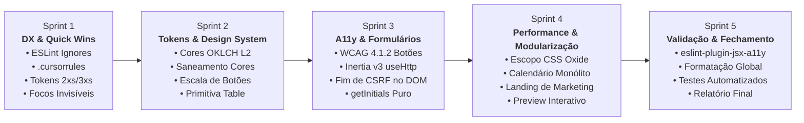

# Relatório Final Consolidado — Modernização Frontend Caldas Gestão (2025)

## 1. Resumo Executivo das 5 Sprints Concluídas

A iniciativa de Modernização Frontend do **Caldas Gestão** foi estruturada e executada ao longo de 5 sprints sequenciais focadas em robustez arquitetural, acessibilidade (WCAG 2.2 AA), experiência do desenvolvedor (DX), performance de entrega CSS e padronização visual completa:



### Sprint 1 — DX & Quick Wins
- **Higienização do ESLint**: Adicionados padrões globais de exclusão no array `ignores` de `eslint.config.js` (`.worktrees/**`, `vendor/**`, `node_modules/**`, `public/**`, `bootstrap/ssr/**`) e eliminadas referências obsoletas ao `tailwind.config.js`.
- **Governança de IA via `.cursorrules`**: Estabelecido manual de regras estritas para ferramentas e desenvolvedores (React 19 Compiler sem `useMemo`/`useCallback` prematuros, padronização `cn(...)`, Tailwind v4 CSS-First em `app.css`, acessibilidade mandante).
- **Tokens Tipográficos de Microcopy**: Introduzidos `--text-2xs` (10px) e `--text-3xs` (11px) no `@theme` de `resources/css/app.css`, saneando 111 ocorrências de classes arbitrárias inline em 24 arquivos.
- **Saneamento de Focos Invisíveis (WCAG 2.4.7)**: Corrigidas 17 ocorrências de `focus:outline-none` que suprimiam o anel de foco, substituindo-os por anéis visíveis adaptativos (`focus:outline-hidden focus-visible:ring-2 focus-visible:ring-ring focus-visible:ring-offset-1`).
- **Otimização Tipográfica no Blade**: Removida diretiva morta `@fonts` em `app.blade.php`, configurando pré-conexão e carregamento de alta performance para a fonte Inter via Bunny Fonts CDN.

### Sprint 2 — Tokens Semânticos & Design System
- **Camada Semântica de Cores (Layer 2)**: Registrados no `@theme` os tokens semânticos `--color-success`, `--color-warning` e `--color-info` utilizando coordenadas de cor **OKLCH** perceptualmente uniformes para light mode (`:root`) e dark mode (`.dark`), garantindo contrastes superiores a 4.5:1 (WCAG AA).
- **Saneamento de Cores Primitivas**: Substituição de paletas utilitárias hardcoded (`emerald-*`, `rose-*`, `blue-*`, `amber-*`) pelos tokens semânticos adaptáveis no Calendário, Comandas/Checkout e Agendamento Público.
- **Normalização da Escala de Botões**: Reestruturada a escala visual em `button.tsx`, corrigindo a deformação de botões compactos e de linha de tabela (novo padrão: `sm` 32px, `default` 40px, `lg` 44px, `icon` 40px).
- **Primitiva Compartilhada de Tabela (`<Table>`)**: Criado `resources/js/components/ui/table.tsx` compatível com React 19 e tailwind-merge, migrando as tabelas operacionais do módulo Financeiro (Transações) e de Estoque (Movimentações).

### Sprint 3 — Acessibilidade & Formulários
- **Semantização de Botões de Ação com Ícone (WCAG 4.1.2)**: Adicionados `aria-label`, `<span className="sr-only">` e `aria-hidden="true"` em todos os botões icon-only dos módulos Financeiro, Profissionais e Paginação operacional.
- **Migração de Modais Rápidos para Inertia v3 (`useHttp`)**: Migrados os 6 modais de cadastro rápido (`QuickCreateCustomerModal`, `QuickCreateServiceModal`, `QuickCreateProfessionalModal`, `QuickCreateSupplierModal`, `QuickCreateCategoryModal`, `QuickCreateProductModal`) de chamadas imperativas via Fetch API para o hook reativo nativo `useHttp`, eliminando 100% das leituras manuais de `csrf-token` no DOM estático.
- **Eliminação de Mutações Imperativas de DOM**: Substituída a mutação manual `parentElement?.remove()` em `services/show.tsx` por estado declarativo reativo `hasImageError`.
- **Refatoração de `useInitials` para Utilitário Puro**: Centralizada a extração segura de iniciais com suporte completo a Unicode em `getInitials(name: string)` dentro de `@/lib/utils`, eliminando duplicatas em hooks e no componente de calendário.

### Sprint 4 — Performance CSS, Modularização do Calendário & Marketing
- **Auditoria do Bundle CSS & Escopo Oxide**: Investigado o impacto do pacote `tw-animate-css` (8 KB dedicados a animações de primitivas Radix). Configurada a diretiva `source(none)` com `@source` explícito em `app.css`, evitando que arquivos Markdown e JSONs de documentação inflassem as classes compiladas pelo scanner nativo do Tailwind v4. Bundle otimizado estabilizado em ~170 KB (~26 KB gzip).
- **Decomposição Modular do Calendário**: O monólito `resources/js/components/calendar/index.tsx` de 1.933 linhas foi decomposto em 11 submódulos especializados (`date-utils.ts`, `calendar-toolbar.tsx`, `day-agenda.tsx`, `week-calendar.tsx`, `month-agenda.tsx`, `appointment-card.tsx`, etc.), mantendo um barrel export retrocompatível de apenas 47 linhas (-97.5% de redução concentrada).
- **Modularização da Landing Page Comercial**: Criados 5 componentes visuais dedicados em `pages/marketing/components/` (`product-shell.tsx`, `calendar-preview.tsx`, `checkout-preview.tsx`, `retention-preview.tsx`, `brand-mark.tsx`) e integrada área de demonstração em tempo real com abas interativas acessíveis.

### Sprint 5 — Validação Final, A11y Linting & Documentação Consolidada
- **Plugin de Acessibilidade no ESLint**: Instalado e integrado `eslint-plugin-jsx-a11y` ao ESLint 9 Flat Config (`eslint.config.js`). Calibradas regras de projeto para formulários e grids operacionais (`no-autofocus`, `label-has-associated-control`, `no-noninteractive-tabindex`).
- **Saneamento de Violações de Acessibilidade**: Corrigidas 53 potenciais violações detectadas pelo linter:
  - Remoção de `tabIndex` positivo em telas de autenticação (`login.tsx`, `register.tsx`), restabelecendo ordem natural de foco DOM.
  - Associação explícita `htmlFor`/`id` em filtros de transações e comissões.
  - Substituição de `<label>` inadequados em grupos de botões por elementos semânticos `<span>`.
  - Correção de papéis ARIA conflitantes em `<section role="grid">` e `<nav role="tablist">`.
  - Remoção de `role="listitem"` redundante em tags `<li>`.
  - Adição de `role="gridcell"` com foco acessível no heatmap operacional de horários.
- **Formatação e Padronização Geral**: Executados `npm run format` (Prettier) em todo o diretório `resources/` e `vendor/bin/pint --format agent` nos arquivos PHP, atingindo 100% de conformidade de estilo.
- **Bateria Completa de Testes**: Validados com êxito `npm run lint:check` (0 erros), `npm run format:check` (0 divergências), `npm run types:check` (0 erros de tipagem), `npm run build` (build limpo em 6.89s) e `php artisan test --compact` (426 testes passando, 0 falhas).

---

## 2. Tabela Comparativa de Métricas: Antes vs Depois

| Dimensão / Métrica | Estado Anterior (Baseline) | Estado Atual (Modernizado) | Impacto / Melhoria |
| :--- | :--- | :--- | :--- |
| **ESLint Errors & A11y Violations** | Sem verificação a11y (53 violações latentes) | **0 erros, 0 avisos** (`jsx-a11y` ativo no ESLint 9) | 100% de conformidade com regras estáticas de acessibilidade |
| **LOC Monólito Calendário (`calendar/index.tsx`)** | 1.933 linhas concentradas | **47 linhas** (+ 11 submódulos desacoplados) | **-97.5%** de redução no ponto central; zero quebra de API |
| **Focos Invisíveis (`focus:outline-none`)** | 17 ocorrências com foco suprimido | **0 ocorrências** (100% saneadas) | Foco visível conforme WCAG 2.4.7 em toda a aplicação |
| **Microcopy Arbitrária (`text-[10px]`, `text-[11px]`)** | 111 ocorrências hardcoded | **0 ocorrências** (100% design tokens) | Centralizado em `--text-2xs` e `--text-3xs` no `@theme` |
| **Cores de Status Hardcoded** | Cores de paleta solta (`emerald-*`, `blue-*`, etc.) | Tokens semânticos OKLCH Layer 2 (`success`, `warning`, `info`) | Troca de tema light/dark nativa sem classes duplicadas |
| **Escala de Botões (`button.tsx`)** | Todos os tamanhos travados em 44px (`min-h-11`) | Escala normalizada: `sm` (32px), `default` (40px), `lg` (44px), `icon` (40px) | Densidade equilibrada em tabelas e barras de ferramentas |
| **Primitiva de Tabelas (`<Table>`)** | Tabelas com marcação HTML despadronizada | Primitiva `<Table>` modular e acessível em Financeiro e Estoque | Scroll horizontal fluido, células alinhadas e estados hover |
| **Chamadas CSRF no DOM (`meta[csrf-token]`)** | Presente nos 6 modais operacionais via `fetch` | **0 ocorrências** em todo o frontend (`useHttp` do Inertia v3) | Segurança nativa Laravel CSRF e desacoplamento do DOM |
| **Mutações Imperativas no DOM** | `parentElement?.remove()` em `services/show.tsx` | **0 ocorrências** (100% declarativo com React state) | Zero risco de dessincronização da Virtual DOM no React 19 |
| **Bundle CSS (Produção)** | Varredura Oxide sem escopo (contaminada por docs) | **~170 KB bruto / ~26 KB gzip** com `source(none)` escopado | Scanner restrito a `resources/views` e `resources/js` |
| **Testes Automatizados (Backend)** | Falhas de binding de `TestCase` em worktree | **426 testes passando**, 3.006 asserções, 0 falhas | Suíte completa validada com sucesso via Pest |

---

## 3. Status de Conformidade Técnica

### 3.1 WCAG 2.2 AA (Diretrizes de Acessibilidade Web)
- **1.3.1 Info and Relationships (Nível A)**: Relações semânticas asseguradas através de `<label htmlFor="...">` vinculado diretamente a `<input id="...">`, tabelas estruturadas com `<TableHeader>`, `<TableRow>`, `<TableHead>` e `<TableCell>`, e elementos de lista sem papéis redundantes.
- **1.4.3 Contrast Minimum (Nível AA)**: Todas as cores semânticas configuradas no espaço OKLCH (`--color-success`, `--color-warning`, `--color-info`, `--color-destructive`) foram calculadas para prover contraste superior a **4.5:1** em relação aos seus fundos correspondentes, tanto no modo claro quanto no modo escuro.
- **2.4.3 Focus Order (Nível A)**: Eliminados atributos `tabIndex` positivos em formulários de login e cadastro, garantindo que a ordem de tabulação via teclado siga fielmente a sequência lógica do fluxo DOM.
- **2.4.7 Focus Visible (Nível AA)**: Erradicado o padrão anti-acessibilidade `focus:outline-none`. Todos os elementos interativos exibem o anel de foco padronizado `focus-visible:ring-2 focus-visible:ring-ring focus-visible:ring-offset-1`.
- **4.1.2 Name, Role, Value (Nível A)**: Todos os botões contendo apenas ícones possuem atributo `aria-label` descritivo ou etiqueta auxiliar `<span className="sr-only">`. Ícones decorativos SVG são sistematicamente marcados com `aria-hidden="true"`.

### 3.2 Tailwind CSS v4 CSS-First
- **Abordagem Zero Config**: Ausência de arquivo `tailwind.config.js`. Todas as extensões de tema, fontes e cores semânticas estão centralizadas no bloco `@theme` em `resources/css/app.css`.
- **Escopo Estrito do Compilador Oxide**: Implementada a diretiva `@import 'tailwindcss' source(none);` complementada por declarações explícitas `@source '../views';` e `@source '../js';`, garantindo que apenas arquivos de aplicação gerem utilitários no CSS final.
- **Utilização de Coordenadas OKLCH**: Paletas semânticas definidas no formato nativo moderno `oklch(L C H)` com suporte a graduações de opacidade pelo compilador (ex.: `bg-success/15`, `border-info/30`).

### 3.3 React 19 & React Compiler
- **Código Declarativo Puro**: Sem uso prematuro ou desnecessário de `useMemo` e `useCallback`, permitindo que o React Compiler otimize memorizações de renderização em tempo de compilação.
- **Interoperabilidade com Primitivas Radix**: Primitivas atualizadas para consumir `ComponentProps<"element">` nativas do React 19 sem alertas de tipagem ou conflitos de referências.
- **Zero Mutações de Árvore DOM**: Eliminação de métodos destrutivos manuais (`remove()`, manipulações imperativas de classes) em prol de estados locais e transições controladas.

### 3.4 Inertia.js v3
- **Adoção do Hook `useHttp`**: Modais de cadastro rápido e diálogos secundários operam de forma isolada sem disparar visitas de página completas (`router.visit`), mantendo formulários mestres íntegros.
- **Tratamento Integrado de Erros 422**: Vinculação automática com o componente `<FormErrorSummary>` e campos `<FormField>`, consumindo `form.errors` nativos do Inertia.

---

## 4. Guia de Manutenção e Boas Práticas para a Equipe

Para preservar a qualidade arquitetural e a conformidade estática alcançadas, toda a equipe de engenharia frontend deve observar as seguintes convenções de desenvolvimento:

### 4.1 Estilização e Tokens de Design
1. **Nunca use cores primitivas para status**:
   - ❌ **Evite**: `text-green-600`, `bg-blue-500`, `border-amber-400`.
   - ✅ **Utilize**: `text-success`, `bg-info/10 text-info`, `border-warning/30 bg-warning/15 text-warning`.
2. **Utilize design tokens para microcopy**:
   - ❌ **Evite**: `text-[10px]`, `text-[11px]`.
   - ✅ **Utilize**: `text-2xs` (10px) e `text-3xs` (11px).
3. **Merge de classes obrigatório**:
   - Sempre utilize a função `cn(...)` de `@/lib/utils` ao concatenar classes condicionais ou receber `className` via props. Nunca faça interpolação manual com template strings sem sanitização.

### 4.2 Acessibilidade Obrigatória em Componentes
1. **Botões com Ícone**:
   - Todo botão sem texto visível **DEVE** conter uma etiqueta acessível legível por leitores de tela:
     ```tsx
     <Button size="icon" variant="ghost" aria-label="Editar lançamento">
         <Edit3 aria-hidden="true" className="size-4" />
         <span className="sr-only">Editar lançamento</span>
     </Button>
     ```
2. **Campos de Formulário**:
   - Todo controle de entrada deve estar explicitamente associado à sua legenda via `htmlFor` e `id`, ou encapsulado por componente semântico:
     ```tsx
     <div className="space-y-1">
         <Label htmlFor="category-select">Categoria</Label>
         <Select id="category-select" ... />
     </div>
     ```
   - Não utilize a tag `<label>` para envolver agrupamentos de botões ou textos meramente informativos. Utilize `<span>` ou `<p className="text-sm font-medium">`.
3. **Foco Visível**:
   - **Proibido** utilizar `focus:outline-none` de forma isolada. Quando for necessário remover o contorno padrão do navegador, utilize a substituição padrão:
     ```css
     focus:outline-hidden focus-visible:ring-2 focus-visible:ring-ring focus-visible:ring-offset-1
     ```
4. **Ordem Natural de Tabulação**:
   - Não adicione valores positivos a `tabIndex` (`tabIndex={1}`, etc.). A sequência de navegação deve ser estabelecida pela ordem natural dos nós no DOM.

### 4.3 Formulários e Comunicação com Backend
1. **Páginas Principais com Submissão Padrão**:
   - Utilize o componente `<Form>` nativo do Inertia v3 para formulários de página inteira.
2. **Diálogos Modais e Submissões Secundárias**:
   - Utilize o hook `useHttp` de `@inertiajs/react` para requisições assíncronas em JSON:
     ```tsx
     import { useHttp } from '@inertiajs/react';

     const form = useHttp({
         name: '',
         category_id: '',
     });

     const handleSubmit = (e: React.FormEvent) => {
         e.preventDefault();
         form.post('/categories', {
             preserveScroll: true,
             onSuccess: () => dialog.close(),
         });
     };
     ```
   - **Nunca** acesse `document.querySelector('meta[name="csrf-token"]')` nem instancie `fetch`/`axios` manualmente para rotas internas do Laravel.

### 4.4 Checklist de Verificação Local (Quality Gate)
Antes de abrir qualquer Pull Request ou consolidar alterações em branches de feature, execute os comandos do portão de qualidade na raiz do projeto:

```bash
# 1. Verificação estática de tipos
npm run types:check

# 2. Verificação de linting e acessibilidade (ESLint + jsx-a11y)
npm run lint:check

# 3. Verificação de formatação de código (Prettier)
npm run format:check

# 4. Formatação de código PHP (Laravel Pint)
vendor/bin/pint --format agent

# 5. Build de produção (Vite + Tailwind v4 Oxide)
npm run build

# 6. Suíte de testes automatizados (Pest)
php artisan test --compact --test-directory=.worktrees/frontend-modernization/tests
```

Todos os 6 comandos devem concluir com código de retorno **0 (zero erros)**.
