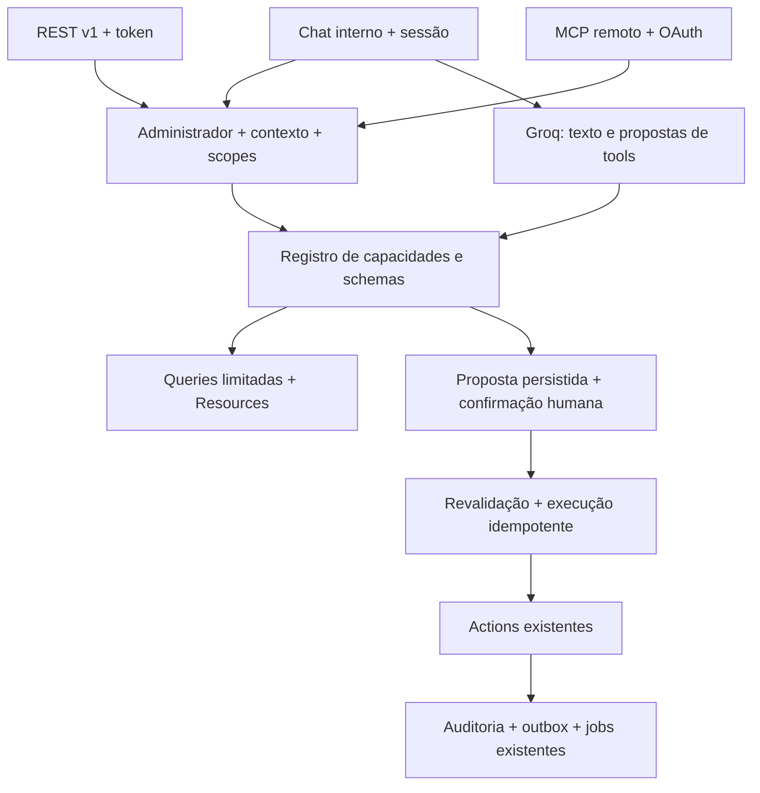

# PRD + decisões de arquitetura — API externa, MCP e assistente IA

**Data:** 30/09/2026 · **Versão:** 2.6 · **Status:** execução ativa no worktree. Protocolo moderno MCP 1.0.1 aprovado pelo usuário após comparação; Passport 13.8 e Boost 2.10.0 preservando Boost como dependência de desenvolvimento. O usuário autorizou leituras externas limitadas a nomes de categorias/serviços/profissionais, preço/duração e indicadores de setup, sempre no tenant/unidade autorizado; clientes, contatos, notas e vendas seguem fora do escopo. O OpenAPI REST está na versão 1.1.0 e descreve 11 rotas/7 operações, alinhadas à allowlist efetiva reduzida descrita no checkpoint abaixo. O endpoint MCP foi implementado com OAuth desligado por padrão; OAuth discovery não oferece DCR/CIMD nem `offline_access`, então conexão ChatGPT via OAuth aguarda decisão explícita de segurança e homologação.

### Checkpoint de implementação — 30/09/2026

- API REST implementada para contexto, capabilities, categoria, serviço, profissional, indicadores de setup, propostas e status de propostas. Credenciais administrativas são emitidas uma única vez, revogáveis e tenant/unidade-bound; a interface oferece conjuntos limitados e privilégios de leitura separados de `operations:propose`.
- As leituras externas aprovadas de catálogo retornam somente nomes de categorias e profissionais, e nome/preço/duração de serviços; setup retorna indicadores agregados. Não retornam IDs, status, tipo/vínculos, clientes, contatos, notas, vendas, descrição ou campos privados.
- O catálogo histórico documentou 17 propostas para categoria, profissional, serviço, unidade, horários/disponibilidade e booking. O checkpoint de segurança abaixo registra a allowlist efetivamente aceita agora, mais restrita. Escritas aceitas continuam propostas e confirmação web requer passkey vinculada.
- MCP Streamable HTTP está em `/mcp/integration`, com capabilities e tools limitadas, grant revalidado, `Origin`/`Content-Type`, guard pré-auth de 600 por minuto por IP executado antes de validação (conta inclusive tráfego malformado/origem negada) e quota autenticada de 60 por minuto por usuário+IP; a feature flag OAuth permanece `false` por padrão. A metadata não anuncia registro de cliente nem refresh scope. O schema/histórico já foi reduzido de 17 para 7 operações e acompanha a allowlist efetiva; o servidor também rejeita availability/schedule/booking. A implementação de protocolo passou testes HTTP, mas não foi conectada ao produto ChatGPT.
- Verificações focadas executadas no worktree: REST credencial/catálogo 23 testes/148 assertions; OpenAPI inicial 3/74; MCP/OAuth/catalog/propostas 38/309; Groq inicial 13/80. A validação integrada REST/propostas/Groq passou 37 testes/347 assertions. Evidências posteriores e mais abrangentes estão registradas abaixo; números anteriores são históricos.
- Assistente interno Groq implementado parcialmente neste worktree: página administrativa, conversas isoladas por usuário/tenant/unidade, retenção de 30 dias, sanitização estrutural de argumentos antes de persistir/replay, tools de catálogo/setup e propostas pendentes (nunca execução direta), com revisão via passkey. `unit.update` no Groq exclui endereço e texto livre; a allowlist de escrita Groq segue em cinco operações (`category.create/update`, `service.create/update`, `unit.update`) e não será ampliada para disponibilidade/agendamento/publicação sem autorização e revisão próprias. O envio ao Groq permanece síncrono; a execução protegida por runs/jobs/polling aguarda a decisão de privacidade sobre o payload enviado a cada turno.
- **Atualização de validação 30/09/2026 no worktree:** `composer ci:check` passou: lint, formatação, TypeScript, build Vite, Pint, PHPStan com 0 erros e Pest global SQLite **676 testes: 649 passed, 27 skipped, 0 failed/errors, 5.031 assertions**, com `APP_KEY` sintética e `LOG_CHANNEL=null`. Não tratar os 27 skips como cobertura aprovada. O contrato OpenAPI foi exercitado contra respostas REST reais (4 testes/302 assertions), validando schemas e ausência de dados proibidos.
- **Revalidação incremental Sprint 3 após hardening de locators (30/09/2026):** a suíte focada REST/MCP/OpenAPI/credenciais/propostas/Groq passou **105/105 testes, 1.203 assertions**. Inclui locators por nome exato, falha fechada para nomes ausentes/ambíguos, merge parcial da unidade/profissional, escopo tenant/unidade, resumo de proposta sem IDs de entidade/revisões expostos, revisão autenticada por nomes, proposta UUID mantida no fluxo web e removida do histórico enviado ao Groq, nome da unidade ausente do payload Groq, paginação com `has_more` e limites `page=1..10000`, `per_page=1..100`. `composer ci:check` passou novamente após as correções de segurança: lint, Prettier, TypeScript, build Vite, Pint, PHPStan (0 erros) e Pest global SQLite **709 testes: 681 passed, 28 skipped, 5.239 assertions**; skips PostgreSQL não equivalem a cobertura aprovada. Testes focados: proxies 3/6; parser Origin MCP 17/75; conjunto capabilities 3/4; contexto REST sem cache, 19/126. Revalidação PostgreSQL 18.4 sintética final passou **181/1.646**, incluindo `IntegrationCredentialApiTest` com a assertion atualizada de cache-control; `TrustProxiesTest`, `McpRouteTest` (Origin) e `IntegrationCredentialCapabilitySetTest` também incluídos. Cluster e artefatos temporários removidos após a execução. TE2E desktop/mobile passou 4/4 com Groq fake. Workflow PostgreSQL 17 no GitHub segue pendente. Build exigiu permissão escalada restrita para temporários do Vite no worktree.
- **Atualização posterior de hardening (30/09/2026):** listagem de credenciais e os desafios Passkey de options/verify agora enviam `Cache-Control: private, no-store` e `Pragma: no-cache`; os testes focados passaram, respectivamente, **19/138 assertions** e **5/44 assertions**. `TRUSTED_PROXIES` rejeita CIDRs `/0` e mantém redes específicas válidas; a cobertura passou **6/11 assertions**. Alteração e reset de senha revogam PATs/credenciais, access/refresh tokens, grants OAuth e authorization codes pendentes, preservando `revoked_at` e isolando os demais usuários; os testes passaram **13/72 assertions**. O gate completo intermediário `composer ci:check` passou **714 testes: 686 passed, 28 skipped, 5.283 assertions**, com lint, Prettier, TypeScript, build Vite, Pint e PHPStan sem erros. Os números PostgreSQL desse checkpoint intermediário são evidências históricas separadas.
- **Fechamento da revalidação de segurança (30/09/2026):** troca de senha, reset de senha e primeiro login revogam PATs/credenciais, access/refresh tokens, grants OAuth e authorization codes pendentes, preservando os registros revogados e isolando outros usuários. Nova auditoria reproduziu bucket anônimo compartilhado por usuários no mesmo IP; a quota estrita de 60/min agora roda depois da validação de identidade/grant, por usuário+IP e compartilhada entre credenciais. Um guard separado pré-auth executa antes da validação de protocolo, inclui tráfego malformado e bloqueia a 601ª chamada por IP (bucket hash); flag OAuth desligada mantém `404` sem consumir quota. `McpRouteTest.php` passou 26 testes/1.627 assertions, incluindo tentativa HTTP de reutilizar o grant de A no tenant/unidade B, negada antes de marcar o grant como usado; `OAuthGrantAuthorizationTest.php` inclui troca de authorization code com verifier PKCE incorreto, rejeitada sem emitir tokens (1 teste/13 assertions). `composer ci:check` passou **726 testes: 698 passed, 28 skipped, 6.856 assertions** antes da última regressão de teste; Pest global atual passou **727 testes: 699 passed, 28 skipped, 6.866 assertions**. Lint, formatação, TypeScript, build Vite, Pint e PHPStan passaram após as mudanças de middleware e antes da regressão somente de teste. PostgreSQL 18.4 sintético focal passou **62 testes/1.841 assertions** nos fluxos MCP/OAuth/credenciais e guard, incluindo o caso tenant-cross-tenant, usando role runtime least-privilege. PostgreSQL 17 no GitHub, grants/configuração reais de produção e homologação ChatGPT/Groq real continuam pendentes.
- **Fechamento da revalidação de segurança (30/09/2026):** troca de senha, reset de senha e primeiro login revogam PATs/credenciais, access/refresh tokens, grants OAuth e authorization codes pendentes, preservando os registros revogados e isolando outros usuários. Nova auditoria reproduziu bucket anônimo compartilhado por usuários no mesmo IP; a quota estrita de 60/min agora roda depois da validação de identidade/grant, por usuário+IP e compartilhada entre credenciais. Um guard separado pré-auth executa antes da validação de protocolo, inclui tráfego malformado e bloqueia a 601ª chamada por IP (bucket hash); flag OAuth desligada mantém `404` sem consumir quota. `McpRouteTest.php` passou 26 testes/1.627 assertions, incluindo tentativa HTTP de reutilizar o grant de A no tenant/unidade B, negada antes de marcar o grant como usado; `OAuthGrantAuthorizationTest.php` inclui troca de authorization code com verifier PKCE incorreto, rejeitada sem emitir tokens (1 teste/13 assertions). `composer ci:check` passou **726 testes: 698 passed, 28 skipped, 6.856 assertions** antes da última regressão de teste; Pest global atual passou **727 testes: 699 passed, 28 skipped, 6.866 assertions**. Lint, formatação, TypeScript, build Vite, Pint e PHPStan passaram após as mudanças de middleware e antes da regressão somente de teste. PostgreSQL 18.4 sintético focal passou **62 testes/1.841 assertions** nos fluxos MCP/OAuth/credenciais e guard, incluindo o caso tenant-cross-tenant, usando role runtime least-privilege. PostgreSQL 17 no GitHub, grants/configuração reais de produção e homologação ChatGPT/Groq real continuam pendentes.
- **Banco e TE2E:** a validação integrada PostgreSQL 18.4 sintética passou **167/167 testes, 1.615 assertions**. Playwright foi repetido em processo isolado com PostgreSQL 18.4 sintético, role runtime e Groq fake em loopback: **6/6** (owner registra passkey via UI, confirma proposta de serviço via step-up, rejeita outra proposta, colaborador bloqueado; desktop/mobile). O job próprio em PostgreSQL 17 ainda precisa rodar na CI; isto não homologa ChatGPT/Groq real nem produção.
- **Checkpoint factual mais recente (30/09/2026):** `composer ci:check` passou com `APP_KEY` efêmera e `PHP_INI_SCAN_DIR` adicional para `memory_limit=1G`; ESLint, Prettier, TypeScript, build Vite, Pint e PHPStan passaram sem erros. Em SQLite o Pest global mais recente passou **728 testes: 700 passed, 28 skipped, 6.875 assertions** (skips mantidos como não cobertura). A execução integral anterior de `composer ci:check` no PostgreSQL 18.4 descartável passou: **727/727, 7.033 assertions, sem falhas nem skips**, incluindo build/qualidade e role runtime least-privilege. O host local havia inicializado o PostgreSQL em `America/Sao_Paulo`, causando seis falhas de teste; com `APP_URL=http://localhost` e timezone PostgreSQL `UTC`, iguais ao ambiente do CI, todos passaram. O assistente fail-closed passou teste específico (todas as rotas 404, sem escrita nem chamada ao provedor). O `assistant-admin.spec.ts` final passou **6/6** no Chromium desktop/mobile, cobrindo registro de passkey via UI com confirmação recente de senha, proposta Groq fake aprovada e serviço conferido no catálogo, proposta rejeitada e colaborador bloqueado. Graphify foi atualizado; avisos remanescentes: dependência opcional `tree_sitter_sql` ausente e `resources/js/types/index.ts` não extraído por sintaxe. O cluster PG18 sintético foi desligado após a execução; os artefatos ficam em `/private/tmp`. Ainda falta executar PostgreSQL 17 no GitHub Actions e homologar cliente ChatGPT/MCP Inspector/Groq real; OAuth continua desligado; autorização externa permanece limitada a nomes de categorias/serviços/profissionais, preço, duração e indicadores agregados; Sprints 4 e 6 dependem de nova autorização para dados/rotinas adicionais; Sprint 7 assíncrona aguarda decisão entre enviar somente o turno atual ou histórico ao Groq. Deploy, commit e push não foram feitos.
- **Atualização TE2E de 05/10/2026:** os locators foram alinhados aos rótulos visíveis em português; a jornada de registro de passkey agora confirma explicitamente a senha, pois as rotas Laravel Passkeys usam `password.confirm`. O job `e2e-assistant` da CI foi ajustado para `ASSISTANT_ENABLED=true` e `APP_URL`/`PLAYWRIGHT_TEST_BASE_URL=http://localhost:8000`, mantendo `P0_BASE_URL` e o Groq fake em `127.0.0.1`; o host `localhost` fornece um RP ID válido para WebAuthn. A execução integral local do Playwright passou **6/6** no Chromium contra uma aplicação sintética isolada em SQLite temporário e Groq fake. As falhas anteriores foram esclarecidas: labels obsoletos em inglês, assistente desativado causando 404 e incompatibilidade de RP WebAuthn ao usar host IP. Este resultado local em SQLite não substitui o job PostgreSQL 17 da CI, que continua pendente. Nenhum deploy, push ou PR foi feito.
- O harness TE2E admin/colaborador está validado localmente contra PostgreSQL 18.4 e provider fake; o job próprio em PostgreSQL 17 ainda precisa rodar na CI. Rotina completa de clientes, atendimento, caixa/vendas/estoque não está implementada.
- Migrations e testes PostgreSQL foram executados num cluster PostgreSQL 18.4 sintético temporário; validação focada posterior passou em 15 testes/69 assertions. A role runtime tem privilégios elevados, memberships, schema ownership/CREATE, acesso ao metadata de migrations e `CREATE` em `public` testados como proibidos; workflow CI verifica esses invariantes fora de transações de teste. O workflow PostgreSQL 17 ainda não foi executado nesta sessão. Nenhum banco ou papel de produção foi acessado. TE2E usa Groq fake; ChatGPT/Groq com conta/chave reais não foi homologado.
- Decisão pendente: revisão automática bloqueou adicionar `offline_access` e DCR/CIMD sem autorização explícita. O usuário foi consultado sobre um caminho OAuth de cliente público, PKCE S256 obrigatório, redirects validados, capacidades explícitas e refresh token revogável de até 30 dias; até resposta, OAuth não será habilitado.
- **Checkpoint adicional de segurança (30/09/2026):** a allowlist efetiva de leitura REST/MCP/Groq foi reduzida a nomes de categorias, serviços e profissionais, preço/duração e indicadores agregados de setup. Não expor IDs, estados, `type`, `category_id` ou `revision` nos resultados externos. A escrita externa está restrita a CRUD de categorias, profissionais e serviços, e `unit.update`; esse último não aceita `description` nem `address`. Disponibilidade, horários/agenda e booking são rejeitados no servidor para propostas externas, mesmo se enviados diretamente fora dos schemas publicados. Sumários externos de propostas foram minimizados para `changed_fields`, sem valores propostos ou metadados internos. `IntegrationOpenApiContractTest` confirma schemas/response data contra a superfície REST efetiva. Estes resultados são validação, não certificação independente de segurança nem conclusão da goal.
- **Pendências de segurança e política:** a autorização de leitura cobre somente nomes de categoria/serviço/profissional, preço/duração e indicadores agregados de setup. Continuam pendentes decisão sobre referências por UUID opaco, retenção de `input`/`result_reference` e tratamento do texto livre enviado ao Groq (redação heurística não garante remoção de PII). Role/proxy/APP_URL/grants de produção não foram inspecionados; deployment deve configurar `TRUSTED_PROXIES` com CIDRs reais, `APP_URL` HTTPS canônico e bloquear acesso direto ao origin. RLS continua adiada e sem barreira DB contra queries sem escopo; a autorização depende das queries/policies Laravel e testes por endpoint. PostgreSQL 17 CI e homologação real ChatGPT/Groq seguem pendentes.

Este documento é a especificação de execução sprint por sprint. Checkboxes representam trabalho futuro, não entregas concluídas. As decisões propostas aqui não substituem ADRs aceitos do projeto. Na elaboração inicial, nenhuma API, credencial ou integração foi criada; o checkpoint ao final registra alterações posteriores da execução.

## 1. Objetivo e resultado esperado

Permitir que o proprietário/administrador de uma barbearia configure e opere o Caldas Gestão por três superfícies: API externa versionada, MCP remoto conectado a ChatGPT ou cliente compatível e chat interno com Groq. A entrada para ativação, credenciais e conexões será `settings/profile`. O chat terá uma página própria, integrada à navegação administrativa.

**Restrição obrigatória:** colaboradores, profissionais e recepcionistas sem elegibilidade administrativa não podem emitir credenciais, consentir OAuth, usar API/MCP nem usar o chat administrativo, mesmo que tenham permissões operacionais no painel convencional.

### 1.1 Jornadas de produto

| Jornada | Pedido em linguagem natural | Resultado observável |
| --- | --- | --- |
| Configuração inicial | “O que falta para minha barbearia receber reservas?” | Diagnóstico real de unidade, serviços, profissionais, vínculos, horários e publicação. |
| Catálogo | “Cadastre corte por R$ 40, 30 minutos, com João.” | Busca/desambiguação, proposta explícita, confirmação e serviço vinculado. |
| Funcionamento | “Atendo terça a sábado, das 9h às 18h, almoço das 12h às 13h.” | Regras válidas por profissional/fuso, sem confundir horário público com disponibilidade efetiva. |
| Página pública | “Prepare a página com meu WhatsApp, serviços e barbeiros.” | Rascunho revisável; publicação apenas após confirmação e checagem de prontidão. |
| Agenda | “Quais horários livres amanhã para corte?” | Slots calculados pelo domínio com profissional, duração, fuso e regras. |
| Atendimento | “Agende Carlos amanhã às 14h com João.” | IDs confirmados, disponibilidade revalidada, um único agendamento e efeitos de comanda informados. |
| Remarcação | “Passe o horário de Carlos para 15h.” | Proposta identifica cliente/agendamento; confirmação; conflito concorrente tratado. |
| Comandas | “Adicione uma pomada à comanda de Carlos.” | Item e valor verificados; alteração confirmada; nenhum item duplicado em retry. |
| Caixa | “Quanto entrou hoje? Feche o caixa com R$ 250 em dinheiro.” | Leitura de valores reais; fechamento exige valores informados pelo humano e confirmação. |
| Gestão | “Quais produtos estão acabando? Quem não voltou há 45 dias?” | Estoque baixo e retenção com critérios claros e paginação. |

### 1.2 Escopo e limites

Entrega obrigatória: acesso administrativo, perfil/credenciais/conexões, API de configuração inicial e rotina, MCP autenticado, operações com confirmação no servidor, chat Groq, auditoria e bateria TE2E.

**Limite de dados aprovado para integrações externas (30/09/2026):** leituras só de nomes de categorias/serviços/profissionais, preço/duração e indicadores agregados de setup. Não incluir leitura de clientes/contatos/notas/vendas nem detalhes de compromissos associados a clientes. Qualquer expansão dessas leituras exige nova decisão explícita. A Sprint 4 mantém esses fluxos como requisitos de produto, mas não pode expô-los em API/MCP/Groq sob a autorização atual; antes disso, remover os campos pessoais e obter autorização específica. Estoque, caixa, transações financeiras e campos livres de configuração também não estão no allowlist de leitura aprovado.

Extensão posterior, fora do critério de conclusão desta goal: CRUD geral de usuários/papéis, credenciais de infraestrutura, entitlements/plano SaaS, cobrança Lastlink, fiscal, estornos externos, exclusão/anonymização em massa, disparo de campanhas, arquivos remotos arbitrários e automações sem supervisão. Pacotes/assinaturas devem aparecer em consultas de resumo quando necessários; sua gestão completa é backlog separado.

Não criar ferramentas genéricas de SQL, shell, Eloquent, HTTP arbitrário ou alteração de qualquer campo. Operações financeiras desta entrega registram fatos no sistema; não prometem executar PIX/cartão em provedores externos.

## 2. Base factual da revisão

Graphify foi usado para navegação. A enumeração anterior de rotas via `php artisan route:list --except-vendor --json` precisa ser reproduzida no worktree depois da preparação do runtime: este checkout está sem `vendor`. A revisão do código-fonte confirma que a aplicação só registra `web`, `console` e `health`, e que rotas `/api/v1` e `/mcp` não existem. O checkout principal segue sujo; seus resultados não são o baseline desta execução.

| Evidência | Situação observada | Implicação |
| --- | --- | --- |
| `composer show --direct` | Laravel 13.26.1, Inertia Laravel 3.3.1, Fortify 1.38.0, Wayfinder 0.1.21, Pest 5.1.1. | Sintaxe e APIs devem seguir versões instaladas. |
| `composer.json`/`composer.lock` | Passport e Sanctum ausentes. Laravel MCP v0.9.4 está no lock transitivamente via Boost em desenvolvimento, não como dependência direta de produção. Não é seguro depender dele em runtime `--no-dev`. | Dependência direta de MCP e Passport autorizada pelo usuário após avaliação comparativa do protocolo Laravel MCP v1.0.1; incluir MCP como produção e Passport como produção, validando resolução e runtime `--no-dev`. |
| `bootstrap/app.php` | Baseline inicial registrava web/console/health; a execução neste worktree agora registra `routes/api.php` e `routes/ai.php`. | REST versionada e rota do chat interno adicionadas; revisar a tabela como histórico do baseline. |
| `routes/web.php` | Operacional sob auth, verified, tenant.context, saas.access, first.login.complete. | Preservar gates de SaaS/identidade também para API, com erros JSON. |
| `routes/settings.php` | Perfil exige auth; não resolve contexto de tenant explicitamente. | Integrações no perfil precisam de contexto administrativo explícito, mantendo perfil pessoal acessível. |
| `TenantContext`, `ResolveTenantContext` | Contexto com membership ativo e unidade permitida; leitura atual usa sessão/cabeçalhos. | Resolver contexto externo a partir da credencial/concessão, sem exigir sessão web. |
| `AuthorizationService`, `OwnerPermissionCatalog` | Permissões persistidas por escopo; owner sistema é reconciliado; manager em teste é papel customizado. | Não usar nome de papel como prova de administração. |
| Elegibilidade administrativa | Só existe owner system como papel reservado; `tenant.manage` também pode estar em papel customizado e `AssignRole` deixa manager atribuir papéis não-system. Não existem `integration.*`/`assistant.*`. | D01 precisa de concessão administrativa separada, criada/revogada por owner autenticado; `tenant.manage`, `role.manage` ou permissões de operação nunca concedem acesso externo. Revalidar em cada chamada e confirmação; testar escalada via papel customizado. |
| `app/Policies/*` | Algumas policies resolvem contexto a partir do recurso. | Exigir também igualdade com o tenant/unidade da credencial; policy isolada não limita a credencial. |
| `OperationalMutation`, `IdempotencyService` | Header atual `X-Idempotency-Key`; wrapper permite ausência e trabalha com referências/303. | Adaptar contrato externo e replay JSON, sem copiar semântica de redirect. |
| `OperationalMutation` | Wrapper atual executa mutation imediatamente e pode fornecer idempotência; não oferece estado persistido ou confirmação humana. | Motor de propostas/aprovações do D04 é infraestrutura nova, não reuso desse wrapper. |
| `CreateAppointment`, `UpdateAppointment` | Verificam vínculo profissional-serviço, disponibilidade, versões e transações; integração Google após commit. | Reusar domínio; retry não pode duplicar efeitos. |
| `CreateAppointmentSale`, `Unit` | Automação de comandas é condicional às configurações da unidade. | Não afirmar que todo agendamento cria comanda; mostrar efeito efetivo na proposta. |
| `CalendarController::index` | Carrega 42 dias, opções amplas e notas/telefone. | Criar queries limitadas e Resources próprios. |
| `CustomerController::show` | Histórico amplo de vendas, pacotes, assinaturas e métricas. | Separar busca, detalhe mínimo e histórico paginado. |
| `OnlineBookingSettingsController::index` | Chama EnsureOnlineBookingSite e retorna dados de rascunho/publicação; pode criar estrutura. | Novo GET de consulta não deve criar registros silenciosamente. |
| `SaveOnlineBookingDraft`, `PublishOnlineBookingSite` | Controle de revisão e requisitos de publicação. | Preparar rascunho, validar prontidão, publicar versão confirmada. |
| `OnlineBookingSettingsController::readiness` vs `PublishOnlineBookingSite::assertReady` | Readiness inclui WhatsApp/telefone e flags online dos pares; assertReady usa seleção do rascunho, estados ativos, unidade e domínio. | Há critérios diferentes; unificar/explicar no contrato de setup após decisão explícita, com teste de regressão. |
| `bootstrap/app.php` proxy | Baseline confiava em qualquer proxy informado; isso foi removido no worktree. | Usar `TRUSTED_PROXIES` com CIDRs de origem conhecidos; vazio significa não confiar em headers encaminhados. Testar spoof de host/forwarded para redirects, URLs resource e rate limits na configuração de produção antes de exposição. |
| `CashShiftController::index` | Caixa ativo filtrado pelo usuário que abriu. | Deixar claro “meu caixa” vs caixas da unidade; não inferir caixa de colaborador. |
| `.github/workflows/tests.yml` | PostgreSQL 17, role runtime/migration separada, composer ci:check. | Manter prova de grants/rollback; adicionar job E2E com sessões persistentes. |
| `playwright.config.ts`, `tests/e2e/*` | Chromium desktop/mobile; testes públicos permitem skip sem fixture e não cobrem envio completo. | Criar TE2E obrigatório e determinístico, sem tratar skip como aprovação. |
| Baseline Git ao iniciar execução | Worktree gerenciado `/Users/murilloalves/.codex/worktrees/api-mcp-assistente/caldas-gestao`, HEAD `76d1003` (`Booking público: handles globais e host compartilhado (#13)`), um commit à frente do `main` local (`6ac7784`). Plano copiado ao worktree. O checkout principal tem 34 paths modificados rastreados e 450 paths `.playwright-mcp/` não rastreados; inclui booking público, produtos, frontend, testes e artefatos Graphify. | Manter esses diffs intactos; revisar seu escopo antes da Sprint 3 e integrar apenas após o usuário decidir a base. Nenhum teste da árvore suja conta como evidência do baseline desta execução. |
| Ambiente do worktree | `composer install --no-scripts` e `npm ci` instalaram somente os locks atuais; build Vite passou. Há `.env` vazio e ignorado, criado para evitar warnings do Dotenv; nenhuma chave foi gravada. PHP CLI 8.5.9 coincide com CI 8.5; Node local 26.3.1 difere do Node 22 do CI. `phpunit.xml` força SQLite em memória e sessão array; não prova persistência de browser nem PostgreSQL. | `vendor/`/`node_modules/`/`.env` são somente locais e manifests ficaram inalterados. APP_KEY de teste é sintética e fornecida no processo. Comparar gates de frontend ao CI Node 22; configurar E2E próprio com PostgreSQL persistente e sessão persistente. Não copiar `.env` da árvore principal. |
| PostgreSQL local | `pg_isready` disponível, mas `/tmp:5432` retorna `no response`; Docker CLI não está instalado. Nenhum serviço/DB PostgreSQL de teste está ativo neste host. | Gate PG não foi executado. Não apontar testes para outro database desconhecido; provisionar service PostgreSQL 17 dedicado conforme CI antes de testar migrations/grants/concurrency. |
| CI/Playwright atual | `.github/workflows/tests.yml` executa fluxo PostgreSQL de schema/roles/migration e `composer ci:check`, sem instalar browser nem chamar Playwright. `composer ci:check` não inclui E2E. Existem apenas specs públicos de booking e performance; os specs podem `skip` quando fixture HTTP não está pronta e o booking spec não conclui submissão. | E2E-01/02 ainda não têm harness, fixtures, sessão persistente ou job CI. Gate futuro precisa fixture fail-closed, PostgreSQL persistente próprio por job, sessão file/database e provider Groq fake no processo web. Specs skipped não contam como verdes. |
| Laravel MCP/OAuth atual | No baseline, Boost v2.5.5/MCP v0.9.4 não ofereciam protocolo moderno. | Decisão aplicada: Boost 2.10.0 em `require-dev`, MCP 1.0.1 e Passport 13.8.0 em runtime. Transporte MCP e OAuth contextual implementados, porém feature flag desligada e sem DCR/CIMD nem `offline_access`; interop ChatGPT aguarda decisão/gates separados. |

Referências internas: [ADR-002](../adr/ADR-002--fundacao-de-dados-e-tenancy.md), [ADR-003](../adr/ADR-003--categorias-de-comanda-e-checkout-consolidado.md), [ADR-004](../adr/ADR-004--supabase-rls-e-pooler.md), [ADR-005](../adr/ADR-005--uuidv7-padronizacao.md), [ADR-006](../adr/ADR-006--lgpd-retencao-e-anonimizacao.md), [ADR-009](../adr/ADR-009-google-calendar.md). A [API de reconstrução](../reconstruction/api-proposal.md) é uma proposta histórica, não prova de endpoints implementados.

## 3. Requisitos e critérios transversais

- [ ] R01: API/MCP/chat exclusivos de administradores elegíveis do tenant, com checagem a cada requisição e execução em job.
- [x] R02 parcial: perfil administrativo permite emitir/revogar credenciais API e consultar metadados; OAuth/conexões externas ainda não estão disponíveis.
- [ ] R03: nenhum token existente é recuperável em texto; “consultar credenciais” significa metadados e rotação. Segredo de emissão aparece uma vez.
- [x] R04 parcial: REST e MCP usam catálogo de capabilities e operações; Actions/domínio são reutilizados nas operações implementadas.
- [x] R05 parcial: contexto, catálogo e setup têm projeções/escopo tenant-unidade explícitos; ainda faltam queries não implementadas da agenda e rotina.
- [x] R06 para operações atuais: escritas de domínio passam por proposta e confirmação web com passkey; LLM não aprova.
- [x] R07 para fluxos implementados: propostas têm idempotência/versão e revalidam elegibilidade no commit; jobs de outros domínios ainda não existem.
- [ ] R08: ferramentas não enviam credenciais nem dados excessivos a Groq/ChatGPT; logs redigidos e retenção definida.
- [ ] R09: erro do provedor não causa escrita automática, confirmação falsa ou reexecução financeira.
- [ ] R10: UI em português, utilizável em desktop/mobile, com estados vazio, carregando, erro, conflito e resultado.
- [ ] R11: testes de segurança, contrato, protocolo MCP, E2E de navegador e PostgreSQL são gates obrigatórios.
- [x] R12 parcial: API/MCP têm flags separadas e revogação de credencial/grant; o assistente interno tem `ASSISTANT_ENABLED` (default fail-closed) aplicado a todas as rotas e teste cobrindo 404 sem efeitos em banco/provedor quando desativado. Gestão centralizada da flag pela UI e evidência operacional de reversão ainda pendentes.
- [ ] R13: emitir/rotacionar credenciais, conceder OAuth e confirmar checkout/caixa/publicação exige step-up administrativo recente. MVP usa marcador próprio apenas após assertion WebAuthn/passkey validada, ligado a user/purpose e timestamp auditável, validade inicial 5 minutos/uso único. Login normal, `password.confirm` e configuração de 2FA não servem como prova; TOTP não é fallback até ter challenge recente verificável nesse fluxo; desafio nunca vai ao LLM.

### 3.1 Metas não funcionais e aceite de produto

Metas propostas para homologação com dataset sintético representativo: p95 de consultas simples abaixo de 1s; consulta de disponibilidade abaixo de 2s; timeout do turno IA até 60s; proposta local abaixo de 2s. Medir em ambiente declarado, separar tempo do provedor e não apresentar target como benchmark atingido. Estabelecer volume/dataset no baseline, medir query count e evitar crescimento N+1. Segurança e consistência são gates, mesmo se a meta de latência ainda exigir ajuste.

Aceite de produto: owner completa configuração inicial e pelo menos um atendimento com checkout/estoque/caixa pelas tools; colaborador tem todos os caminhos externos negados; administrador identifica contexto, proposta, aprovação e resultado sem ler detalhes técnicos. Nenhum segredo em reload, nenhum sucesso fictício, nenhuma repetição de efeito e nenhum dado de outro tenant nas respostas. Homologação ChatGPT é em ChatGPT web e requer plano/capacidade que permita MCP remoto com write (documentação OpenAI consultada: Business/Enterprise/Edu; Pro somente read/fetch); MCP apps não estão disponíveis no mobile. O ChatGPT pode congelar snapshot de tools após publicação, então mudança de contrato exige fluxo de refresh/republicação pelo workspace admin. O chat interno precisa cobrir uso mobile.

## 4. Decisões de arquitetura propostas (ADR integrados)

### D01 — Administração explícita e contextual

Decisão: adicionar uma política de elegibilidade administrativa no tenant, inicialmente concedida ao owner sistema. Administradores delegados precisam de concessão explícita controlada pelo owner, sem expor atribuição pela IA. A implementação pode reutilizar capacidades persistidas, como `integration.manage`, `integration.use`, `assistant.use`, desde que somente administradores elegíveis possam recebê-las e que exista teste de não escalada. Os nomes são propostos, a fechar na Sprint 0.

`tenant.manage` isolado, nome “manager” ou ter `calendar.manage` não bastam para presumir elegibilidade. Não inventar um papel global nem conceder acesso a todos os usuários durante backfill. Atualizar OwnerPermissionCatalog para não remover permissões novas em reconciliação. Perfis comuns continuam editando seus próprios nome/email, mas não recebem props/rotas administrativas autorizadas.

Autorização efetiva = integração habilitada ∩ administrador atual ∩ membership ativo ∩ tenant/unidade permitidos ∩ scopes do token/concessão ∩ permissão de negócio ∩ SaaS ativo ∩ recurso no contexto. Sem fallback para tenant de sessão em chamadas externas.

### D02 — OAuth remoto e credenciais pessoais

Decisão preferida: Laravel MCP + Passport para OAuth remoto; usar componentes mantidos, verificar compatibilidade exata antes de instalar. Para REST privada, avaliar PAT do Passport sob o mesmo modelo de concessão/contexto; só acrescentar Sanctum se o spike provar necessidade. Evitar dois guards/stores concorrentes sem justificativa e evitar construir criptografia/OAuth próprio. O chat interno Groq está autorizado para catálogo/setup e propostas administrativas; dados de clientes/agenda ficam condicionados a autorização separada.

**Decisão aprovada e dependências instaladas:** usar `laravel/mcp:^1.0.1` e `laravel/passport:^13.8`, preservando Boost como dependência de desenvolvimento e atualizando-o a `^2.10`. A evidência oficial confirma Boost 2.9.0+ aceita MCP 1.x, então não é necessário remover Boost nem adotar SDK MCP alternativo. A versão moderna usa protocolo `2026-07-28`, requests stateless sem `MCP-Session-Id`/afinidade de sessão e oferece compatibilidade do servidor para clientes legados `initialize`. Fluxo moderno exige `server/discover`, metadata e headers por chamada; harness deve validar `MCP-Protocol-Version`, `Mcp-Method`, `Mcp-Name` quando aplicável e consistência com o body. A inspeção do pacote confirma DCR e metadata OAuth/PRM básicos, mas não resource/audience binding nem authorization contextual do produto (ver D02 abaixo). Não aceitar alegação genérica de compatibilidade ChatGPT: comprovar cliente e plano em homologação. Mudanças de erros/schema v1 devem ser cobertas por contrato e testes.

**Contrato observado no Laravel MCP 1.0.1 e Passport 13.8 instalados:** `Registrar::oauthRoutes()` publica Protected Resource/Authorization Server metadata e DCR; Passport registra authorization e token endpoints. O pacote anuncia code + PKCE `S256` e grants `authorization_code`/`refresh_token`; League aceita `plain` no nível de pacote, mas middleware contextual do produto rejeita qualquer método diferente de `S256` antes do Passport. Há um scope único `mcp:use`; DCR público cria Passport public client com esse scope e sem rate limit ou autenticação próprios. O padrão publicado em `mcp.redirect_domains` é `['*']`. Metadados `resource`/`issuer` existem, porém o resource ainda não é validado criptograficamente no token e JWT Passport usa `aud=client_id`, não URI do MCP (sem RFC8707 audience binding). Refresh token roda/rotaciona por padrão; o worktree configura access de 15 minutos e refresh/grant de até 30 dias. `Mcp::web()` não autentica Bearer nem impõe scope; cada rota MCP deve anexar autenticação Passport, scope e política administrativa/contextual. Passport consent padrão web aceita qualquer usuário autenticado; exige gate administrativo na tela e revalidação. Portanto os pacotes resolvem transporte, discovery básico, autorização OAuth, DCR e refresh, mas não substituem autorização do produto.

**Gate OAuth/MCP antes de exposição:** restringir redirects a allowlist explícita (sem `*`), limitar/rate-limit DCR ou pré-registrar clients, manter middleware S256 e teste de downgrade, consentimento somente para admin elegível, Bearer + `mcp:use` + policy por chamada, tenant/unit explícitos e revalidados, TTL curto configurado, refresh revogável/rotativo e revogação imediata quando admin/membership/conexão perde elegibilidade. Implementar/verificar audience/resource vinculados ao MCP ou garantir criptograficamente rota/issuer exclusivos, com teste de token de client/resource errado. Não habilitar ferramentas MCP até esses gates passarem. Nenhum resultado ainda comprova interoperabilidade com ChatGPT.

**Resultado da auditoria read-only do pacote instalado:** `Mcp::web()` só adiciona negociação de `Accept`, validação de cabeçalhos MCP e `WWW-Authenticate`; autenticação e autorização de negócio devem ser aplicadas explicitamente. `OAuthRegisterController` cria cliente público sem autenticação e lhe concede `mcp:use`. League aceita `plain` e PKCE omitido no nível de pacote, apesar de metadata anunciar `S256`; middleware de produto agora exige S256 e testes rejeitam downgrade. Passport deixa access/refresh tokens válidos por um ano se a aplicação não configurar TTL; TTL customizados de 15/30 dias estão corrigidos e cobertos. A tela default de consentimento descreve autorização genérica, e concessões anteriores podem evitar novo consentimento visível; produto força consentimento administrativo contextual com Passkey. O guard não valida `aud` contra URI do resource MCP. O middleware existente `RequireIntegrationCredential` é adequado aos PATs da API, mas OAuth MCP não cria nem vincula automaticamente um registro de credencial/contexto compatível. O middleware OAuth-aware do produto revalida administrador, grant, tenant/unidade e capabilities em cada chamada. Permanecem testes/gates de DCR, audience/resource incorreto, tenant cruzado, revogação, capability insuficiente e interoperabilidade externa.

Passport PAT pode usar access token assinado/JWT, diferentemente de PAT opaco do Sanctum. Reusar armazenamento/verificação oficial, não exigir hash de JWT em substituição ao guard. Para token opaco, guardar hash; para token oficial assinado, não persistir cópia do Bearer em texto e aplicar revogação server-side. A UI nunca recupera token já emitido. Não afirmar que registrar `Mcp::oauthRoutes()` sozinho satisfaz audience/resource/refresh: verificar e completar essas proteções no spike.

OAuth: Authorization Code + PKCE S256, redirect URI exata, consentimento administrativo ligado ao tenant/unidades/capacidades, access token curto e refresh rotativo/revogável. Middleware do produto exige S256 antes do Passport, com teste de downgrade; access de 15 minutos e refresh/grant de até 30 dias estão configurados e testados. Revisão do código instalado comprovou que Passport 13.8 depende de `aud[0] = client_id` para resolver o client; não substituir `aud` pela URL do MCP. No cenário atual de único resource, exchange/refresh valida o `resource` contra o grant persistido, e cada chamada MCP revalida resource, usuário, tenant/unidade, capabilities e elegibilidade pelo mesmo grant; isso é o controle efetivo da aplicação, não uma claim de audience portátil. Antes de adicionar outro resource ou endpoint protegido por esses tokens, exigir claim/validação de resource adicional com compatibilidade Passport e testes negativos; não abrir consumos que não passem pelo middleware contextual. Não usar password grant ou implicit grant. Revogar consentimento/integração também revoga refresh; perda de administração/membership bloqueia acesso em cada request antes da expiração criptográfica.

PAT serve para integração privada que suporta Bearer. Não prometer que copiar PAT no ChatGPT substitui OAuth. Perfil lista conexões e URL MCP; conectar ChatGPT depende de suporte/plano da conta e deve ser verificado em homologação.

Parâmetros iniciais propostos: access OAuth 15 min; refresh inatividade 30 dias com limite absoluto 90 dias; PAT expira em 30 dias (máximo 90); scopes explícitos, sem wildcard. Se a versão escolhida não suportar algum mecanismo, documentar alternativa segura e teste antes de liberar.

**Gate de versão/dependência — resolvido:** no commit-base, Boost 2.5.5 exigia MCP 0.x; Boost 2.9.0+ adicionou MCP 1.x. Atualizamos explicitamente os três pacotes sem atualizar Laravel Framework nem remover pacotes: Boost 2.10.0 permanece em `require-dev`; MCP 1.0.1 e Passport 13.8.0 estão em `require`. A resolução Composer preservou as demais versões travadas; validate, audit, package discovery, CLI e runtime `--no-dev --dry-run` passaram. APIs OAuth e controles de segurança continuam sob gates Sprint 0. Nenhum SDK Groq foi aprovado.

### D03 — Adaptadores compartilhando capacidades de negócio



Controladores REST, handlers MCP e runner Groq usam catálogo comum de operações/schema/permissions, não chamam uns aos outros por HTTP interno. Chat interno recebe tools do mesmo catálogo; não precisa guardar PAT do administrador nem fazer loopback OAuth. Validar se Groq precisa de um cliente MCP interno ou se function calling com adaptador comum atende; opção padrão é catálogo local compartilhado, com MCP externo testado como superfície real.

Schemas HTTP e ferramentas podem ter formatos próprios, mas convergem para comandos validados. APIs novas usam Controllers/Requests/Resources nos diretórios existentes. Código novo de integração fica em subdiretórios de `app/Actions`, `app/Support`, `app/Contracts`, `app/Http`; não introduzir nova arquitetura de pastas base.

### D04 — Confirmação de escrita comprovada no servidor

Estado: `pending_confirmation → executing → succeeded | failed | needs_refresh`; alternativas `rejected` e `expired`. Aprovação e execução podem ser atômicas para operação local síncrona; jobs revalidam no worker.

Fluxo obrigatório:

1. REST/MCP/chat propõe operação permitida, com parâmetros normalizados e IDs desambiguados.
2. Servidor valida campos, autorização, versões e estima efeitos; persiste proposta imutável, hash, origem, ator, tenant/unidade, expiração e identificação do token/concessão quando aplicável.
3. Retorna resumo em português: registros, valores, horários/fuso, antes/depois e efeitos de comanda/estoque/caixa/publicação. Nunca permite nome ambíguo virar ID silenciosamente.
4. Confirmação ocorre em rota web autenticada administrativa (CSRF, checagem de ownership/contexto, reautenticação para alto risco). O MCP devolve URL para essa tela. A URL não contém segredo nem dá poder de aprovação por si só.
5. Não existe ferramenta MCP/Groq capaz de autoaprovar. Confirmação nativa do cliente pode complementar, mas não substituir essa prova.
6. Revalidar situação da concessão/PAT original, permissão atual, SaaS e versões; confirmar não amplia os scopes usados para propor. TTL inicial 10 minutos.
7. Consumir proposta uma vez sob lock; executar Action e registrar resultado idempotente. Retry retorna mesmo resultado, sem repetir efeitos.
8. Alteração de argumentos/versão exige nova proposta; falha pré-commit não escreve parcialmente. Falha de job externo após commit tem estado/retentativa observáveis.

Nesta versão REST também usa proposta/confirmacão para escrita de domínio. Os endpoints de comando das tabelas seguintes retornam `202` com operation_id e estado pendente, não fingem criação `201` antes de execução. Gestão de credenciais continua fluxo administrativo próprio, não ferramenta LLM. Consultas seguem GET 200 sem mutação.

### D05 — Contratos externos e concorrência

- Prefixo `/api/v1`; OAuth/discovery e `/mcp` têm contratos próprios.
- UUIDs opacos e campos allowlist. Dinheiro em centavos inteiros + `currency: BRL`, sem float; datas ISO 8601 com offset e timezone IANA. Servidor interpreta “amanhã” no fuso da unidade, não no fuso do browser/LLM.
- Paginação cursor proposta: 25 padrão/100 máximo; busca normalizada; agenda requer intervalo limitado (máximo 31 dias); resumo máximo 90 dias.
- Header público `Idempotency-Key` obrigatório para propostas/mutações; mapear internamente para serviço existente. Não quebrar `X-Idempotency-Key` do painel. Chave vinculada a origem/ator/token/tenant/unidade/operação/hash; mesmo key com payload diferente retorna 409.
- Versão `lock_version` ou revisão esperada obrigatória em edição e publicação; retornada em leitura; não fazer retry automático que sobrescreve alterações concorrentes.
- Erros REST `{error:{code,message,field_errors},request_id,correlation_id}`; códigos 401/403/404/409/422/429/503. MCP preserva JSON-RPC/tool errors, OAuth WWW-Authenticate e resultado estruturado; não reutilizar envelope REST cegamente.
- Jobs longos retornam status consultável; cancelamento só quando realmente suportado. GET/list não inclui tokens, notas livres ou histórico financeiro completo por padrão.

### D06 — Groq, privacidade e comportamento do assistente

Chave por configuração de servidor, em secret store/env e `config()`. Nome do modelo configurável e confirmado contra catálogo atual; não fixar um modelo lembrado de cabeça. MVP usa Laravel HTTP Client com timeouts, fakes e adapter de provider; SDK só após justificar dependência.

Groq faz function calling: validação server-side de nomes/argumentos, catálogo allowlist, limites de chamadas, tokens, tempo e custo. Dado de cliente (inclusive notas, texto de rascunho) é conteúdo não confiável; não vira instrução. Resposta Markdown sanitizada, URLs permitidas, sem executar HTML. Não buscar URLs arbitrárias para logo/mídia: usuário usa upload validado da plataforma.

Texto do LLM nunca é evidência de sucesso. UI só exibe “executado” quando existe resultado do servidor. Timeout/429/5xx mostram recuperação e preservam histórico; retries somente leitura/provedor antes de mutação, sem duplicar operação. Streaming é melhoria opcional, não pré-requisito do core; envio inicial pode ser job com polling protegido.

Retenção inicial proposta: conversas/mensagens 30 dias, resultados mínimos com IDs; auditoria segue ADR-006 e legal holds. Confirmar política na Sprint 0. Redigir Authorization, cookies, tokens e chave Groq de logs/traces. Mostrar aviso simples sobre envio de conteúdo ao provedor antes do primeiro uso; não enviar toda base/histórico.

### D07 — Isolamento, quotas e operação

Feature flags separadas (API, MCP, chat); configuração de integração por tenant com desligamento global de emergência. Limites iniciais propostos: leitura 60/min por credencial, proposta 10/min, confirmação 10/min por ator, chat 10 mensagens/min/tenant; até 8 chamadas de tools por turno, 60s orçamento total e tamanho de mensagem 8 KB. Ajustar por evidência de homologação, nunca sem teto. O código agora confia apenas nos forwarded headers de IP/proto/port quando o IP de origem pertence a `TRUSTED_PROXIES`; `X-Forwarded-Host` e o header `Forwarded` não são aceitos. Sem CIDRs, nenhum proxy é confiável. Validar no edge real URL canônica, callback, issuer/resource, IP e throttling antes de exposição.

HTTPS, validação de Origin no MCP, host/proxy confiáveis, métodos/content types limitados, limites de payload, scopes e quotas. CORS só para origens aprovadas; CORS não autentica integrações de servidor. Proteger discovery de OAuth contra SSRF ao lidar com client metadata/remotes. Sem token passthrough a terceiros.

Auditar operação, ator, credencial/concessão, tenant/unidade, confirmação, resultado, request/correlation ID e origem; evitar PII livre em metadata. Conferir cobertura de auditoria em publish/unpublish/save draft, não assumir que herdar OperationalAction já registra evento. Auditoria append-only e grants de runtime preservados.

## 5. Catálogo de endpoints e tools

**Todos os endpoints de dados/tools exigem elegibilidade administrativa.** Well-known/OAuth metadata públicos são mínimos e não incluem tenant data. A configuração atual não habilita DCR/CIMD nem `offline_access`; OAuth continua desligado por padrão. Consentimento OAuth e emissão/gestão de concessão exigem sessão administrativa e step-up definido. O scope técnico do pacote é `mcp:use`; capabilities de concessão são verificadas separadamente em cada handler. `GET` significa leitura; comandos escrevem só após D04. Os contratos REST atuais estão descritos no OpenAPI 1.1.0; JSON-RPC e metadata OAuth seguem contratos próprios.

Toda chamada externa carrega contexto fixo de tenant na concessão. Se mais de uma unidade for autorizada, a chamada deve enviar `unit_id` explícito (ou usar rota/tool nomeada por unidade) e o servidor valida em allowlist, membership ativo e SaaS em cada request e novamente no worker. Nunca resolver contexto pelo cookie, header legado ou sessão do painel. Cliente de chat sempre mostra unidade atual e pede seleção/desambiguação antes de executar.

Os controllers web/Inertia não devem ser reutilizados como serializações API. O contrato atual `docs/openapi/integrations-v1.yaml` (OpenAPI 3.1.0, `info.version: 1.1.0`) descreve 11 rotas REST: contexto, capabilities, leituras limitadas de catálogo/setup, propostas e status. A allowlist de leitura em vigor expõe somente nomes de categorias/serviços/profissionais, preço/duração e indicadores agregados de setup, sob tenant+unidade vinculados à credencial; não inclui IDs, estados, `type`, `category_id`, `revision`, clientes, contatos, notas, vendas ou outros campos privados. As propostas externas aceitas são CRUD de categorias, profissionais e serviços, e `unit.update` sem `description`/`address`; disponibilidade, horários/agenda e booking são rejeitados server-side, inclusive em chamadas diretas. As respostas externas de proposta contêm somente `changed_fields`, sem valores, IDs ou metadados internos. Não descreve transporte OAuth/MCP nem comprova interoperabilidade com cliente externo. Paginação/limites, `Idempotency-Key`, lock/version e conflitos estão documentados onde aplicável; MCP JSON-RPC e OAuth `WWW-Authenticate` seguem contratos separados. Referências opacas por UUID continuam como decisão pendente. Rotas de setup/contexto são queries sem side effects. `GET /online-booking` agora lê o estado sem criar site/draft; diagnóstico e publicação usam a mesma regra de readiness. `FinalizeClosingSession` fecha vendas consolidadas e mexe em pagamentos/comissões/estoque; qualquer contrato futuro de checkout deve definir tender/payment e nunca aceitar valor calculado pela IA nem fingir pagamento.

### 5.1 Contexto e configuração inicial — essenciais

| Endpoint REST v1 | Tool MCP | Domínio/permissão adicional | Reuso ou lacuna |
| --- | --- | --- | --- |
| GET `/context` | `get_workspace_context` | tenant.view/unit.view | Novo Resource; lista somente contextos vinculados à concessão. |
| GET `/setup/status` | `get_setup_status` | unit.view/catalog read/calendar.view | Agregação nova; separar pendência real de recomendação. |
| GET `/units/{id}` | `get_unit_settings` | unit.view | Model/Policy existentes; leitura sanitizada nova. |
| PATCH `/units/{id}` | `propose_unit_update` | unit.update | Nova Action allowlist: nome/endereço/timezone/flags de automação; testar impacto temporal. |
| GET `/categories` e GET `/categories/{id}` | `search_categories`, `get_category` | category.view | CategoryController/Actions. |
| POST/PATCH `/categories[/{id}]` | `propose_category_create`, `propose_category_update` | category.manage | Reusar Actions; vínculo conforme modelo atual. |
| GET/POST/PATCH `/units/{id}/settings` | `get_unit_settings`, `propose_unit_update` | unit.view/update | API nova; não existe Unit update controller genérico. Allowlist explícita; não confundir com booking flags. |
| GET `/services` e GET `/services/{id}` | `search_services`, `get_service` | service.view | Serviço, preço/duração, status e vínculos. |
| POST/PATCH `/services[/{id}]` | `propose_service_create`, `propose_service_update` | service.manage | Create/UpdateService; mínimo de duração compatível com agenda. |
| GET `/professionals` e GET `/professionals/{id}` | `search_professionals`, `get_professional` | professional.view | Profissional é entidade operacional, não conta/role administrativo. |
| POST/PATCH `/professionals[/{id}]` | `propose_professional_create`, `propose_professional_update` | professional.manage | Create/UpdateProfessional; vínculos com serviços na mesma unidade. |
| GET `/availability-rules` | `get_working_hours` | calendar.view/configure | Query nova; mutações existentes. |
| POST/PATCH `/availability-rules[/{id}]` | `propose_working_hours_create`, `propose_working_hours_update` | calendar.configure | Create/UpdateAvailabilityRule; almoço como janela/bloqueio apropriado. |
| GET `/booking/settings` | `get_booking_settings` | unit.view | Evitar side effects de Ensure no GET. |
| PATCH `/booking/settings` | `propose_booking_settings_update` | unit.update | Reusar UpdateOnlineBookingSettings; modifica flags de unidade/serviços/profissionais. |
| GET `/booking/draft` | `get_booking_draft` | unit.view | Query/Resource específico, sem token/url privada de longa vida. |
| PATCH `/booking/draft` | `propose_booking_draft_update` | unit.update | SaveOnlineBookingDraft; content/revision e merge explícito. |
| POST `/booking/publish` | `propose_booking_publish` | unit.update | PublishOnlineBookingSite; mostrar revisão e domínio público final. |
| POST `/booking/unpublish` | `propose_booking_unpublish` | unit.update | UnpublishOnlineBookingSite; confirmação de retirada do ar. |
| GET `/booking/publications` | `list_booking_publications` | unit.view | Histórico limitado; restauração fica backlog. |

`setup/status` verifica: unidade ativa e timezone, serviços ativos/preço/duração, profissionais ativos e vínculos, disponibilidade real, flags de booking, rascunho/revisão/domínio quando aplicável e publicação. Não confundir publicar página com garantir slots: horários públicos são apresentação, AvailabilityRule/ScheduleBlock compõem disponibilidade efetiva. Diagnóstico read-only não provisiona unidade/tenant.

Exemplo de contrato de proposta (informativo; IDs/hash reais são gerados no servidor):

```json
{
  "operation_id": "uuidv7",
  "operation": "appointment.create",
  "status": "pending_confirmation",
  "context": {"tenant_id": "uuid", "unit_id": "uuid", "timezone": "America/Sao_Paulo"},
  "summary": "Agendar Carlos para corte com João em 29/09 às 14h, duração 30 min, R$ 40,00.",
  "effects": {"creates_appointment": true, "creates_sale": false},
  "expires_at": "2026-09-28T15:10:00-03:00",
  "confirmation_url": "https://dominio-configurado/settings/integration-operations/uuidv7"
}
```

Leitura mínima de agendamento retorna id, customer/professional/service identificados, starts_at/ends_at/timezone, status, lock_version e referência de comanda quando autorizada. Resultado de operação executada retorna status `succeeded`, resource refs e resultado sanitizado; resultado pendente não contém texto afirmando que a mutação aconteceu. Desambiguação retorna candidatos e pede seleção humana antes de criar proposta.

### 5.2 Agenda, clientes e gestão diária — essenciais

| Endpoint REST v1 | Tool MCP | Permissão adicional | Comportamento |
| --- | --- | --- | --- |
| GET `/appointments` e GET `/appointments/{id}` | `list_appointments`, `get_appointment` | calendar.view | Query nova, paginada e minimizada; intervalo/profissional/status; detalhe inclui versão e efeito de comanda. Não expor diretamente CalendarController (janela fixa de 42 dias/campos de UI). |
| GET `/availability` | `find_available_slots` | calendar.view | Query nova, filtros de unidade/profissional/serviço/datas; sugestão não reserva slot. |
| POST `/appointments` | `propose_appointment_create` | calendar.manage | 1 serviço conforme Action interna atual; não presumir suporte interno a múltiplos itens/recorrência. |
| PATCH `/appointments/{id}` | `propose_appointment_update` | calendar.manage | Mudança parcial externa mapeada com snapshot/versionamento para Action atual. |
| POST `/appointments/{id}/cancel` | `propose_appointment_cancel` | calendar.manage | Rota atual; preservar cancelamento de comanda automática/vínculos conforme domínio. |
| POST `/appointments/{id}/check-in` | `propose_appointment_check_in` | calendar.manage | Rota atual; versão obrigatória e estado permitido. |
| POST `/appointments/{id}/transition` | `propose_appointment_transition` | calendar.manage | Adaptador novo mapeado somente às transições permitidas pelo domínio; nunca status arbitrário. |
| GET `/schedule-blocks` | `list_schedule_blocks` | calendar.view | Query nova limitada. |
| POST/PATCH `/schedule-blocks[/{id}]` | `propose_schedule_block_create`, `propose_schedule_block_update` | calendar.manage | Reusar Actions; uma pausa não remarca automaticamente clientes existentes. |
| DELETE `/schedule-blocks/{id}` | `propose_schedule_block_remove` | calendar.manage | Usa versão e confirmação. |
| GET `/customers` e GET `/customers/{id}` | `search_customers`, `get_customer` | customer.view | Busca nome/telefone; mínimos campos, sem notas livres por padrão. |
| GET `/customers/{id}/history` | `get_customer_history` | customer.view + permissões dos módulos retornados | Histórico paginado; não herdar toda serialização da tela. |
| POST/PATCH `/customers[/{id}]` | `propose_customer_create`, `propose_customer_update` | customer.manage | Desambiguar duplicados; não decidir consentimento de comunicação por inferência. |
| GET `/dashboard/summary` | `get_business_summary` | capabilities financeiras/agenda específicas | Extrair números crus/intervalos do Snapshot, não somente strings/sparklines. |
| GET `/retention/inactive` | `list_inactive_customers` | retention.view | Critério/dias explícitos, paginação; nenhuma mensagem enviada. |

### 5.3 Comandas, caixa e estoque — rotina administrativa obrigatória

| Endpoint REST v1 | Tool MCP | Permissão adicional | Efeitos a preservar |
| --- | --- | --- | --- |
| GET `/sale-categories` | `list_sale_categories` | sale_category.view | Categoria e escopo de unicidade. |
| POST/PATCH `/sale-categories[/{id}]` | `propose_sale_category_create`, `propose_sale_category_update` | sale_category.manage | Setup da automação de comandas; validar categoria default. |
| GET `/sales` e GET `/sales/{id}` | `list_sales`, `get_sale` | sale.view | Comanda aberta/ready/finalizada, totais centavos e versão. |
| POST `/sales` | `propose_sale_open` | sale.manage | OpenSale, conflitos/vínculos com agendamento. |
| POST `/sales/{id}/items` | `propose_sale_item_add` | sale.manage | AddSaleItem; produto/serviço/profissional válidos. |
| DELETE `/sales/{id}/items/{item}` | `propose_sale_item_remove` | sale.manage | RemoveSaleItem; versão e efeitos de estoque. |
| POST `/sales/{id}/discount` | `propose_sale_discount` | sale.discount | Aplicar limites/motivo, cálculo do servidor. |
| POST `/sales/{id}/transition` | `propose_sale_transition` | sale.manage | Adaptador de TransitionSaleStatus; somente transições aceitas pelo domínio, sem status arbitrário nem bypass do fechamento. |
| POST `/closing-sessions` | `propose_checkout` | sale.close ou regra existente sale.manage | FinalizeClosingSession; checkout consolidado, pagamentos, caixa/comissões/estoque. |
| GET `/cash-shifts` e GET `/cash-shifts/{id}` | `list_cash_shifts`, `get_cash_shift` | cash_shift.view | Query nova. Diferenciar `my_current_cash_shift` (caixa aberto pelo ator) e `list_unit_cash_shifts` (caixas visíveis da unidade); policy/module visibility aplicada por chamada. |
| POST `/cash-shifts` | `propose_cash_open` | cash_shift.open | OpenCashShift; valor informado, não inventado. |
| POST `/cash-shifts/{id}/movements` | `propose_cash_movement` | cash_shift.move | RecordCashMovement; tipo/motivo, versão. |
| POST `/cash-shifts/{id}/close` | `propose_cash_close` | cash_shift.close | CloseCashShift; contagem física informada pelo humano. |
| GET `/products` e GET `/products/{id}` | `search_products`, `get_product` | product.view | Catálogo mínimo e disponibilidade, preço/custo conforme scope. |
| POST/PATCH `/products[/{id}]` | `propose_product_create`, `propose_product_update` | product.manage | Reusar Actions; fotos via upload convencional. |
| GET `/inventory/balances` | `list_inventory_balances` | inventory.view | Filtro low_stock e unidades de medida, sem ajuste implícito. |
| GET `/inventory/movements` | `list_inventory_movements` | inventory.view | Histórico paginado. |
| POST `/inventory/movements` | `propose_inventory_movement` | inventory.manage | RecordInventoryMovement, motivo/versão e saldos consistentes. |

Correção da proposta anterior: não criar `/sales/{id}/finalize` que faça fechamento simplificado; a entidade de fechamento consolidado existente é a autoridade. Ajustar venda finalizada/reverter comissões é backlog sensível, não parte da rotina básica da IA.

### 5.4 Administração, propostas e chat

Rotas de sessão (nomes finais a definir):

- GET `settings/profile`: props administrativas mínimas sob contexto; perfil pessoal existente preservado.
- GET/PATCH `settings/integrations`: estado/configuração de canais, permissões, quotas; admin autenticado.
- POST/DELETE `settings/api-credentials[/{id}]`: emitir/revogar PAT, senha recente/2FA conforme política, CSRF e rate limit.
- GET/DELETE `settings/oauth-connections[/{id}]`: metadados/revogar concessão, sem devolver refresh/access token.
- GET `settings/integration-operations/{id}`: tela segura de proposta; POST `.../{id}/confirm` e POST `.../{id}/reject`: confirmação humana/CSRF.
- GET `assistant`; GET/POST `assistant/conversations`; GET `assistant/conversations/{id}`; POST `.../{id}/messages`; GET `assistant/runs/{id}`; DELETE conversa conforme retenção/legal hold.

REST: GET `/api/v1/operations/{id}` para resultado/estado de proposta visível à credencial original. MCP: `get_operation_status`, além de prompts/guias de configuração inicial e rotina. Não fornecer `confirm_operation` como tool. Metadata OAuth/resource é pública e mínima; tool/list/call com dados exigem auth. Registrar `/mcp` via pacote em `routes/ai.php` ou arquivo recomendado pela versão verificada; não confundir Laravel Boost de desenvolvimento com o MCP do produto.

## 6. Modelo de dados proposto

Proposta de tabelas; inspecionar schema com Boost antes de escrever migrations e reaproveitar estruturas compatíveis.

| Estrutura | Campos/chaves principais | Invariantes |
| --- | --- | --- |
| Integration settings | tenant_id único; flags de canais; quotas/config não secreta; versão | Owner/admin elegível pode alterar; defaults desabilitados. |
| Credential/grant context | ligação à credencial OAuth/PAT oficial; user, membership, tenant; unidades/scopes permitidos; revoked_at | Nunca substituir tabelas criptográficas do pacote; tenant/ator imutáveis. |
| Proposed operations | UUIDv7, actor, membership, tenant/unit, grant/token ref, operation key, payload/hash, expected versions, status, expires, confirmed_by/at, result refs, request IDs | Payload imutável, atômica, uma execução; nova proposta se parâmetros mudarem. |
| Conversations | UUIDv7, actor/membership, tenant/unit, title, expires_at | Sem conversa compartilhada entre tenant/usuários; jobs revalidam identidade. |
| Messages/runs | conversation, papel, conteúdo mínimo, operation refs, provider/model, contagens/estado/erro redigido | Sem segredo; retenção; metadata do modelo não é autorização. |

Indexes por tenant/ator/status/expiração/created_at, FKs e constraints compostas onde cabíveis. Filas e resultado de operação usam referências, não dumps de modelos. Grants runtime/migration e schema `app` seguem ADR existente. Verificar migrations dos pacotes no schema/grants do projeto; SQLite não comprova concorrência ou segurança PostgreSQL.

## 7. Execução em sprints e subagentes

Sprints são unidades de entrega, sem promessa de duração. Avançar somente após critérios/gates. Com quatro slots, reservar um ao raiz e até três implementadores simultâneos.

Raiz: orquestra, revisa, executa gates, resolve decisões, Git/PR/commits/push; não escreve código/config da implementação. Subagentes: `gpt-5.6-luna` por padrão; `gpt-5.6-sol` somente se usuário autorizar. Usar forks/contexto que permitam override do modelo segundo a ferramenta disponível. Skills pertinentes obrigatórias.

### Sprint 0 — Contratos, dependências e baseline

- [x] Inventariar git status, anexos/worktrees e trabalhos em uso; escolher checkout isolado a partir do baseline relevante, com autorização/contabilização das mudanças locais. Worktree criado a partir do remote default; PRD copiado; checkout principal com 34 paths rastreados modificados e 450 paths não rastreados sob `.playwright-mcp/`, todos preservados e ainda sem decisão de integração.
- [x] Ler AGENTS e `.ai/rules/index.md` + globs/keywords, se existir. `AGENTS.md` e instruções do usuário foram lidas; `.ai/rules` não existe no worktree nem na revisão do checkout principal.
- [x] Confirmar versões PHP/JS, esquema Boost, rotas reais, estado das Actions e flags de automação. Rotas foram enumeradas no worktree; PHP 8.5.9/Node 26.3.1 registrados contra PHP 8.5/Node 22 do CI.
- [x] Fixar o subconjunto atual do catálogo OpenAPI/JSON Schema, capabilities, elegibilidade, confirmation flow e limites implementados; o escopo restante deste PRD segue backlog aberto.
- [x] Revisar rotas/actions existentes contra o catálogo: confirmou que controllers são web/Inertia e que endpoints novos de setup/contexto/agenda/clientes exigem queries puras; corrigidos riscos de GET online-booking com side effect, payload 42 dias/calendário, histórico amplo de cliente, visibilidade de caixa do ator vs unidade, checkout consolidado e versionamento/idempotência. Falta congelar os schemas/semântica OpenAPI.
- [x] Auditar API MCP 1.0.1/Passport 13.8 instalados: metadata AS/PRM, DCR, PKCE/S256, scope real, middleware, audience, TTL e refresh. Confirmado suporte parcial do pacote e registrada a lista de controles ausentes em D02; nenhuma interoperabilidade ChatGPT foi alegada.
- [x] Publicar contrato REST OpenAPI 3.1.0 v1.1.0 para o subset implementado: atualmente 11 rotas e 7 operações, incluindo leituras limitadas de catálogo/setup; contrato MCP/OAuth permanece separado. A versão inicial especificou 17 operações, depois reduzidas conforme a allowlist aprovada. O teste `IntegrationOpenApiContractTest` verifica alinhamento de rotas, capabilities, catálogo e schemas publicados, sem provar conexão externa.
- [x] Validar a superfície MCP moderna no transporte HTTP por testes focados (descoberta/chamadas de tools, headers de protocolo, Origin/content type, grants e erros). [ ] Ainda falta homologação do MCP Inspector e interoperabilidade real ChatGPT; o teste de pacote/protocolo não prova isso.
- [ ] Fechar o fluxo OAuth interoperável: resolver DCR versus CIMD/clientes pré-registrados, redirects/allowlist, resource binding compatível com Passport, refresh/revogação, issuer/proxy e registrar evidência do cliente. Para o único MCP resource, binding no grant e revalidação em exchange/request foram revisados; tokens Passport mantêm `aud=client_id`. Middleware S256 e lifecycle estão implementados/testados. Metadata atual não anuncia DCR/CIMD e OAuth está desligado por padrão.
- [ ] Fechar contratos para domínios futuros: agenda, clientes, BRL em centavos, timestamps com offset/IANA, idempotência e `lock_version`/409; definir regras únicas de setup/readiness/publicação e pagamentos de `FinalizeClosingSession` antes de expor esses domínios. Não incluir clientes/contatos/notas/vendas nas permissões externas autorizadas até decisão explícita.
- [x] Auditar proxy/URL canônica e step-up existentes: o baseline `trustProxies('*')` confiava em forwarded headers de qualquer origem; código não prova firewall do origin. `APP_URL` também ancora origins/RP ID de Passkeys e callback provider. Middleware `password.confirm` grava timestamp compartilhado de senha e passkey (3h default), sem fator auditável; TOTP login/configurado também não prova autenticação forte recente.
- [x] Remover wildcard do código: [bootstrap/app.php] usa `config/trustedproxy.php` e só confia em `X-Forwarded-For/Proto/Port` quando a origem está em `TRUSTED_PROXIES`; configuração vazia não confia em forwarded headers. A configuração rejeita wildcard, hostname e CIDR inválido. `TrustProxiesTest`: 3/3 (6 assertions), cobrindo headers forjados sem proxy, com proxy dentro/fora da faixa e host spoof.
- [ ] Deployment precisa definir `TRUSTED_PROXIES` com CIDRs reais e configurar `APP_URL` HTTPS canônico; bloquear acesso direto ao origin e testar callback/issuer/resource no edge real antes de produção.
- [x] Implementar e aplicar prova step-up para emissão/revogação de credencial, consentimento OAuth e confirmação de operação: assertion WebAuthn/passkey validada pelo Laravel Passkeys, fator/passkey/user/tenant/unidade/purpose e timestamps em `step_up_proofs`, validade de 5 min, challenge no cache database com lock, consumo atômico de uso único, allowlist de purpose e binding OAuth de `client_id` + capabilities selecionadas. A rota de aprovação OAuth consome a prova antes de Passport; alteração/replay é negado. Não registra assertion/challenge/options, nem envia material WebAuthn a LLM. Revisão adicional verifica passkey revogada antes de liberar uso. TOTP continua sem fallback.
- [x] Obter aprovação para preferir o protocolo MCP moderno após comparação oficial.
- [x] Atualizar Boost em `require-dev` para ^2.10, adicionar Laravel MCP ^1.0.1 e Passport ^13.8 e resolver explicitamente os três, preservando Laravel Framework e demais dependências não relacionadas. Instalados Boost 2.10.0, MCP 1.0.1, Passport 13.8.0; composer validate/audit, package discovery, CLI e `composer install --no-dev --dry-run` passaram. Permanecem implementação dos controles OAuth, interop e middleware.
- [x] Medir baseline Pest/SQLite: 540 testes, 3652 assertions, 0 failures/errors, 26 skips; 14.079s, relatório JUnit `/tmp/caldas-prd-pest.xml`. `npm run build` passou.
- [ ] Medir baseline PostgreSQL e checks completos de qualidade, em runtime comparável ao CI (PHP 8.5/Node 22), e definir fixtures E2E isoladas com usuários de dois tenants e dois contextos por tenant.
- [ ] Criar provisioning/fixtures browser determinísticos próprios: DatabaseSeeder atual não garante catálogo/publicação nem sessão E2E. Banco PostgreSQL persistente, sessão file/database e provider fake explicitamente configurados, sem depender de env de produção.
- [x] Verificar cobertura TE2E/CI atual. Revisão read-only confirmou que não há job Playwright e os dois specs existentes não cobrem a jornada do PRD; booking/performance podem pular sem fixture. Isso é uma lacuna atual, não resultado de teste.

Checkpoint histórico pós-Sprint 1 parcial: dependências Laravel MCP 1.0.1, Passport 13.8.0 e Boost 2.10.0; elegibilidade owner + membership + SaaS; proxy sem confiança implícita em forwarded headers; step-up passkey ligado a user/tenant/unidade/finalidade; credencial bearer de emissão única. Naquele momento, OpenAPI, catálogo/setup e MCP ainda não estavam implementados. Testes globais então registrados foram 562 testes (536 passaram, 26 skipped, 3.838 assertions), sem PostgreSQL, navegador ou cliente externo. Os resultados e pendências desse parágrafo são do checkpoint daquela etapa e não devem ser lidos como estado atual.

**Checkpoint integrado anterior:** perfil/PAT, API/MCP, catálogo e chat Groq foram implementados parcialmente naquele momento. O texto abaixo preserva evidências históricas dessa etapa. O estado atual está registrado na revisão 8.4 e na tabela de sprints ao final; OAuth permanece desativado, não há credencial Groq real e nenhum deploy/commit/push/PR ocorreu.

Paralelo: A contratos/domínio; B segurança/pacotes; C fixtures/CI e teste baseline. **Saída:** contratos congelados, aprovação de deps resolvida, baseline de falhas preexistentes registrado, nenhum gate crítico indisponível ocultado.

### Sprint 1 — Autenticação administrativa e perfil

- [x] Registrar API/OAuth e administração contextual, com revalidação persistida (OAuth segue desligado por padrão).
- [ ] Implementar flags por tenant/canal, concessões e credenciais vinculadas a contexto.
- [x] Perfil administrativo: emissão única, copiar segredo, capabilities, expiração, último uso e revogação; sem recuperação de segredo antigo.
- [x] Consentimento OAuth, descoberta canônica HTTPS e revogação individual de grants; fluxo administrativo exige Passkey contextual, OAuth segue desligado e sem concessão para colaboradores.
- [ ] Auditoria de ciclo de vida e backfill owner idempotente; teste de reconciliação do catálogo.
- [x] Testes focados de tenant/unidade, colaborador, elegibilidade, expiração/revogação e step-up executados nas suites de integração atuais. [ ] Gates completos PostgreSQL/browser continuam pendentes.

Paralelo: A auth/credentials/migrations; B perfil frontend usando contrato acordado; C testes com fixtures próprias. **Saída:** credencial real autenticando endpoint mínimo de contexto; colaboradores bloqueados no backend; OAuth controlado testável.

### Sprint 2 — Catálogo compartilhado e motor de propostas

- [x] Registro de capabilities e schemas da operação inicial, protegido pela credencial administrativa contextual.
- [x] ProposedOperation para `service.create` e `category.create`, imutabilidade dos dados de comando, confirmação humana web, step-up passkey, execução atômica e TTL de 10 minutos.
- [x] Idempotência de proposta: replay retorna mesma proposta; chave com payload diferente retorna 409.
- [x] Revalidar token Passport originário, contexto tenant/unidade, elegibilidade administrativa e SaaS no momento da confirmação.
- [x] Queries de contexto/setup e catálogo read-only para os campos limitados aprovados: nomes de categorias/serviços/profissionais, preço/duração e indicadores de setup, tenant/unidade-scoped; clientes, contatos, notas e vendas proibidos.
- [ ] TE2E completo: proposta → confirmar → executar → repetir; rejeitar/expirar/conflito; confirmação por outro usuário/tenant bloqueada. Os testes Pest focados cobrem hoje o fluxo de serviço e controles relacionados, não uma jornada browser/PostgreSQL.

Paralelo: A motor/DB/Actions; B tela confirmação e integração de perfil; C contratos/security tests. **Saída:** uma escrita de catálogo demonstrada sem bypass e com resultado único.

Registro histórico parcial da Sprint 2 (quando 17 operações estavam especificadas): o contrato OpenAPI 3.1.0 v1.1.0 descrevia 11 rotas e 17 propostas, incluindo contexto/capabilities, catálogo/setup, propostas e status. A allowlist foi posteriormente reduzida; o resumo atual e os schemas OpenAPI refletem 11 rotas/7 operações. A autorização REST usa bearer com capabilities separadas. Confirmação humana usa sessão web e passkey ligada à proposta; operações preservam idempotência, versão e revalidação de contexto/elegibilidade. `IntegrationOpenApiContractTest` compara paths/métodos/capabilities/operações e schemas publicados. Leituras aprovadas usam projeções limitadas por tenant/unidade e excluem clientes, contatos, notas e vendas. Estado focado à época: OpenAPI 3/80; REST/MCP/propostas/credenciais/catálogo 56/566 em SQLite; PostgreSQL 18 propostas/MCP/configuração/booking 41/384; DatabaseFoundation 13/61; E2E fake 4/4. Esses gates não comprovam PostgreSQL 17, papel real, OAuth ou interoperabilidade ChatGPT.

### Sprint 3 — Configuração inicial da barbearia

- [x] Operação `category.create` via proposta administrativa, schema estrito, vínculo tenant/unidade do servidor, idempotência, revisão interna e confirmação por passkey.
- [x] Operação `category.update` via UUID/versão esperada fornecidos pelo administrador, PATCH parcial com campos omitidos preservados e `null` explícito aplicado, revisão atual-vs-proposto somente em Inertia autenticado, revalidação optimistic-lock no commit; resumo REST contém UUID, versão e nomes dos campos alterados, sem valores (12 testes/154 assertions anteriores; suíte focada atualizada abaixo).
- [x] Operação `service.update` exige UUID/versão e aceita PATCH parcial de escalares e relações; campos/vínculos omitidos e imagem são preservados, `category_id: null` e `professional_ids: []` limpam relações explicitamente; revisão autenticada atual-vs-proposto e revalidação optimistic-lock; resumo externo não revela valores atuais ou propostos.
- [x] Endpoints REST de catálogo/setup para categoria/serviço/profissional e indicadores de configuração, com campos limitados e escopo tenant/unidade.
- [ ] CRUD completo de profissionais e demais operações/relacionamentos não descritos no catálogo atual.
- [x] `professional.update` por nome exato no tenant/unidade bound, PATCH parcial (nome/status/serviços), resolução interna de IDs/versão, preservação de campos e vínculos omitidos, snapshot/revalidação optimistic-lock; revisão Inertia autenticada exibe estado atual e proposto por nomes, API/MCP não expõem IDs internos.
- [ ] Horários/disponibilidade, timezone e validações de almoço/intervalos.
- [ ] Configuração booking, rascunho/revisão, prontidão, publicação/unpublish e leitura sem side effects.
- [x] API PATCH parcial de categoria e serviço com semântica de merge explícita, sem apagar vínculos omitidos; campos omitidos preservados e valores explicitamente nulos/listas vazias podem limpar campos/associações permitidos.
- [x] Catálogo REST/MCP/Groq paginado com `has_more`, sem contagens exatas; páginas limitadas a 1–10.000 e no máximo 100 registros por página. Assistente deve continuar a paginação ou declarar resultado parcial, com aviso server-side quando encerra antes.
- [ ] Auditoria de rascunho/publicação, versão e origens.
- [ ] TE2E: barbearia vazia → catálogo/vínculos/horários → rascunho → publicação → reserva pública real.

**Achados S3 e fechamento parcial:** `OnlineBookingSettingsController@index` não chama mais `EnsureOnlineBookingSite`; leituras sem site/draft não os criam. `OnlineBookingReadiness` agora é compartilhada com publicação e os testes de configuração/publicação passaram. O contrato de replace do painel legado permanece; a API de propostas usa PATCH parcial. A allowlist de `changed_fields` é derivada dos campos realmente enviados (incluindo `category_id` em `service.update`); um teste encontrou e corrigiu a necessidade de reindexar essa lista. Locators por nome exato e `professional.update` parcial agora resolvem IDs/versões apenas no servidor, falham em nome ambíguo, preservam relações omitidas e revalidam snapshots na confirmação. A UI Inertia autenticada revisa nomes/valores atuais e propostos; sumários REST/MCP não expõem IDs de catálogo nem valores atuais/propostos. Groq não recebe nome da unidade nem UUID de proposta no histórico; paginação informa quando o catálogo continua. A suíte focada integrada passou 105/105 (1.203 assertions); o `composer ci:check` mais recente passou integralmente (709 testes, 681 passaram, 28 skipped, 5.239 assertions; Pint/PHPStan/TypeScript/ESLint/Prettier/build verdes). A revalidação sintética PostgreSQL 18.4 final passou 181/181 (1.646 assertions), incluindo `IntegrationCredentialApiTest` com a assertion atualizada de cache-control; TE2E pós-copy passou 4/4 desktop/mobile com Groq fake e Postgres 18.4. Operações e queries adicionais de agenda continuam fora do escopo atual. Snapshots de publicação são versionados; auditoria operacional append-only permanece sujeita à verificação final.

Paralelo: A catálogo/unidade; B booking/horários; C QA de onboarding e testes. **Saída:** configuração inicial completa por operações propostas; publicar não elimina requisitos de agenda.

Registro histórico parcial da Sprint 3 (antes da redução de escopo): propostas estavam especificadas para categoria, profissional, serviço, unidade, disponibilidade, regras/blocks e booking, e REST/OpenAPI/MCP enumeravam 17 operações. A allowlist foi posteriormente reduzida; o contrato atual anuncia 7 operações em 11 rotas e o servidor rejeita availability/schedule/booking. O GET de booking era somente leitura e a prontidão de publicação usava regra compartilhada. PATCH parcial para categoria/serviço preservava campos e vínculos omitidos; testes integrados anteriores cobriram os contratos então vigentes. Configuração inicial ainda não cobre todas as jornadas; operações completas de agenda/rotina e OAuth/ChatGPT real permanecem pendentes.

### Sprint 4 — Clientes, agenda e diagnóstico diário

- [ ] Busca/detalhe/histórico restrito de clientes e criar/editar. **Bloqueado para API/MCP/Groq pela allowlist atual:** não expor até decisão explícita sobre dados de clientes.
- [ ] Agenda com intervalo paginado/limitado, disponibilidade calculada, criar/remarcar/cancelar/check-in/status/bloqueios. **Gate de contrato:** remover cliente/contato/notas/vendas e confirmar separadamente se slots e metadados de compromisso podem ser lidos externamente antes de publicar tools.
- [ ] Preservar vínculos profissional-serviço, estados, timezone e automação de comanda habilitada/desabilitada.
- [ ] Resumo de negócio e retenção leitura, respeitando capacidades adicionais e minimização.
- [ ] TE2E: cliente ambíguo → desambiguar → buscar slot → confirmar → remarcar → check-in/status → cancelar quando permitido.
- [ ] PostgreSQL: duas tentativas no mesmo slot, lock_version obsoleto e retries concorrentes sem duplicatas.

Paralelo: A clientes/relatórios; B agenda/disponibilidade; C testes concorrência/E2E. **Saída:** rotina de atendimento auditável e nenhuma colisão ou comanda duplicada.

### Sprint 5 — MCP remoto e conexão ChatGPT

Fundação de protocolo/harness pode ser adiantada em paralelo às Sprints 3–4 após gates de 0–2, com contratos congelados e owner exclusivo de rotas OAuth/MCP. A conclusão de Sprint 5 exige integração das tools dos domínios aprovados; adiantar fundação não permite marcar tools/interop como entregues.

- [x] Transporte MCP Streamable HTTP protegido, versão moderna, Origin/content type validados, guard pré-auth por IP (600/min) e quota por usuário/IP após validação do grant (60/min).
- [x] Tools de leitura permitida e proposta/status para operações anunciadas, schemas explícitos e anotações de leitura/escrita.
- [x] OAuth metadata/WWW-Authenticate e consentimento admin customizado implementados; aprovação requer step-up Passkey ligado ao client/capabilities. OAuth continua desligado.
- [x] Desligar o grant Passport Device Code e não registrar suas rotas; MCP só aceita Authorization Code + PKCE no escopo atual.
- [ ] OAuth refresh/DCR/CIMD interoperável com ChatGPT; autorização do usuário separada está pendente e auto-review rejeitou a mudança até haver essa autorização.
- [ ] Rever interop e proteção contra abuso antes de autorização/ativação externa. Redirect não registrado é rejeitado sem redirect/código; DCR continua indisponível. Refresh/access lifecycle de 15/30 dias, rotação e S256 estrito foram corrigidos e testados; isso não fecha os gates de interop.
- [x] Consentimento verifica owner/admin e contexto escolhido; cada chamada MCP revalida grant, resource, tenant/unidade e capabilities; middleware exige PKCE S256 e não aplica PAT middleware sem vínculo OAuth explícito. Passport `aud[0]` permanece client ID; o binding do resource único é verificado no grant persistido e está coberto em exchange/request. Multi-resource requer novo controle de audience.
- [ ] Escrita via proposta + URL de aprovação humana; status como tool, sem autoaprovação.
- [x] Testes HTTP do transporte MCP cobrem descoberta e chamadas de tools; ainda falta homologação independente MCP Inspector/ChatGPT.
- [x] Testes negativos para DCR indisponível, redirect não registrado, colaborador, downgrade/ausência/verifier incorreto PKCE, grant revogado, resource e capability insuficientes; MCP também nega `tools/list`/`tools/call` para colaborador e quota MCP isolada por usuário+IP.
- [x] Provar tenant/unidade distintos na rota HTTP MCP: grant do owner A não pode usar contexto tenant/unidade B (403, grant não marcado como usado); grant legítimo de B continua funcionando. Isso não substitui homologação ChatGPT.
- [ ] Homologação com MCP Inspector e conexão real ChatGPT elegível; registrar diferenças entre teste de protocolo e teste do produto ChatGPT.

Paralelo: A servidor/tools; B OAuth interop/perfil instruções; C harness protocolo/security. **Saída:** leitura/proposta/resultado MCP real + evidência de ChatGPT em homologação ou gate externo explicitamente pendente (nunca conclusão fictícia).

### Sprint 6 — Comandas, caixa e estoque

- [ ] Catálogo de produtos/categorias de venda, consultas de caixa/comandas/saldo/movimentos.
- [ ] Propostas abrir comanda, itens, desconto, transições e checkout consolidado.
- [ ] Propostas caixa abrir/movimentar/fechar e estoque entrada/ajuste.
- [ ] Adicionar tools MCP a partir dos contratos de rotina administrativa.
- [ ] Testar centavos, pagamentos do fechamento, comissão, estoque, caixa correto e quantidade de eventos.
- [ ] TE2E: atendimento → comanda/itens → checkout → reflexo em caixa/estoque/comissão → fechar caixa; retry/rejeição/conflito.

Paralelo: A vendas/checkout; B caixa/estoque/produtos; C QA integridade financeira. **Saída:** nenhuma dupla contabilização; valores de contagem física nunca inferidos pela IA.

### Sprint 7 — Chat interno Groq

- [x] Adapter HTTP Groq configurável por env/config, sem chave no browser; modelo padrão verificado na documentação atual do provedor.
- [x] Conversas e mensagens isoladas por usuário/tenant/unidade, expiração de 30 dias e comando agendado de limpeza.
- [x] UI administrativa em português, menu restrito, contexto de unidade, estados indisponível/erro/429/timeout, aviso de redaction e cartão que leva à revisão da proposta com passkey.
- [x] Tools allowlist de catálogo/setup e propostas; mutações ficam pendentes, passam por validação de schema e confirmação server-side.
- [x] Testes Groq fake determinísticos focados passaram (13 testes/80 assertions), cobrindo elegibilidade, redaction, UUID preservado, PII bloqueada, tools, proposta pendente e erros do provedor.
- [x] Tratamento de tool args agora decodifica e valida a estrutura antes de armazenamento/replay; preserva UUIDs/valores válidos e substitui input inválido, campos inesperados e strings detectadas como sensíveis por marcadores seguros.
- [ ] Alinhar a allowlist Groq com as operações elegíveis sem endereço ou texto livre; o auto-review bloqueou expansão para disponibilidade compartilhada. Completar a jornada E2E de proposta/rejeição/confirmação; não ampliar dados de cliente/agenda.
- [ ] Runs/jobs/polling protegidos para turnos longos; implementação atual chama o provedor sincronamente e a verificação de TE2E completa ainda está em andamento.
- [x] TE2E focado: admin desktop/mobile → confirmação de senha → passkey via WebAuthn virtual → proposta → aprovação/rejeição → conferir criação/ausência no catálogo; colaborador bloqueado desktop/mobile. Em 05/10/2026, Playwright passou **6/6** no Chromium contra aplicação sintética isolada em SQLite temporário e Groq fake; o job `e2e-assistant` também foi alinhado para `ASSISTANT_ENABLED=true` e `APP_URL`/`PLAYWRIGHT_TEST_BASE_URL=http://localhost:8000`, preservando P0/Groq fake em loopback. As falhas anteriores foram labels em inglês obsoletos, assistente desligado (404) e RP WebAuthn incompatível com host IP. [ ] Rodar no job PostgreSQL 17 da CI; o resultado SQLite não equivale a essa cobertura. A rotina completa segue incompleta.

Paralelo: A backend/provider/runner; B React/UI/Wayfinder; C fakes/evals/adversarial e navegador. **Saída:** chat utiliza mesmo domínio/confirmacão/admin do MCP, sem credencial externa no browser.

### Sprint 8 — Bateria TE2E, documentação e entrega

- [ ] Todas as superfícies em ciclo completo, PostgreSQL/grants, OAuth, desktop/mobile e dados de múltiplos tenants.
- [ ] Quotas/custo, limites, concorrência, auditoria/retention, feature flags/revogação imediata e retry pós-commit.
- [ ] CI obrigatório Pest/Postgres/static/build/Playwright/protocolo MCP; artefatos redigidos.
- [ ] Documentação OpenAPI, instruções de conexão, credenciais, suporte, homologação e rollback.
- [ ] Revisão cruzada final com subagente distinto do implementador; registrar riscos e testes não executados.
- [ ] Commit/push/PR conforme autorização do trabalho, anexar PR ao chat se criada; deploy somente quando autorizado.

Paralelo: A segurança/performance; B jornada TE2E/UX; C docs/contratos. **Saída:** critérios globais e evidências aprovados. Deployment não é implícito na goal de implementação.

### 7.1 Ownership e prevenção de conflitos

Antes de cada despacho, raiz entrega ticket com objetivo, arquivos exclusivos, interface dependente, testes/critério e proibições. Não há edição paralela de `routes/*`, `bootstrap/app.php`, Providers, `composer.*`, migrations com mesma finalidade, `OwnerPermissionCatalog`, `tests/Pest.php`, configs CI/Playwright ou types compartilhados. Atribuir a um único integrador subagente por sprint.

Frontend depende de contrato já estabilizado, pode trabalhar com fixture de resposta, mas gate final usa backend real. Testes do mesmo arquivo pertencem ao dono da implementação ou a um QA com arquivo separado; sincronizar antes de corrigir. Não rodar suites que resetam o mesmo DB enquanto outro agente usa esse DB. Raiz não integra “por cima” escrevendo implementação; devolve ajustes ao dono e revisa diff.

Cada subagente retorna arquivos alterados, testes/comandos e status real, dependências, riscos/pendências e efeito sobre contratos. Não editar AGENTS, regras/deps ou mudar escopo para contornar um gate. Atualizar Graphify após integração de código conforme AGENTS; não fazer rebuild simultâneo por todos os agentes.

## 8. TE2E — bateria e evidências obrigatórias

TE2E significa teste de jornada completa de ponta a ponta; a ferramenta de navegador existente é Playwright. Pest cobre backend/contratos/segurança; PostgreSQL cobre locking/grants; protocolo MCP exige cliente HTTP real. Fake Groq substitui somente o provedor externo, não mocks do domínio ou confirmação.

### 8.1 Matriz mínima de testes

| ID | Camada/caso | Evidência de aprovação |
| --- | --- | --- |
| AUTH-01 | Colaborador com permissões operacionais chama perfil/credenciais/REST/MCP/chat diretamente | 403/ausência de props; zero mutation/secret, inclusive tools/list e OAuth consent. |
| AUTH-02 | Owner de tenant A usa ID/contexto de B, inclusive usuário com membership nos dois | Nenhum dado de B e nenhum efeito; credencial fixa o contexto. |
| AUTH-03 | Escopo read-only propõe escrita; admin perde papel; tenant suspenso; membership/unidade inativos | Bloqueio também na confirmação, refresh e worker. |
| AUTH-04 | Token expirado/revogado, API desligada, canal desligado | Novo request/queued op bloqueado; refresh não recupera privilégio. |
| AUTH-05 | OAuth PKCE ausente/inválido, redirect diferente, state/resource/audience incorretos | Rejeição antes de concessão/execução; consentimento ligado ao contexto. |
| SEC-01 | Emissão/reload/revogação perfil | Token exibido uma vez; segredo ausente em DB claro/log/trace/props posteriores. |
| SEC-02 | CSRF/reautenticação, CORS/Origin/SSRF, métodos/payloads/rate limits | Rejeições previsíveis, 429 com retry guidance; nenhum bypass por header forjado. |
| OP-01 | Alterar payload/hash/operação/ator/contexto de proposta | Proposta inválida; sem execute; confirmação segura de única operação. |
| OP-02 | Confirmar duas vezes, double click, replay idempotente, confirmar após expirar/revogar/editar versão | Um resultado/evento; conflito/expiração explícitos; sem sobrescrita. |
| OP-03 | Timeout após commit e retry; crash entre aprovação e worker; dois workers | Recuperação idempotente; status real; nenhuma duplicação financeira. |
| SETUP-01 | Configuração inicial completa | Serviço/profissional/vínculos/horário/draft/publicação e reserva pública persistidos. |
| SETUP-02 | Página sem pares válidos/horários; GET de settings | Prontidão correta e GET não cria site; horário público não promete slot. |
| CAL-01 | Dois comandos concorrentes para slot, fuso/DST/duração/vínculo/estado inválidos | Uma criação ou conflito consistente no PostgreSQL; nenhuma colisão. |
| CAL-02 | Agendamento com automação de comanda on/off, remarcar/cancelar | Efeitos exatos do domínio, Google sync fake depois de commit, sem duplicata. |
| SALE-01 | Checkout consolidado, retry, desconto/status/versão inválida | Caixa, itens, estoque, comissão e totals coerentes; rollback integral. |
| CASH-01 | Caixa de outro ator, abertura duplicada, contagem/fechamento | Contexto/ownership correto; valor informado pelo humano. |
| INV-01 | Movimentação de estoque concorrente e cross-unit | Saldo/unidade/motivo/versionamento corretos. |
| MCP-01 | `server/discover`, `tools/list`, `tools/call`, erros, headers modernos e notifications em HTTP; compatibilidade legada `initialize` | JSON-RPC válido para protocolo `2026-07-28`, validar `MCP-Protocol-Version`, `Mcp-Method` e `Mcp-Name` contra o body; auth em todos os caminhos e negociação legada coberta separadamente. |
| MCP-02 | Cliente externo lê → propõe → usuário confirma web → consulta resultado | Transporte real; sem tool de autoaprovar; scopes da origem preservados. |
| AI-01 | Groq chama tool inexistente, JSON malformado, ID de B, prompt injection em nota | Ferramenta bloqueada, sem fuga/escala/escrita; texto não substitui resultado. |
| AI-02 | 429/5xx/timeout/custo/loop/resposta falsa “feito” | Limites aplicados; recuperação; sem confirmação/efeito inventado. |
| E2E-01 | Admin ativa integração, emite/revoga, colaborador bloqueado | Navegador real, sessão persistente, backend real, desktop + mobile. |
| E2E-02 | Chat configura loja e realiza atendimento/checkout/caixa | UI → HTTP real → DB → leitura na tela normal; fake Groq somente backend. |
| DB-01 | Migrate rollback/reapply, schema app, grants runtime vs migration | Novas tabelas/pacotes operam no runtime; auditoria append-only comprovada. |
| OBS-01 | Auditoria/correlation/retention/feature flags | Eventos completos sem secret; limpezas respeitam retenção/legal holds. |

### 8.2 Ambiente, fixtures e comandos

Não executar mutações E2E no domínio de produção citado pelo usuário. Usar DB/tenant sintético local ou staging dedicado. Banco do browser precisa persistir entre requisições e sessão deve ser file/database/redis; `:memory:`/session array do PHPUnit não servem ao navegador. Isolar dados por run/worker; limpar somente dados do run.

Fixtures obrigatórias: owner A, admin delegado A, colaborador A (mesmo com scopes operacionais), owner B, usuário A+B, duas unidades A, catálogo/vínculos/horários conhecidos, caixas, credenciais scopes read/write, propostas e fake Groq. Teste crítico sem fixture é falha, não skip. Endpoints de seed/test login só em testing, nunca expostos em produção; preferir login UI/fixtures controladas.

Comandos existentes a reutilizar (pré-requisitos a configurar na Sprint 0, não inventar resultado):

```sh
composer show --direct
php artisan route:list --except-vendor
php artisan test --compact tests/Feature/ArquivoAfetadoTest.php
vendor/bin/pint --dirty --format agent
composer types:check
npm run lint:check
npm run format:check
npm run types:check
npm run build
php artisan test --compact
npm run test:e2e -- --project=chromium
npm run test:e2e -- --project=mobile-chromium
composer ci:check
graphify update .
```

`ArquivoAfetadoTest.php` é placeholder, não arquivo existente. `composer ci:check` repete build/checks/suite; executar bateria única na integração final em vez de duplicar por ritual. Na sprint usar suites afetadas + jornadas correspondentes; gate final inclui suite completa.

A CI atual provisiona PostgreSQL/role runtime e migra por conexão privilegiada. Acrescentar job E2E com sessão/DB próprios e fixtures, instalar browsers com versão do lockfile e exportar relatório JUnit/HTML/traces redigidos. Configurar execução realmente PostgreSQL sem overrides SQLite de phpunit esconderem o teste; seguir helpers existentes. Harness MCP novo ganha comando versionado e instrução após implementado; `mcp:inspector` só se confirmado pela versão instalada.

O job E2E separado provisiona seu próprio service PostgreSQL 17 e roles/runtime/migration; service de outro job não é compartilhado. Usar APP_ENV=testing, DB persistente exclusivo do run, SESSION_DRIVER=file (ou database), flags de integração habilitadas só nas fixtures e provider fake configurado no backend antes de iniciar Artisan serve. Não basta chamar Http::fake em outro processo: o servidor HTTP do browser precisa resolver um fake provider explícito via configuração de teste. Fake/test endpoints ficam indisponíveis fora de testing. Bloquear saída para Groq real na bateria automática. Não reutilizar servidor aberto com env desconhecido como evidência TE2E.

Na revisão não há prova de RLS ativa: não foram encontrados CREATE POLICY/ENABLE ROW LEVEL SECURITY/SET LOCAL de tenant implementados. Testes PostgreSQL desta entrega comprovam tenancy de aplicação, locks, grants e auditoria; caso RLS seja ativada por outro trabalho, acrescentar testes específicos de contexto transacional e conexão reutilizada.

### 8.3 Regra de evidência

Por sprint registrar no checkpoint: SHA/baseline, arquivos, comando, ambiente/DB, exit code, números passed/failed/skipped, report path e bugs corrigidos. Bloqueios de fixture, conta ChatGPT, dependência não aprovada ou chave real não disponível são pendências explícitas. Não converter teste fake em “Groq real/ChatGPT validado”. Testes vivos de provedor externo são separados, com orçamento e dados sintéticos; suíte determinística não depende deles.

### 8.4 Revisão de segurança API e banco

Escopo acrescentado pelo usuário em 30/09/2026: revisar a implementação integrada da API/MCP, autorização administrativa, limites tenant/unidade, exposição de dados, ciclo de credenciais/propostas, logs/segredos e papéis/constraints PostgreSQL; aplicar correções verificáveis. Foi feita revisão local de código com Graphify e skills Laravel `security`, `validation`, `routing`, `migrations` e `config`, incluindo revisão independente de REST/OAuth/MCP. Não foram acessados banco produtivo, credenciais ou dados reais.

| Achado | Evidência/veredito | Ação/gate |
| --- | --- | --- |
| Controle de acesso e allowlists de leitura/escrita | Positivo, dentro do escopo validado: REST/MCP verificam bearer/grant, capability, usuário admin proprietário, tenant/unidade e elegibilidade. Leituras REST/MCP/Groq limitam-se a nomes de categoria/serviço/profissional, preço/duração e setup agregado; não devolvem IDs, estados, `type`, `category_id` ou `revision`. Escritas externas limitadas a category/professional/service CRUD e `unit.update`, sem descrição/endereço; availability/schedule/booking rejeitados no servidor. | Evidência focada recente: catálogo 25 testes/191 assertions; hardening de operações 69/659; Pint e `git diff --check` passaram. Isso não garante segurança geral nem substitui revisão operacional; PG17 CI, runtime grants e configuração/role de produção permanecem pendentes. |
| Cache de contexto autenticado REST | `GET /api/v1/context` retorna indicadores mínimos vinculados à credencial, tenant/unidade e capabilities. | Corrigido para `Cache-Control: private, no-store` e `Pragma: no-cache`; `IntegrationCredentialApiTest` confirma os cabeçalhos e o payload exato minimizado. |
| Cache de credenciais e desafios Passkey | Respostas autenticadas podem permanecer em caches intermediários se não declararem política explícita. | Corrigido: listagem de credenciais e endpoints de Passkey options/verify enviam `Cache-Control: private, no-store` e `Pragma: no-cache`. Testes focados: credenciais **19/138 assertions**; Passkey **5/44 assertions**. |
| Revogação após alteração, reset ou primeiro login | PATs, credenciais, tokens OAuth e códigos de autorização pendentes poderiam sobreviver à troca de senha sem uma barreira central de sessão/autorização. | Corrigido: alteração, reset e primeiro login revogam PATs/credenciais, access/refresh tokens, grants OAuth e authorization codes pendentes, preservam `revoked_at` e não afetam outros usuários. Testes focados de alteração/reset: **13/72 assertions**; `FirstLoginPasswordTest` cobre o fluxo de primeiro login. |
| Sumários externos de propostas REST/MCP | Achado anterior P1: propostas retornavam valores, identificadores e/ou metadados além do necessário. | Corrigido localmente: sumários externos minimizados a `changed_fields`, sem valores propostos, IDs de recurso, versões ou `_provided_fields`. Valores para revisão ficam apenas na interface Inertia autenticada e tenant/unidade-scoped. Testes recentes de hardening de operações: 69/659 passaram. |
| `booking.draft.update` aceita subdocumentos não allowlisted, inclusive `identity.cover_image_path` e `gallery` | P1 confirmado: `ProposeServiceOperationRequest` validava `content` parcialmente como arrays; `SaveOnlineBookingDraft::normalize()` preserva subdocumentos; `PublicBookingController` resolve caminhos como mídia na página pública. Uma proposta aprovada poderia referenciar caminho arbitrário de storage. | Remediado localmente: `OnlineBookingDraftContentRules` aplica allowlists estritos a todos os subdocumentos; referências de capa/galeria exigem registro da mesma unidade e `SaveOnlineBookingDraft` revalida o documento na confirmação. Testes MCP cobrem caminho arbitrário, injeção aninhada e mídia de tenant estrangeiro antes da proposta. `McpIntegrationServerTest` + `IntegrationConfigurationOperationsTest`: 16 testes/167 assertions passaram em SQLite; Playwright/PG seguem como gates separados. |
| Campos livres em propostas externas | Mitigação de escopo: category/professional/service CRUD e `unit.update` estão permitidos; `unit.update` não aceita `description` nem `address`; availability/schedule/booking são rejeitados server-side. | Não ampliar esses campos/operations sem revisão e autorização próprias. A política para texto livre enviado no chat Groq permanece pendente; leia o achado “Redação antes do Groq”. |
| Privilégios da role PostgreSQL | Achado P1 corrigido: a tabela `migrations` herdava grants runtime após migrations; `public` também fazia parte do `search_path` padrão. | Defaults runtime/migration usam somente `DB_SCHEMA`; provisioning strict rejeita role com `CREATE` no schema app ou em `public`, sem alterar grants globais. A evidência histórica PostgreSQL 18.4 cobriu foundation, bootstrap, governance/tenancy, Integration, MCP e OAuth (178/1.573); a revalidação final ampliada passou **202/202 testes, 1.770 assertions**, em 29 arquivos com role runtime least-privilege, incluindo os fluxos de troca/reset/primeiro login. Workflow PG17 ainda não foi executado no GitHub. Papel/configuração real de produção/Supabase não inspecionado. |
| Host adulterado em `confirmation_url` | P2 confirmado: URLs absolutas REST/MCP podiam usar o Host da requisição. | Corrigido no worktree: helper usa a raiz canônica `app.url`; teste com `Host: attacker.example` cobre resposta REST. REST/MCP/propostas passam em 22 testes/224 assertions. |
| Host adulterado em OAuth discovery/resource metadata | P2 confirmado: issuer, resource e endpoints podiam derivar de `Host` quando faltava configuração explícita. | Corrigido: `OAuthEndpointConfiguration` exige URL canônica HTTPS e monta endpoints pela origem configurada; teste cobre Host forjado e rejeição de HTTP. Contrato discovery/MCP/OpenAPI direcionado: 14 testes/361 assertions. |
| Parsing de Origin MCP com componentes proibidos parciais | P2 confirmado: `isset(user, pass, path, query, fragment)` só rejeitava quando todos apareciam juntos; Origin inválido com subset desses componentes podia normalizar para host permitido. | Corrigido: qualquer userinfo/path/query/fragment agora causa rejeição; comparação válida de scheme/host/port preservada. `McpRouteTest`: 17 testes/75 assertions para casos inválidos individuais e origem válida. |
| Conjunto de capabilities válido rejeitado por ordenação | P3 confirmado: token e credencial eram ordenados antes da comparação, mas um conjunto permitido não estava canonizado na mesma ordem lexical. | Corrigido canonizando cada conjunto allowlistado, sem ampliar membros. `IntegrationCredentialCapabilitySetTest`: 3 testes/4 assertions; ordens distintas aceitas e capability adicional rejeitada. |
| Revogação individual de concessão OAuth | P1 antes da exposição externa: não havia fluxo owner para encerrar um client grant, e refresh podia continuar válido por 30 dias. | Corrigido no worktree: perfil lista grants minimizados; revogação owner/tenant/unidade scoped exige Passkey `oauth.revoke` one-time ligada ao snapshot do grant e revoga grant/access/refresh em transação. Testes de revogação 3; suite OAuth/MCP/OpenAPI 28/415 e credenciais/step-up/consentimento 29/194. OAuth permanece desligado. |
| Expiração da concessão e refresh | P2: expiração do access token (15 min) encerrava a concessão antes do refresh token (30 dias). | Corrigido: validade da concessão acompanha o refresh token; teste auth-code → refresh após 16 min → rotação passa. Coberto em `OAuthGrantAuthorizationTest`, dentro de 28 testes/415 assertions. |
| Contrato de operações da capability OAuth/MCP | Schema publicado poderia divergir da allowlist executada no servidor. | O catálogo atual contém sete operações executáveis; contrato de teste impede futuras divergências entre catálogo, OpenAPI e validação runtime. |
| Consentimento OAuth sem step-up e alteração da autorização após a prova | P1 confirmado: `oauth.consent` era purpose válido, mas Passport approval não consumia a prova. | Corrigido: `RequirePasskeyStepUp` roda depois da validação do contexto e antes de Passport. Prova one-time amarra client, tenant/unidade e capabilities; ausência, alteração e replay são rejeitados. UI exige Passkey. `OAuthConsentStepUpTest`: 5/30 e grupo security combinado: 65/452. OAuth continua desligado. |
| Passport Device Code | Passport 13.8 habilita device flow por padrão; suas rotas não usam o binding contextual `OAuthGrant`/tenant/capabilities da integração. | Device grant desligado antes da montagem das rotas; endpoints não são publicados. Teste valida flag e ausência das rotas. OAuth continua desligado e sem interoperabilidade real. |
| `search_path` PostgreSQL e schema `public` | Default anterior incluía `public`, schema compartilhado cujo privilégio `CREATE` varia com versão/configuração; `DB_SEARCH_PATH` também podia reintroduzi-lo. | Caminhos padrão limitados a `DB_SCHEMA`; provisioning `--strict` rejeita `CREATE` da role runtime em `public`, cobrindo configuração legada sem revogar privilégios globais. Runbook orienta reparar grants. PG18.4 sintético: `DatabaseFoundationTest` 15/69. |
| RLS | Não há policy/`ENABLE ROW LEVEL SECURITY`. A decisão ADR-004 documenta RLS adiada até provar `SET LOCAL`/pooler/jobs/conexão reutilizada. | Não ativar parcialmente nesta etapa; manter tenancy Laravel/FKs/Policies obrigatórios. Revisitar apenas com teste PostgreSQL de contexto ausente, cross-tenant, rollback, worker e conexão reutilizada. |
| Retenção de payload de propostas | `input` e `result_reference` ficam em JSON; não foi achado purge de propostas resolvidas. | Política de retenção (incluindo prazo de apagar `input`/`result_reference` e eventual preservação de hash/status) aguarda resposta do usuário; não afirmar retenção concluída antes da decisão, rotina e teste. |
| Texto livre e histórico persistido enviados ao Groq | O payload de cada turno inclui até `max_history_messages` mensagens salvas da conversa (user/assistant/tool), após redação heurística; essa técnica não garante remover PII. A documentação atual da Groq descreve não retenção padrão para inferência, exceções temporárias para confiabilidade/abuso (até 30 dias) e controles ZDR; a configuração da conta usada pela aplicação não foi inspecionada. | A UI agora separa explicitamente a retenção da aplicação Caldas da retenção Groq, explica que a política depende da conta/controles/termos e linka [Your Data in GroqCloud](https://console.groq.com/docs/your-data). Pergunta de política pendente: reenviar histórico para manter contexto ou enviar só turno atual. Não ampliar payload nem implementar execução async enquanto pendente. |
| Resource/audience OAuth | Passport 13.8 emite JWT com `aud=client_id`; seu BearerTokenValidator usa `aud[0]` para resolver o client, então substituir por URL MCP quebraria `auth:api`. | Para o único resource atual, `AccessTokenController` exige resource correto no authorization-code/refresh exchange; `OAuthGrant` persiste resource+user+client+tenant+unit, e `RequireOAuthGrant` revalida tudo por chamada MCP. MCP/OAuth testes negativos cobrem resource incompatível. Isto não é audience binding JWT portátil. Antes de adicionar outro resource/endpoints, implementar claim/validação compatível mantendo `aud[0] = client_id`, com testes de token forwarding e Passport guard. OAuth segue desligado. |
| Rate limiting | REST usa limites explícitos de rota (60/min e 20/min em propostas). MCP aplica middleware IP-only pré-auth (600/min, hash do IP) antes da validação de protocolo e depois limite de 60/min hash(user ID + IP) somente após grant ativo. | `McpRouteTest` cobre 429/`Retry-After`, IPs e usuários independentes, grants diferentes do mesmo usuário compartilhando cota, bloqueio antes da autenticação, malformed/origin denied contabilizados e flag off sem consumo. Persistência de cache multi-instância/carga e orçamento operacional continuam pendentes antes de expor publicamente. |
| Host/Origin MCP | `ValidateMcpRequest` compara `Origin` por esquema/host/porta com `app.url`, sem curingas e rejeita origem `null`. Revisão encontrou parsing que rejeitava userinfo/path/query/fragment apenas se todos existissem. | Corrigido para rejeitar individualmente qualquer componente proibido. `McpRouteTest`: 17/17, 75 assertions, cobrindo cada componente e origem válida canonicalizada. Guard IP próprio roda antes do parser; OAuth continua desligado. Homologar TLS/allowlist e rate limit antes de habilitar clientes externos. |
| `TRUSTED_PROXIES` aceita rede ampla demais | CIDR `/0` permitiria confiar em headers encaminhados de qualquer origem e enfraqueceria a fronteira de proxy confiável. | Corrigido: configuração rejeita `/0` e preserva CIDRs específicos válidos; redes específicas continuam sendo a única forma de confiar nos headers encaminhados. `TrustProxiesTest`: **6/11 assertions**. Definir somente CIDRs reais do edge no deployment. |
| Retenção de conversas | Comando `assistant:purge-conversations` é agendado diariamente com `withoutOverlapping`/`onOneServer`; isso comprova configuração Laravel, não execução do scheduler em produção. | Confirmar `schedule:run`, monitor/alerta e retenção em backup no ambiente operacional. |

Referências primárias consultadas na revisão: [PostgreSQL 17 Row Security](https://www.postgresql.org/docs/17/ddl-rowsecurity.html) (tabelas sem policy ficam disponíveis conforme GRANT; owner/BYPASSRLS alteram a garantia), [PostgreSQL 17 Role Attributes](https://www.postgresql.org/docs/17/role-attributes.html), [PostgreSQL Role Membership](https://www.postgresql.org/docs/16/role-membership.html) e [Laravel Rate Limiting](https://laravel.com/framework/docs/rate-limiting). RLS é uma segunda camada e depende do privilégio/role e do contexto correto; não substitui a autorização da aplicação.

## 9. Checklist global de conclusão

- [ ] Sprints 0–8 com entregas, reviews e gates registrados.
- [ ] Colaboradores bloqueados em emissão, consentimento, refresh, REST, MCP e chat; administrador de A sem acesso B.
- [ ] Administradores podem emitir/revogar credenciais e gerenciar conexões no perfil; nunca recuperar segredo antigo.
- [ ] Configuração inicial + rotina de agenda/clientes/comandas/caixa/estoque funcionando nas superfícies previstas.
- [ ] MCP OAuth/HTTP demonstrado; conexão ChatGPT validada em homologação ou pendência externa reportada sem marcar objetivo global concluído.
- [ ] Todas as escritas passam por aprovação humana server-side, scopes originais e revalidação.
- [ ] Groq fake TE2E aprovado; provider real validado se credencial/ambiente disponibilizados, com registro distinto.
- [ ] Suites completas/segurança/Postgres/TE2E desktop-mobile e qualidade verdes; nenhum skip crítico aceito.
- [ ] OpenAPI/JSON Schemas e catálogo tools congruentes com route:list/código real.
- [ ] Feature flags/revogação, observabilidade, retenção, grants e rollback documentados e exercitados.
- [ ] Mudanças locais preexistentes preservadas; Graphify atualizado; documentação/checkpoint refletem estado real.
- [ ] PR/commits conforme autorização; deployment só após autorização específica quando necessário.

## 10. Protocolo de execução futura por goal

Esta especificação está sendo executada na goal ativa através das Sprints 0–8. Em execuções futuras, iniciar/reiniciar goal somente após pedido explícito, sem inventar token budget. Goal concluída significa critérios efetivamente cumpridos, não apenas lista de tarefas encerrada.

Manter checkpoint durável neste documento ou arquivo de progresso autorizado na mesma pasta, com tabela:

| Sprint | Estado | Donos/arquivos | Baseline/commit | Gates/report paths | Pendências |
| --- | --- | --- | --- | --- | --- |
| 0 | parcial; dependências aprovadas, hardening proxy/banco, contrato OpenAPI 1.1.0 e kill switch fail-closed do chat; gates externos pendentes | raiz coordena/revisa; segurança/dependências por subagentes | worktree gerenciado `/Users/murilloalves/.codex/worktrees/api-mcp-assistente/caldas-gestao`, base `76d1003`; checkout principal preservado | `composer ci:check` mais recente passou em SQLite (**728; 700 passed, 28 skipped, 6.875 assertions**) e em PostgreSQL 18.4 sintético UTC anterior (**727/727, 7.033 assertions, zero falhas/skips**), com ESLint, Prettier, TypeScript, build Vite, Pint, PHPStan, migrations e role runtime least-privilege; kill switch focado **1/1, 9 assertions**; Playwright local mais recente **6/6** no Chromium contra SQLite sintético isolado e Groq fake, com locators pt-BR, confirmação de senha e RP `localhost`; Graphify atualizado | executar PostgreSQL 17 no GitHub Actions; sem ChatGPT/MCP Inspector/Groq real; OAuth desligado; configurar/testar proxy e `APP_URL` reais, revisar secrets/deploy/rollback; Sprints 4/6 aguardam autorização de dados; Sprint 7 async aguarda escolha do payload Groq; deploy/commit/push não feitos |
| 1 | parcial; política admin, passkey, credenciais API e interface de perfil implementadas; OAuth contextual existe mas está desligado | raiz coordena; implementações de credenciais/perfil por subagentes | migrations/models/policies/middleware, `routes/api.php`, `routes/settings.php`, controllers e UI perfil | owner + membership ativo + SaaS; colaborador bloqueado; segredo aparece uma vez; revogação e capability checadas no backend. Cache de credenciais e Passkey sem armazenamento intermediário (**19/138** e **5/44 assertions**); troca/reset/primeiro login revogam artefatos de autenticação, cobertos na suíte focada e PostgreSQL final. E2E fake final 6/6 desktop/mobile | provisionamento Passport por ambiente, interop OAuth, job PostgreSQL 17/produção; sem ativação/deploy |
| 2 | parcial; catálogo de propostas com confirmação server-side; allowlist efetiva de escrita externa reduzida a category/professional/service CRUD e `unit.update` | subagentes por escopos; raiz revisa/testa | proposed operations, capabilities, idempotência, version binding, confirmação web e passkey | Hardening recente de operações 69/659; OpenAPI v1.1.0: 11 rotas/7 operações; teste de contrato live 4/302; PG18 focado incluso em 48/611 | job PostgreSQL 17, UUIDs opacos, interop MCP/ChatGPT; retenção `input`/`result_reference` aguarda decisão |
| 3 | parcial; REST/MCP com leitura de catálogo/setup minimizada e validação server-side da allowlist de escrita | catálogo/setup e operações por subagentes; raiz revisa contrato e progresso | `IntegrationCatalogController`, MCP tools, schema capability e OpenAPI | leitura só nomes, preço/duração e indicadores agregados; sem IDs, status, `type`, `category_id` ou `revision`; suíte foco SQLite 105/1.203; PG18 18.4 final 202/1.770 em 29 arquivos/role runtime least-privilege; TE2E fake final 6/6 incluindo aprovação com passkey | completar jornadas de setup permitidas; API externa continua sem dados de clientes/agendamento até decisão específica; OAuth/MCP externo só após gates e aprovação |
| 4 | não iniciada | a definir | — | — | depende de 3 |
| 5 | parcial; servidor MCP Streamable HTTP, consentimento admin com step-up, discovery canônica, ciclo refresh e revogação individual; OAuth desligado; Device Code desativado | transporte MCP/capabilities e hardening OAuth por subagentes; raiz revisa | `routes/ai.php`, `app/Mcp`, Passport provider/repositories, grant policy/writer/controller, step-up e UI do perfil | MCP HTTP/JSON-RPC; `McpRouteTest` 26/1.627 cobre guard IP pré-auth 600/min antes de validação, tráfego inválido, rota em cache, quota pós-grant 60/min por usuário+IP e tentativa tenant/unidade cruzada; PKCE verifier incorreto 1/13; Origin malformed 17/75; capabilities 3/4; redirect, colaborador, resource/revogação/capability cobertos. PostgreSQL 18.4 focal final: 62/1.841 | ChatGPT/MCP Inspector reais; PostgreSQL 17 GitHub CI; audience binding e operação externa antes de habilitar |
| 6 | não iniciada | a definir | — | — | depende de 5 |
| 7 | parcial; chat Groq permanece síncrono; migration/model de run existem, job/polling não concluídos | subagente assistente; raiz revisa | `AssistantController`, `AssistantChatService`, `AssistantToolExecutor`, página `assistant/index`, migrations e purge command | Pest global mais recente **728/700/28/6.875**; PG18.4 final anterior **202/1.770**; TE2E local mais recente **6/6** no Chromium desktop/mobile, contra SQLite sintético isolado e Groq fake, com confirmação de senha, aprovação/rejeição via passkey e colaborador bloqueado; CI e2e-assistant preparada com assistente habilitado e RP `localhost`; UI distingue retenção local e Groq; kill switch fail-closed exercitado | resultado SQLite não substitui PostgreSQL 17 CI; decisão pendente: reenviar histórico persistido ao Groq versus só turno atual; só depois avaliar async/retention; ChatGPT/Groq real pendentes |
| 8 | não iniciada | a definir | — | — | depende de 7 |

Uma única goal pode atravessar sprints. Não criar nova goal enquanto houver outra inacabada. Em compactação, retomar checkpoint sem reimplementar trabalho aprovado. Reportar progresso/falhas objetivamente; não reduzir escopo, excluir testes ou pular confirmação/deps por autonomia. Usar estados de goal segundo a ferramenta disponível: pause só se usuário pedir; blocked apenas após recorrência exigida pela ferramenta; complete só com objetivo alcançado. Escalação/rejeição automática deve ser explicitamente comunicada.

### Prompt sugerido para a execução

> Execute `docs/planning/prd-adr-api-mcp-assistente-ia.md` como uma goal, cobrindo as Sprints 0–8 em ordem. O agente raiz orquestra, revisa, testa e cuida de Git; toda implementação de código/configuração é delegada a subagentes gpt-5.6-luna com escopos exclusivos e até três implementadores em paralelo. Respeite AGENTS, skills, versões e regras locais. Comece pelo baseline, contratos e aprovação das dependências; preserve mudanças preexistentes. API, MCP e chat administrativos devem bloquear colaboradores em todas as camadas. Após cada sprint execute os testes afetados e TE2E exigidos, corrija falhas e atualize checklist/checkpoint com evidências. Execute a bateria final Pest/PostgreSQL/protocolo MCP/Playwright desktop-mobile e qualidade. Não marque concluído com testes críticos indisponíveis, skips ou integração externa não comprovada. Complete a implementação revisável; publicação/deploy exige autorização aplicável.

## 11. Riscos, decisões pendentes e rollback

| Risco/pendência | Tratamento | Sprint/gate |
| --- | --- | --- |
| Administrador não tem papel canônico além de owner | Adotar eligibility explícita owner/delegação; não inferir manager de nome. | 0/1 |
| Dependências e OAuth MCP evoluem | Fixar versões aprovadas e registrar prova de PKCE/discovery/refresh/resource. | 0/5 |
| Baseline OnlineBooking modificado | Isolar checkout relevante, inspecionar diff e não perder mudanças existentes. | 0/3 |
| Unit update/availability search faltam como casos de uso públicos | Criar Action/query limitada e testes; não bypass por mass assignment. | 3/4 |
| HTTP GET existente faz Ensure/site | Implementar leitura pura e preparação como comando explicitamente confirmado. | 3 |
| Efeitos financeiros invisíveis | Preview confiável, flags on/off, idempotência/concorrência e checkout consolidado. | 4/6 |
| Proposta altera parâmetro depois de aprovada | Snapshot/hash imutável, TTL, lock, revalidation e prova humana. | 2 |
| Logs/traces copiam segredo | Redação antes de exportar; teste de ausência; nunca commit dos tokens. | 1–8 |
| E2E atual sem fixture pula teste | Fixtures determinísticas e gates fail-closed, sem skips críticos. | 0/8 |
| Produção usa PG/runtime/pooler | Provar migrations/grants e não presumir RLS ativa a partir de ADR. | 0/8 |
| Conta ChatGPT/chave Groq não disponível | Testes locais/protocolo/fakes continuam; gate real explícito aguarda ambiente. | 5/7/8 |

Rollback funcional: desligar canal(s), revogar concessões/PAT/refresh e cancelar propostas pendentes; manter dados de negócio/auditoria já confirmados. Não desfazer vendas/caixa automaticamente como rollback de release. Migrations aditivas; reversão destrutiva só em DB de teste. Homologar deploy/migração da aplicação antes de ativar para owners piloto; confirmar secrets/APP_URL/proxy/queue/timeouts/flags. Exposição pública/discovery depende do ambiente aprovado.

## 12. Fontes primárias e revalidação

Pesquisa consultada em 28/09/2026; revalidar no spike porque pacote, protocolo e produto externo mudam. Recomendações de TTL/quotas/admin são decisões de produto propostas aqui, não valores normativos das fontes.

- [OWASP API Security Top 10](https://api-security.owasp.org/editions/2023/en/0x11-t10/): autorização de objeto/função/propriedades e consumo de recursos.
- [OWASP REST Security](https://cheatsheetseries.owasp.org/cheatsheets/REST_Security_Cheat_Sheet.html): HTTPS, autenticação/autorização por endpoint, limites e cuidado com keys.
- [IETF RFC 9700](https://datatracker.ietf.org/doc/html/rfc9700): melhores práticas OAuth, PKCE, redirecionamentos e privilégio mínimo.
- [Laravel Authentication 13](https://laravel.com/framework/docs/13.x/authentication): escolha de Sanctum/Passport e integração com autenticação existente.
- [Laravel MCP 13](https://laravel.com/docs/13.x/mcp): auth/authorization/tools e testes; consultar versão instalada antes de usar exemplos.
- [MCP Authorization](https://modelcontextprotocol.io/specification/latest/basic/authorization): protocolo e discovery/escopo de tokens.
- [MCP Security Best Practices](https://modelcontextprotocol.io/specification/latest/basic/security_best_practices): token passthrough, confused deputy e SSRF.
- [OpenAI: autenticação MCP](https://developers.openai.com/plugins/build/auth): metadata/resource e fluxo OAuth para conexão.
- [OpenAI: conectar e testar](https://developers.openai.com/plugins/deploy/connect-chatgpt): homologação do cliente ChatGPT.
- [OpenAI: Developer mode e MCP apps](https://help.openai.com/en/articles/12584461-developer-mode-and-mcp-apps-in-chatgpt): planos com write, OAuth refresh, disponibilidade web/mobile e publicação/frozen snapshot; confirmar novamente antes da homologação por se tratar de beta sujeito a mudanças.
- [Groq Tool Use](https://console.groq.com/docs/tool-use): function calling e distinção entre chamadas locais e ferramentas gerenciadas.
- [Laravel MCP 1.0 Upgrade Guide](https://github.com/laravel/mcp/blob/main/UPGRADE.md): migração protocol `server/discover`, headers, sessão stateless e compatibilidade legada; não prova por si só endpoints OAuth do servidor.
- [Laravel MCP v1.0.1 Upgrade Guide](https://github.com/laravel/mcp/blob/v1.0.1/UPGRADE.md): referência fixada que foi comparada com o pacote instalado.
- A revisão atual da documentação oficial do Laravel MCP 1.0 confirma que requests `2026-07-28` usam `server/discover`, carregam versão/capacidades por request e validam os headers de protocolo; clientes legados `initialize` continuam suportados. A especificação moderna deprecia DCR em favor de Client ID Metadata Documents, mas mantém fallback para clientes legados. O callback/resource URI público de metadata é gerado a partir de `APP_URL` e não recebe middleware de conexão, logo deve ser testado como rota pública deliberada. Isso não remove os gates de redirect allowlist, PKCE S256, audience/resource binding, Bearer e autorização contextual descritos em D02. Referência consultada: [Laravel MCP upgrade guide](https://github.com/laravel/mcp/blob/v1.0.1/UPGRADE.md) e [Laravel MCP 13 documentation](https://laravel.com/docs/13.x/mcp).
- [Laravel Boost PR #1028](https://github.com/laravel/boost/pull/1028) e [Boost 2.10.0 composer.json](https://raw.githubusercontent.com/laravel/boost/v2.10.0/composer.json): evidência de suporte MCP 1.x no Boost 2.9+ e constraint exata em 2.10.
- [Laravel MCP Authentication](https://laravel.com/docs/13.x/mcp#authentication): fluxos Laravel MCP/OAuth documentados e limites de auth middleware.

Critério para ADR final: alternativas avaliadas, compatibilidade demonstrada, decisão/impacto registrado e status aprovado pelo processo do projeto. Este PRD/ADR integrado é o documento de entrada para essa execução, não atestado de segurança nem relatório de testes executados.
